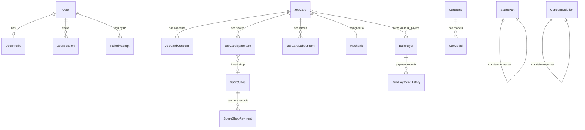
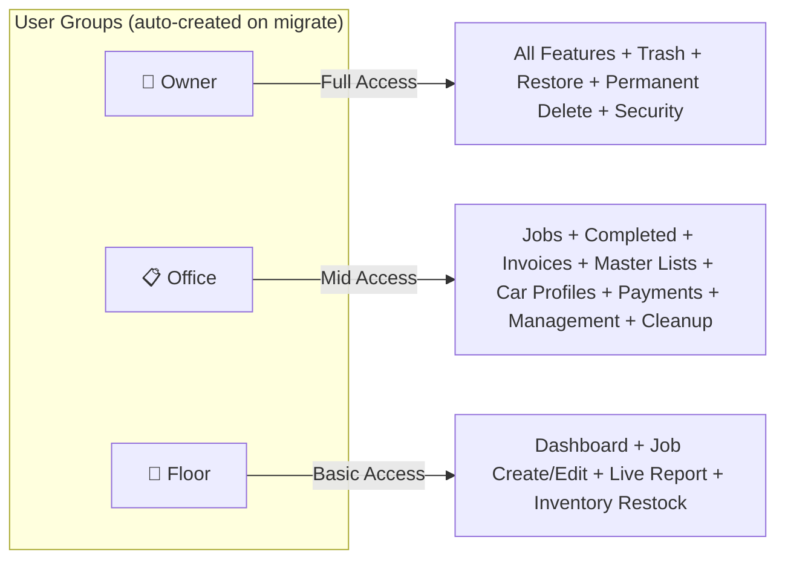
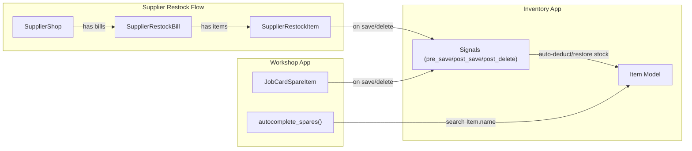
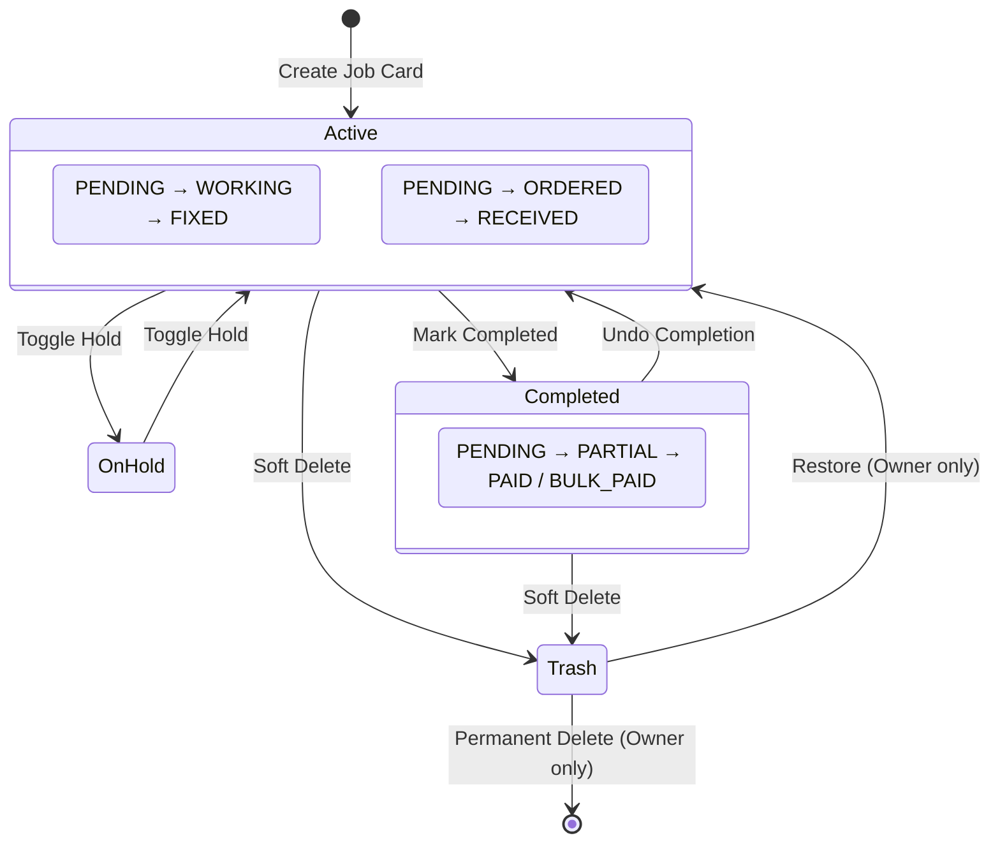
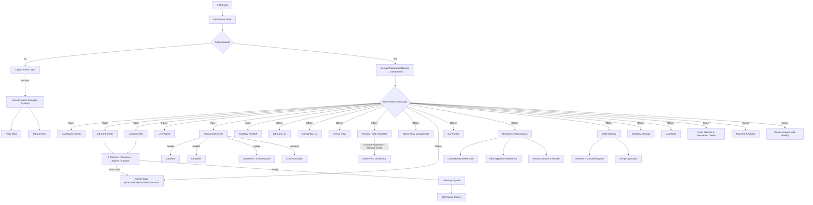

# 🏗️ WorkshopOS (Titan) — SUPER MASTER BLUEPRINT

> **Project**: WorkshopOS (Titan) · Django project package name `formulad_workshop`
> **Framework**: Django 5.2 LTS · Python 3.13 · SQLite (dev, current production) · PostgreSQL (production-ready in settings, migration not yet performed)
> **Apps**: `workshop` (core) + `inventory` (warehouse)
> **Accurate as of**: 2026-07-23, commit `a34537c`
>
> This is the **technical reference** doc — exact model/route/template/admin/test counts and structure. For workflow narrative see `OPERATIONAL_BLUEPRINT.md`; for mission, status, and roadmap see `TITAN_MASTER_HANDOVER.md`; for day-to-day coding conventions see `CLAUDE.md`.

---

## 1. HIGH-LEVEL ARCHITECTURE

```mermaid
graph TB
    subgraph DJANGO["Django Project: formulad_workshop"]
        SETTINGS["settings/ (base, dev, prod)"]
        ROOT_URLS["Root urls.py"]
    end

    subgraph WORKSHOP["Workshop App (Core)"]
        W_MODELS["models.py — 17 Models"]
        W_VIEWS["views/ — 13 Module Package"]
        W_ANALYSIS["analysis_views.py — Owner Dashboard (mid-rebuild)"]
        W_AUTH["auth_views.py — Auth Views"]
        W_MGMT["management_views.py — Management Views"]
        W_CASH["cashbook_views.py — 4 Cashbook Views"]
        W_CLEAN["cleanup_views.py — 5 Views"]
        W_URLS["urls.py — 94 URL Patterns"]
        W_FORMS["forms.py — 6 Forms + 3 Formsets"]
        W_DECO["decorators.py — 3 RBAC Guards"]
        W_MID["middleware.py — Session Tracker"]
        W_TAGS["templatetags — 6 Filters"]
        W_ADMIN["admin.py — 9 Registered"]
        W_CMD["Commands — setup_groups, backup_db"]
        W_TPL["Templates — 70 HTML Files"]
    end

    subgraph INVENTORY["Inventory App (Warehouse + Supplier Shops)"]
        I_MODELS["models.py — 8 Models"]
        I_VIEWS["views.py + views_suppliers.py — 33 Views"]
        I_URLS["urls.py — 33 URL Patterns"]
        I_SIGNALS["signals.py — 8 Signal Handlers (3 groups)"]
        I_ADMIN["admin.py — 8 Registered"]
        I_TPL["Templates — 18 HTML Files"]
    end

    subgraph EXTERNAL["External Services (⚠️ Legacy — replacement planned)"]
        TWILIO["Twilio SMS API"]
        TELEGRAM["Telegram Bot API"]
    end

    ROOT_URLS -->|"/"|  W_URLS
    ROOT_URLS -->|"/inventory/"| I_URLS
    ROOT_URLS -->|"/admin/"| DJANGO_ADMIN["Django Admin"]

    I_SIGNALS -->|"Auto Stock Sync"| W_MODELS
    W_VIEWS -->|"Autocomplete API"| I_MODELS
    W_AUTH --> TWILIO
    W_AUTH --> TELEGRAM
```

---

## 2. DATABASE MODELS — COMPLETE MAP

### Workshop App Models (17)



| # | Model | Key Fields | Purpose |
|---|-------|--------|---------|
| 1 | **UserProfile** | user (1:1→User), mobile_number | Extends Django User with mobile for OTP |
| 2 | **FailedAttempt** | ip_address (unique), failures, last_attempt | IP-based brute-force lockout |
| 3 | **UserSession** | user (FK→User), session_key (unique), ip, user_agent, last_activity | Live device monitoring & remote revoke |
| 4 | **Mechanic** | name (unique), is_active, created_at | Workshop staff roster |
| 5 | **CarBrand** | name (unique), logo_image, created_at | Master list for autocomplete |
| 6 | **CarModel** | brand (FK→CarBrand), name, created_at | Master list, unique_together(brand,name) |
| 7 | **SparePart** | name (unique), created_at | Master list for autocomplete |
| 8 | **ConcernSolution** | concern (text), created_at | Knowledge base for autocomplete |
| 9 | **SpareShop** | name (unique), phone, address, is_trashed | Master list of spare parts suppliers |
| 10 | **JobCard** | bill_number, dates, vehicle info, customer, financials, status flags | **Core entity** — full lifecycle |
| 11 | **JobCardConcern** | job_card (FK), concern_text, status (PENDING/WORKING/FIXED) | Per-job concerns |
| 12 | **JobCardSpareItem** | job_card (FK), part name, qty, prices, shop (FK→SpareShop), order tracking | Per-job spare parts |
| 13 | **JobCardLabourItem** | job_card (FK), job_description, amount | Per-job labour charges |
| 14 | **BulkPayer** | customer_name (unique), job_cards (M2M→JobCard), advance_balance, is_trashed | Group for fleet/repeat customers. **UI label: "Fleet Account"** — cosmetic only, model/field/URL names unchanged |
| 15 | **BulkPaymentHistory** | bulk_payer (FK), amount, method, jobs_affected, details (JSON: `{jobs, advance_used, advance_stored}`) | Audit trail for bulk payments, precise reversal |
| 16 | **SpareShopPayment** | shop (FK→SpareShop), amount, method, note, is_trashed | Ledger payment record |
| 17 | **CashbookEntry** | entry_type, category, amount, method, date | Daily expense & income ledger |

`advance_balance` (added migration `0047_bulkpayer_advance_balance`) tracks credit carried forward when a lump-sum Fleet Account payment exceeds the total currently owed; `total_balance` can legitimately go negative once this credit exists.

### Inventory App Models (8)

| # | Model | Key Fields | Purpose |
|---|-------|--------|---------|
| 1 | **Category** | name | Groups inventory items |
| 2 | **Item** | category (FK), name, average_stock, current_stock, usage_count | Warehouse part with stock levels |
| 3 | **ConsumptionRecord** | user (FK→User), item (FK→Item), quantity, date, timestamp | Audit trail for stock changes |
| 4 | **SupplierShop** | name (unique), phone, total_billed_amount, total_paid_amount, is_active | Supplier / Supplies Shop master record |
| 5 | **ShopCatalogItem** | shop (FK→SupplierShop), item (FK→Item), unique_together(shop,item) | Links a supplier to the items they stock |
| 6 | **SupplierRestockBill** | supplier (FK→SupplierShop), bill_date, total_amount, discount_amount, note | Individual restock purchase from a supplier |
| 7 | **SupplierRestockItem** | bill (FK→SupplierRestockBill), item (FK→Item), quantity, unit_price, total_price | Line item on a restock bill |
| 8 | **SupplierPayment** | supplier (FK→SupplierShop), amount, payment_method, date, note, is_trashed | Payment record for supplier accounts |

---

## 3. SECURITY & ACCESS CONTROL

### 3.1 Three User Roles (RBAC)



| Decorator | Roles Allowed | Used On |
|-----------|---------------|---------|
| `@staff_required` | Floor + Office + Owner | Dashboard, Job Create/Edit/Detail, Live Report, Autocomplete, `concern_edit`, **the entire Inventory app** (stock, categories, items, low-stock, history) **and the entire Supplier-Shops module** (bills, payments, catalog — see access-asymmetry note in `OPERATIONAL_BLUEPRINT.md` §5B) |
| `@office_required` | Office + Owner | Job List, Job Delete, Completed, Invoices, Master Lists (except `concern_edit`), Car Profiles, Management, Cleanup, Cashbook, Pending Payments, Spare Shops (non-destructive), Bulk Payer create/detail/pay |
| `@owner_required` | Owner only | Paid Bills, Audits, Trash + Restore + Permanent Delete, Bulk Payer delete/history-delete, Spare Shop delete/reverse/permanent-delete, Payment Reversal, Owner Analysis, Session Terminate |

Superusers pass every check regardless of group membership. For the human-readable "who can do what" breakdown, see `OPERATIONAL_BLUEPRINT.md` §2.

### 3.2 Auth System

| Feature | Implementation |
|---------|---------------|
| **Staff Login** | `/login/` — Username/Password, blocks Owners |
| **Owner Login** | `/admin-login/` — Username or Mobile + Password, direct login |
| **IP Lockout** | 5 failures → 15 min block via `FailedAttempt`, keyed on `REMOTE_ADDR` only |
| **Security Alerts** | On every login → SMS (Twilio) + Telegram to BOTH owners (⚠️ legacy, replacement planned — see `TITAN_MASTER_HANDOVER.md` roadmap) |
| **Forgot Password** | `/forgot-password/` → OTP via SMS/Telegram → `/reset-password/` |
| **OTP Authentication** | 6-digit, 5-min expiry, 3 attempts max, 60s cooldown |
| **Session Tracking** | `SessionTrackingMiddleware` updates `UserSession`, throttled to a 5-minute cooldown per session |
| **Remote Revoke** | Owners can terminate any session from the management dashboard |
| **40-day Sessions** | `SESSION_COOKIE_AGE = 3,456,000` seconds |

### 3.3 Notification Channels (⚠️ Legacy — Replacement Planned)

```
Login Event → send_titan_security_alert()
                ├─→ Twilio SMS → Owner 1 Mobile
                ├─→ Twilio SMS → Owner 2 Mobile
                ├─→ Telegram → Owner 1 Chat ID
                └─→ Telegram → Owner 2 Chat ID
```

A replacement (OTP-centered) notification system is on the roadmap — see `TITAN_MASTER_HANDOVER.md`. Don't extend this legacy path further.

---

## 4. ALL URL ROUTES — COMPLETE (127 Total)

### Workshop App (94 routes)

| Section | URL Pattern | View | Access |
|---------|-------------|------|--------|
| **HOME** | `/` | `home` | Staff |
| | `/jobcards/create/` | `jobcard_create` | Staff |
| **JOBS** | `/jobcards/` | `jobcard_list` | Office |
| | `/jobcards/live-report/` | `live_report` | Staff |
| | `/jobcards/<pk>/` | `jobcard_detail` | Staff |
| | `/jobcards/<pk>/edit/` | `jobcard_edit` | Staff |
| | `/jobcards/<pk>/delete/` | `jobcard_delete` | Office |
| **COMPLETED** | `/completed/` | `completed_list` | Office |
| | `/jobcards/<pk>/complete/` | `mark_completed` | Office |
| | `/jobcards/<pk>/undo-complete/` | `undo_completed` | Office |
| | `/jobcards/<pk>/toggle-hold/` | `toggle_hold` | Office |
| | `/jobcards/<pk>/update-bill/` | `update_bill_status` | Office |
| **TRASH** | `/trash/` | `trash_list` | Owner |
| | `/jobcards/<pk>/restore/` | `restore_jobcard` | Owner |
| | `/jobcards/<pk>/permanent-delete/` | `permanent_delete_jobcard` | Owner |
| **PENDING PAYMENTS** | `/pending-payments/` | `pending_payments_list` | Office |
| **PAID BILLS** | `/paid-bills/` | `paid_bills_list` | Owner |
| **BULK PAYERS ("Fleet Account" in UI)** | `/pending-payments/bulk-payers/` | `bulk_payer_list` | Office |
| | `/pending-payments/bulk-payers/create/` | `bulk_payer_create` | Office |
| | `/pending-payments/bulk-payers/<pk>/` | `bulk_payer_detail` | Office |
| | `/pending-payments/jobcards/move-to-bulk/` | `move_jobcard_to_bulk` | Office |
| | `/pending-payments/bulk-payers/<pk>/remove-card/` | `bulk_payer_remove_card` | Office |
| | `/pending-payments/bulk-payers/<pk>/pay/` | `bulk_payer_pay` | Office |
| | `/pending-payments/bulk-payers/<pk>/delete/` | `bulk_payer_delete` | Owner |
| | `/pending-payments/bulk-payers/<pk>/history/<hpk>/delete/` | `bulk_payment_history_delete` | Owner |
| | `/pending-payments/bulk-payers/trash/` | `bulk_payer_trash_list` | Owner |
| | `/pending-payments/bulk-payers/<pk>/restore/` | `bulk_payer_restore` | Owner |
| | `/pending-payments/bulk-payers/<pk>/permanent-delete/` | `bulk_payer_permanent_delete` | Owner |
| | `/pending-payments/history/<hpk>/permanent-delete/` | `permanent_delete_payment_history` | Owner |
| **AUDITS** | `/audits/high-discounts/` | `audit_high_discounts` | Owner |
| | `/audits/deleted-bulk-payers/` | `audit_deleted_bulk_payers` | Owner |
| | `/audits/restore-bulk-payer/<pk>/` | `restore_bulk_payer` | Owner |
| **SPARE SHOPS** | `/spare-shops/` | `spare_shop_list` | Office |
| | `/spare-shops/create/` | `spare_shop_create` | Office |
| | `/spare-shops/unassigned/` | `unassigned_spares_hub` | Office |
| | `/spare-shops/<pk>/` | `spare_shop_detail` | Office |
| | `/spare-shops/<pk>/edit/` | `spare_shop_edit` | Office |
| | `/spare-shops/<pk>/pay/` | `spare_shop_pay` | Office |
| | `/spare-shops/<shop_pk>/payment/<payment_pk>/reverse/` | `spare_shop_payment_reverse` | Owner |
| | `/spare-shops/<pk>/delete/` | `spare_shop_delete` | Owner |
| | `/spare-shops/<pk>/restore/` | `spare_shop_restore` | Owner |
| | `/spare-shops/<pk>/permanent-delete/` | `spare_shop_permanent_delete` | Owner |
| | `/spare-shops/payment/<payment_pk>/permanent-delete/` | `spare_shop_payment_permanent_delete` | Owner |
| | `/spare-shops/<pk>/print/` | `spare_shop_print` | Office |
| | `/spare-shops/<pk>/add-unassigned/` | `spare_shop_add_unassigned` | Office |
| | `/spare-shops/items/<item_pk>/unassign/` | `spare_shop_unassign_item` | Office |
| | `/spare-shops/items/<item_pk>/update-price/` | `spare_shop_update_item_price` | Office |
| **MASTER LISTS** | `/master-lists/` | `master_lists_home` | Office |
| | `/master-lists/brands/` | `brand_list` | Office |
| | `/master-lists/brands/add/` | `brand_create` | Office |
| | `/master-lists/brands/<pk>/edit/` | `brand_edit` | Office |
| | `/master-lists/brands/<pk>/delete/` | `brand_delete` | Office |
| | `/master-lists/brands/<id>/models/` | `brand_model_list` | Office |
| | `/master-lists/models/add/` | `model_create` (fallback route) | Office |
| | `/master-lists/brands/<id>/models/add/` | `model_create` (context-aware route) | Office |
| | `/master-lists/models/<pk>/edit/` | `model_edit` | Office |
| | `/master-lists/models/<pk>/delete/` | `model_delete` | Office |
| | `/master-lists/spares/` | `spare_list` | Office |
| | `/master-lists/spares/add/` | `spare_create` | Office |
| | `/master-lists/spares/<pk>/edit/` | `spare_edit` | Office |
| | `/master-lists/concerns/` | `concern_list` | Office |
| | `/master-lists/concerns/add/` | `concern_create` | Office |
| | `/master-lists/concerns/<pk>/edit/` | `concern_edit` | Staff |
| **AUTOCOMPLETE** | `/api/autocomplete/brands/` | `autocomplete_brands` | Staff |
| | `/api/autocomplete/models/` | `autocomplete_models` | Staff |
| | `/api/autocomplete/spares/` | `autocomplete_spares` | Staff |
| | `/api/autocomplete/concerns/` | `autocomplete_concerns` | Staff |
| **CAR PROFILES** | `/car-profiles/` | `car_profile_list` | Office |
| | `/car-profiles/<reg>/` | `car_profile_detail` | Office |
| **INVOICE** | `/invoice/<pk>/` | `invoice_view` | Office |
| **AUTH** | `/login/` | `staff_login_view` | Public |
| | `/admin-login/` | `admin_login_view` | Public (Owner Login) |
| | `/forgot-password/` | `owner_forgot_password_view` | Public |
| | `/reset-password/` | `owner_reset_password_view` | Public |
| | `/logout/` | Django `LogoutView` | Auth'd |
| **MANAGEMENT** | `/manage/` | `manage_dashboard` | Office |
| | `/manage/create-user/` | `manage_create_user` | Office |
| | `/manage/users/<id>/reset-password/` | `manage_reset_password` | Office |
| | `/manage/users/<id>/delete/` | `manage_delete_user` | Office |
| | `/manage/mechanics/create/` | `manage_create_mechanic` | Office |
| | `/manage/mechanics/<id>/toggle/` | `manage_toggle_mechanic` | Office |
| | `/manage/mechanics/<id>/edit/` | `manage_edit_mechanic` | Office |
| | `/manage/sessions/<id>/terminate/` | `manage_terminate_session` | Owner |
| **CASHBOOK** | `/cashbook/` | `cashbook_view` | Office |
| | `/cashbook/add/` | `add_cashbook_entry` | Office |
| | `/cashbook/<id>/delete/` | `delete_cashbook_entry` | Office |
| | `/cashbook/<id>/edit/` | `edit_cashbook_entry` | Office |
| **ANALYSIS** (mid-rebuild — see §14 note) | `/analysis/` | `analysis_dashboard` | Owner |
| | `/analysis/zone/<zone_name>/` | `analysis_zone` | Owner |
| **CLEANUP** | `/manage/cleanup/` | `data_cleanup_view` | Office |
| | `/manage/cleanup/spare/<id>/delete/` | `cleanup_delete_spare` | Office |
| | `/manage/cleanup/spare/<id>/rename/` | `cleanup_rename_spare` | Office |
| | `/manage/cleanup/concern/<id>/delete/` | `cleanup_delete_concern` | Office |
| | `/manage/cleanup/concern/<id>/rename/` | `cleanup_rename_concern` | Office |

*`manage_terminate_session` is secured with `@owner_required`.*

### Inventory App (33 routes under `/inventory/`)

**Access:** all 33 inventory routes (core inventory *and* supplier shops) are `@staff_required` — Floor + Office + Owner. There are no Office-only or Owner-only inventory routes. See the access-asymmetry note in `OPERATIONAL_BLUEPRINT.md` §5B regarding Floor access to supplier financial records.

| URL | View | Purpose |
|-----|------|---------|
| `/` | `inventory_home` | Entry point (redirects to stock list) |
| `/manage/` | `inventory_manage` | Category & item management |
| `/category/<id>/` | `category_detail` | Items in a category |
| `/category/add/` | `add_category` | Create category |
| `/category/edit/<id>/` | `edit_category` | Rename category |
| `/category/delete/<id>/` | `delete_category` | Delete category |
| `/category/<id>/item/add/` | `add_item` | Add item to category |
| `/item/edit/<id>/` | `edit_item` | Edit item details |
| `/item/delete/<id>/` | `delete_item` | Delete item |
| `/list/` | `inventory_list` | Stock level dashboard |
| `/restock/update/<id>/` | `update_stock` | Update stock count |
| `/low-stock/` | `inventory_low_stock` | Items below 25% threshold |
| `/history/` | `consumption_history` | Audit log |
| **SUPPLIER SHOPS** | | |
| `/shops/` | `supplier_shop_list` | All supplier shops dashboard |
| `/shops/deactivated/` | `deactivated_supplier_shop_list` | View deactivated suppliers |
| `/shops/add/` | `add_supplier_shop` | Create new supplier |
| `/shops/<id>/` | `supplier_shop_detail` | Supplier detail with bills & payments |
| `/shops/<id>/edit/` | `edit_supplier_shop` | Edit supplier details |
| `/shops/<id>/deactivate/` | `deactivate_supplier_shop` | Soft-deactivate supplier |
| `/shops/<id>/activate/` | `activate_supplier_shop` | Re-activate supplier |
| `/shops/<id>/catalog/add/` | `add_shop_catalog_item` | Add item to supplier catalog |
| `/shops/<id>/catalog/<item_id>/remove/` | `remove_shop_catalog_item` | Remove item from catalog |
| `/shops/<id>/catalog/<item_id>/edit/` | `edit_catalog_item` | Edit catalog item name |
| `/shops/<id>/restock/` | `shop_restock_select` | Select items for restock bill |
| `/shops/<id>/restock/bill/` | `shop_restock_bill` | Create restock bill |
| `/shops/<id>/bill/<bill_id>/edit/` | `edit_restock_bill` | Edit existing restock bill |
| `/shops/<id>/bill/<bill_id>/delete/` | `delete_restock_bill` | Delete restock bill (reverses stock) |
| `/shops/<id>/bill/<bill_id>/discount/` | `update_bill_discount` | Update bill discount |
| `/shops/<id>/payment/add/` | `add_shop_payment` | Record payment to supplier |
| `/shops/<id>/payment/<payment_id>/delete/` | `delete_shop_payment` | Soft-delete payment |
| `/shops/<id>/bills/ajax/` | `ajax_supplier_bills` | AJAX: paginated bills list |
| `/shops/<id>/payments/ajax/` | `ajax_supplier_payments` | AJAX: paginated payments list |
| `/item/<item_id>/suppliers/` | `inventory_item_suppliers` | View all suppliers for an item |

> Note: this table replaces an earlier version whose URL prefixes (`/suppliers/...`) didn't match the actual code (`/shops/...`) — if you have an old copy of this doc bookmarked or cached, discard it.

---

## 5. CROSS-APP CONNECTIONS



Stock is synced by **8 signal handlers in 3 groups** (`inventory/signals.py`):

**Group 1 — Workshop Consumption (`JobCardSpareItem`, 3 handlers):**
1. **New spare added** → Deduct full qty from warehouse
2. **Qty changed (same part)** → Deduct only the delta
3. **Part name changed** → Restore old part stock, deduct new part stock
4. **Spare deleted** → Restore full qty to warehouse

**Group 2 — JobCard Soft-Delete Reversal (`JobCard`, 2 handlers):**
5. **Job card soft-deleted** → Return all its spares' stock to the warehouse
6. **Job card restored** → Deduct that stock again (only fires when `is_deleted` actually flips)

**Group 3 — Supplier Restock (`SupplierRestockItem`, 3 handlers):**
7. **New restock item created** → Increase stock by full qty
8. **Restock qty changed** → Adjust stock by delta
9. **Restock item/bill deleted** → Reverse stock increase

---

## 6. JOB CARD LIFECYCLE



**Bill Number**: Auto-generated `JB-{YY}-{NNN}` (thread-safe with `select_for_update`)
**Financials**: Denormalized `total_bill_amount` updated via `update_totals()` on every spare/labour save
**Payment Methods**: CASH, UPI, CARD, TRANSFER
**Dates**: All "today"/date-range logic uses `timezone.localdate()` (IST-correct), not `date.today()`.

---

## 7. TEMPLATE STRUCTURE (91 HTML Files)

### Root Templates (`templates/`) — 3 files

| File | Purpose |
|------|---------|
| `403.html` | Custom Forbidden Error |
| `404.html` | Custom Not Found Error |
| `500.html` | Custom Server Error |

### Workshop Templates (`workshop/templates/workshop/`) — 70 files

| Directory | Files | Purpose |
|-----------|-------|---------|
| `/` | `base.html`, `home.html` | Base layout with nav + redirector |
| `/analysis/` | `analysis_dashboard.html` | Owner dashboard shell (hero KPIs, functional) |
| `/analysis/zones/` | `zone_{revenue,mechanic,spares,customer,inventory,cashbook,workshop}.html` (7) | **Placeholder stubs (8 lines each)** — the AJAX endpoint each dashboard card expands into. Mid-rebuild, not a bug — see `CLAUDE.md` |
| `/analysis/tabs/` | `financials.html`, `inventory.html`, `operations.html` (3) | Fully-built replacement content (500-700 lines each), **not yet wired to any view** — the rebuild's destination, not currently reachable |
| `/auth/` | `login.html`, `admin_login.html`, `forgot_password.html`, `reset_password.html`, `otp_verify.html` | 5 auth screens |
| `/dashboard/` | `dashboard_home.html` | Main floor dashboard with active jobs |
| `/jobcard/` | 23 files: CRUD (`jobcard_form/detail/list/confirm_delete`), `job_list_partial`, `live_report`, pending/paid bills + partials, bulk payer detail/panel/trash + bulk_payments + partial, audits (`audit_high_discounts`, `audit_deleted_bulk_payers`), unified trash + 4 tab partials | Job, payment, audit & trash screens |
| `/completed/` | `completed_list.html`, `completed_list_partial.html` | 2 completed-jobs screens |
| `/master_lists/` | 13 files across brands/models/spares/concerns (list/form/confirm_delete each) | Master list CRUD screens |
| `/car_profiles/` | `car_profile_list.html`, `car_profile_detail.html`, `car_list_partial.html` | 3 car profile screens |
| `/invoice/` | `invoice_template.html` | Professional invoice |
| `/spare_shops/` | `shop_list.html`, `shop_detail.html`, `shop_print.html`, `unassigned_hub.html` | 4 spare shop screens |
| `/manage/` | `manage_dashboard.html`, `data_cleanup.html` | 2 admin screens |
| `/cashbook/` | `cashbook.html`, `cashbook_partial.html` | 2 cashbook screens (standalone) |
| `/includes/` | `pagination.html` | Reusable pagination component |

### Inventory Templates (`inventory/templates/inventory/`) — 18 files

| File | Purpose |
|------|---------|
| `home.html` | Redirector |
| `manage.html` | Category & item CRUD |
| `category_detail.html` | Items within category |
| `inventory_list.html` | Stock level management |
| `low_stock.html` | Critical stock alerts |
| `consumption_history.html` | Usage audit log |
| **Suppliers Directory** | |
| `suppliers/shop_list.html` | Supplier shops dashboard |
| `suppliers/shop_detail.html` | Supplier detail with bills, payments, catalog |
| `suppliers/add_shop.html` | Add new supplier form |
| `suppliers/edit_shop.html` | Edit supplier form |
| `suppliers/restock_select.html` | Select items for restock bill |
| `suppliers/restock_bill.html` | Create restock bill form |
| `suppliers/restock_bill_edit.html` | Edit existing restock bill |
| `suppliers/add_catalog_item.html` | Add item to supplier catalog |
| `suppliers/add_payment.html` | Record supplier payment |
| `suppliers/item_suppliers.html` | View all suppliers for an item |
| `suppliers/partials/bill_list_chunk.html` | AJAX partial: paginated bill list |
| `suppliers/partials/payment_list_chunk.html` | AJAX partial: paginated payment list |

---

## 8. FORMS & FORMSETS

| Form | Model | Fields |
|------|-------|--------|
| `CarBrandForm` | CarBrand | name, logo_image |
| `CarModelForm` | CarModel | brand, name |
| `SparePartForm` | SparePart | name |
| `ConcernSolutionForm` | ConcernSolution | concern |
| `SpareShopForm` | SpareShop | name, phone, address |
| `JobCardForm` | JobCard | 10 fields (dates, vehicle, customer, mechanic, color) |

| Formset | Parent→Child | Fields | Features |
|---------|-------------|--------|----------|
| `JobCardConcernFormSet` | JobCard→Concern | concern_text, status | Autocomplete, can_delete |
| `JobCardSpareFormSet` | JobCard→Spare | 8 fields (name, qty, prices, shop, status, dates) | Autocomplete, can_delete |
| `JobCardLabourFormSet` | JobCard→Labour | job_description, amount | can_delete |

All forms use `BootstrapFormMixin` to auto-apply Bootstrap classes.

---

## 9. MIDDLEWARE & INFRASTRUCTURE

| Component | File | Purpose |
|-----------|------|---------|
| `SessionTrackingMiddleware` | `middleware.py` | Logs every authenticated request to `UserSession` (5-min cooldown) |
| `create_user_groups` | `apps.py` | Auto-creates Owner/Office/Floor groups on migrate |
| `inventory.signals` | `signals.py` | Auto stock sync — 8 handlers in 3 groups: 3 for JobCardSpareItem (consumption) + 2 for JobCard (soft-delete stock reversal) + 3 for SupplierRestockItem (restock) |
| Management Commands | `management/commands/` | `setup_groups` (legacy setup), `backup_db` (automated SQLite backups) |
| Custom template filters | `templatetags/custom_filters.py` | `has_group`, `is_tomorrow`, `divide`, `multiply`, `clean_qty`, `get_range` |
| Settings package | `settings/__init__.py` | Auto-selects dev/prod via `DJANGO_ENV`, raises `ImproperlyConfigured` if unset |
| `WhiteNoiseMiddleware` | `settings/production.py` | Serves static assets directly from the application in production |

---

## 10. FULL SYSTEM CONNECTION MAP



---

## 11. DJANGO ADMIN REGISTRATIONS (17 Total)

### Workshop Admin (9)

| Model | Admin Features |
|-------|---------------|
| `UserProfile` | list: user, mobile · search: username, mobile |
| `Mechanic` | list: name, active, created · filter: active |
| `CarBrand` | list: name, created · exclude: logo_image |
| `CarModel` | list: name, brand, created · filter: brand |
| `SparePart` | list: name, created |
| `ConcernSolution` | list: concern, created |
| `JobCard` | list: reg, customer, brand, model, updated · inlines: Concerns + Spares + Labour |
| `BulkPayer` | list: customer_name, is_trashed, created · filter: is_trashed · search: customer_name |
| `BulkPaymentHistory` | list: bulk_payer, amount, payment_method, jobs_affected, created · filter: payment_method · search: customer_name |

*Not registered in admin (managed via dedicated UI views only): `FailedAttempt`, `UserSession`, `SpareShop`, `SpareShopPayment`, `CashbookEntry`, and JobCard's child models (`JobCardConcern`/`JobCardSpareItem`/`JobCardLabourItem`, managed as JobCard inlines instead).*

### Inventory Admin (8)

| Model | Admin Features |
|-------|---------------|
| `Category` | list: name · search: name |
| `Item` | list: name, category, current_stock, average_stock, usage_count · filter: category · search: name |
| `ConsumptionRecord` | list: user, item, qty, date · filter: date, user |
| `SupplierShop` | list: name, phone, total_billed, total_paid, is_active · filter: is_active · search: name |
| `ShopCatalogItem` | list: shop, item, created_at · filter: shop · search: shop name, item name |
| `SupplierRestockBill` | list: id, supplier, bill_date, total_amount, discount · filter: supplier, bill_date · search: supplier name |
| `SupplierRestockItem` | list: bill, item, quantity, total_price · filter: bill supplier · search: item name |
| `SupplierPayment` | list: supplier, amount, method, date, is_trashed · filter: method, is_trashed, supplier · search: supplier name, note |

---

## 12. CONFIGURATION & ENVIRONMENT

### Split Settings Architecture

| File | Environment | Database | SSL |
|------|-------------|----------|-----|
| `settings/base.py` | Shared config | — | — |
| `settings/development.py` | `DJANGO_ENV=development` (default) | SQLite3 | Off |
| `settings/production.py` | `DJANGO_ENV=production` | PostgreSQL — **fully configured, not yet the live database** | Full HSTS |

### Base Settings

| Setting | Value |
|---------|-------|
| `SECRET_KEY` | From `.env` |
| `DEBUG` | From `.env` (overridden per environment) |
| `ALLOWED_HOSTS` | From `.env` (dev: `['*']`) |
| `TIME_ZONE` | `Asia/Kolkata` |
| `SESSION_COOKIE_AGE` | 40 days (3,456,000s) |
| `SESSION_SAVE_EVERY_REQUEST` | True |
| `STATIC_URL` | `/static/` |
| `MEDIA_URL` | `/media/` |
| `LOGGING` | Rotating file handler → `errors.log` (5MB × 5 backups) |
| `CSRF_TRUSTED_ORIGINS` | From `.env` |

### .env Variables Used

| Variable | Purpose |
|----------|---------|
| `SECRET_KEY` | Django secret |
| `DEBUG` | Debug mode toggle |
| `ALLOWED_HOSTS` | Comma-separated allowed hosts |
| `CSRF_TRUSTED_ORIGINS` | Comma-separated trusted CSRF origins |
| `OWNER_1_USERNAME` | Owner 1 login name |
| `OWNER_1_MOBILE` | Owner 1 phone (OTP/alerts) |
| `OWNER_1_CHAT_ID` | Owner 1 Telegram chat |
| `OWNER_2_USERNAME` | Owner 2 login name |
| `OWNER_2_MOBILE` | Owner 2 phone (OTP/alerts) |
| `OWNER_2_CHAT_ID` | Owner 2 Telegram chat |
| `TWILIO_ACCOUNT_SID` | SMS service credentials (⚠️ legacy) |
| `TWILIO_AUTH_TOKEN` | SMS service credentials (⚠️ legacy) |
| `TWILIO_FROM_NUMBER` | SMS sender number (⚠️ legacy) |
| `TELEGRAM_BOT_TOKEN` | Telegram bot credentials (⚠️ legacy) |
| `DJANGO_ENV` | Environment selector (development/production) |
| `DB_NAME`, `DB_USER`, `DB_PASSWORD`, `DB_HOST`, `DB_PORT` | PostgreSQL config (production only, not yet cut over) |

---

## 13. TEST SUITE (19 Test Files)

### Workshop Tests — `workshop/tests/` package (16 files)

| File | Coverage Area |
|------|--------------|
| `tests.py` | Core model tests |
| `test_views.py` | Main view tests |
| `test_auth.py` | Login/logout/lockout |
| `test_api_views.py` | Autocomplete endpoints |
| `test_dashboard_views.py` | Dashboard & completed |
| `test_jobcard_views.py` | Job CRUD & formsets |
| `test_cleanup_views.py` | Data cleanup operations |
| `test_models_extended.py` | Advanced model logic |
| `test_extras.py` | Template filters & utils |
| `test_filters.py` | Custom filter tests |
| `test_middleware.py` | Session tracking |
| `test_management.py` | Management commands |
| `test_cashbook.py` | Cashbook ledger |
| `test_financial.py` | Financial logic & calculations |
| `test_spare_shop_views.py` | Spare shop views & operations |
| `test_analysis.py` | Owner analysis dashboard & zones |

### Inventory Tests (3 files)

| File | Coverage Area |
|------|--------------|
| `tests.py` | Inventory CRUD + signal tests |
| `test_signals.py` | Stock sync signals (advanced scenarios) |
| `tests_suppliers.py` | Supplier shop models, signals, views, AJAX, edge cases |

Run with `python manage.py test workshop inventory` (or `workshop.tests.<file>` / `inventory.<file>` for a subset — see `CLAUDE.md`).

---

## 14. FILE TREE SUMMARY

```
WorkshopOS (Titan)/
├── formulad_workshop/          ← Django Project Config
│   ├── settings/
│   │   ├── __init__.py         ← Auto-selects dev/prod via DJANGO_ENV
│   │   ├── base.py             ← Shared settings
│   │   ├── development.py      ← SQLite, DEBUG=True
│   │   └── production.py       ← PostgreSQL (ready, not yet migrated), SSL, HSTS
│   ├── urls.py                 ← Root: admin + workshop + inventory
│   ├── wsgi.py / asgi.py
│
├── workshop/                   ← Core App (94 URL routes)
│   ├── models.py               ← 17 Models
│   ├── views/                  ← Modular views package
│   │   ├── __init__.py         ← Re-export layer (backward compatible)
│   │   ├── dashboard.py        ← home, live_report
│   │   ├── jobcard.py          ← CRUD (create, list, detail, edit, delete)
│   │   ├── completed.py        ← completed_list, mark/undo/toggle
│   │   ├── trash.py            ← trash_list, restore, permanent_delete
│   │   ├── billing.py          ← invoice_view, update_bill_status
│   │   ├── bulk_payer.py       ← bulk payer / "Fleet Account" views incl. advance-balance cascade
│   │   ├── spare_shop.py       ← spare shop views
│   │   ├── pending.py          ← pending_payments_list
│   │   ├── paid.py             ← paid_bills_list (w/ time filters)
│   │   ├── audits.py           ← audit_high_discounts, audit_deleted_bulk_payers, restore_bulk_payer
│   │   ├── car_profiles.py     ← car_profile_list, detail
│   │   ├── master_lists.py     ← master list views
│   │   └── autocomplete.py     ← 4 autocomplete API views
│   ├── analysis_views.py       ← Owner Analysis dashboard (mid-rebuild)
│   ├── auth_views.py           ← Auth views + helpers
│   ├── management_views.py     ← Management views (accounts, mechanics, security)
│   ├── cashbook_views.py       ← 4 Cashbook views (standalone ledger)
│   ├── cleanup_views.py        ← 5 Cleanup views
│   ├── urls.py                 ← 94 URL patterns
│   ├── forms.py                ← 6 Forms + 3 Formsets
│   ├── decorators.py           ← 3 RBAC decorators
│   ├── middleware.py           ← Session tracker
│   ├── admin.py                ← 9 admin registrations
│   ├── apps.py                 ← Auto-create groups on migrate
│   ├── templatetags/
│   │   └── custom_filters.py   ← 6 template filters
│   ├── management/commands/
│   │   ├── setup_groups.py     ← Group setup command (legacy)
│   │   └── backup_db.py        ← Automated SQLite backup command
│   ├── templates/workshop/     ← 70 HTML files
│   ├── static/css/, static/js/ ← App-specific assets
│   ├── migrations/             ← 49 migrations
│   └── tests/                  ← 16 test files (package, not flat files)
│
├── inventory/                  ← Warehouse + Supplier Shops App (33 URLs)
│   ├── models.py               ← 8 Models (3 core + 5 supplier)
│   ├── views.py                ← core inventory views
│   ├── views_suppliers.py      ← supplier shops module views
│   ├── urls.py                 ← 33 URL patterns (13 core + 20 supplier)
│   ├── signals.py              ← 8 signal handlers, 3 groups (3 consumption + 2 jobcard soft-delete reversal + 3 supplier restock)
│   ├── admin.py                ← 8 admin registrations
│   ├── apps.py                 ← Signal registration
│   ├── templates/inventory/    ← 18 templates (6 core + 12 supplier)
│   ├── migrations/             ← 5 migrations
│   └── tests.py, test_signals.py, tests_suppliers.py ← 3 test files
│
├── templates/                  ← Root Templates
│   ├── 403.html                ← Custom Forbidden Error
│   ├── 404.html                ← Custom Not Found Error
│   └── 500.html                ← Custom Server Error
├── static/css/                 ← Global static assets
├── .env                        ← Secrets & owner config
├── .gitignore                  ← Git exclusions
├── errors.log                  ← Rotating error log
├── requirements.txt            ← Django~=5.2.0, Pillow, python-decouple, twilio, requests, psycopg2-binary, whitenoise, coverage
├── manage.py                   ← Django CLI
├── verify_alerts.py            ← Alert verification script
└── verify_twilio.py            ← Twilio verification script
```

---

> **Total**: 2 Django Apps · 25 Models · 127 URL Routes · 91 Templates · 3 RBAC Tiers · 2 External APIs (⚠️ legacy) · 8 Signal Handlers (3 groups) · 19 Test Files · 54 Migrations (49 workshop + 5 inventory)
