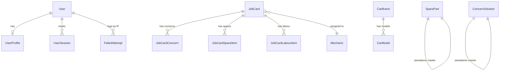
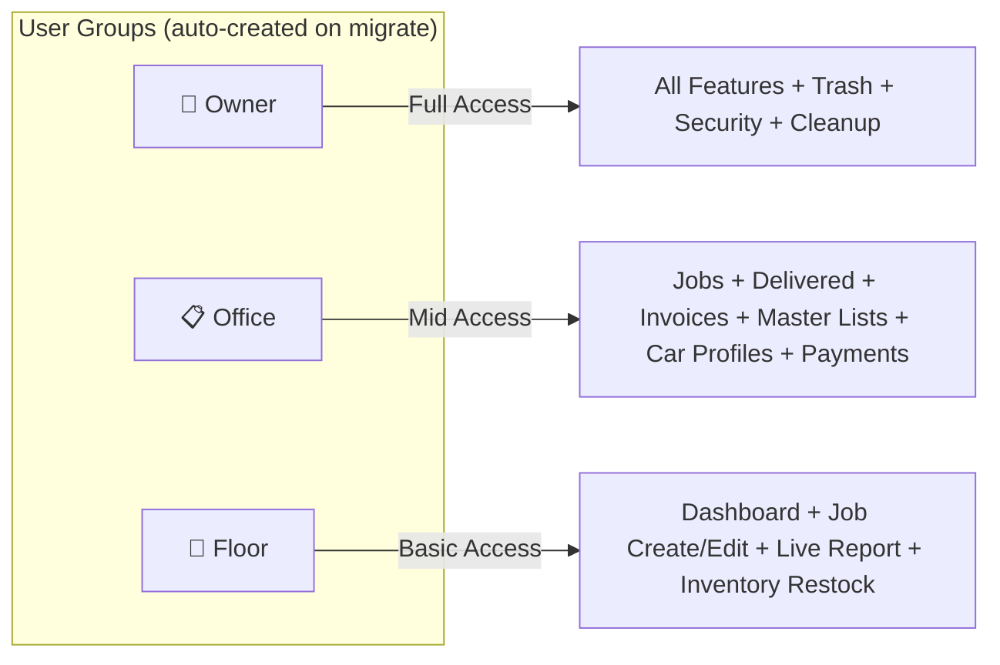
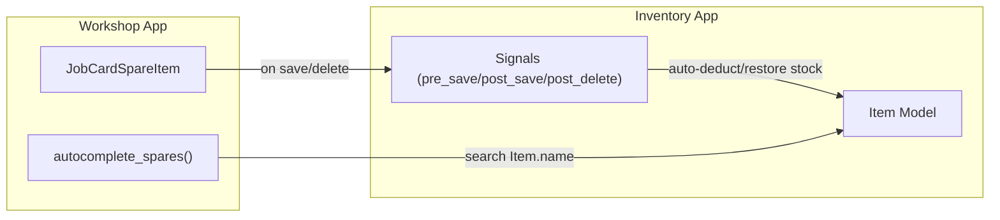
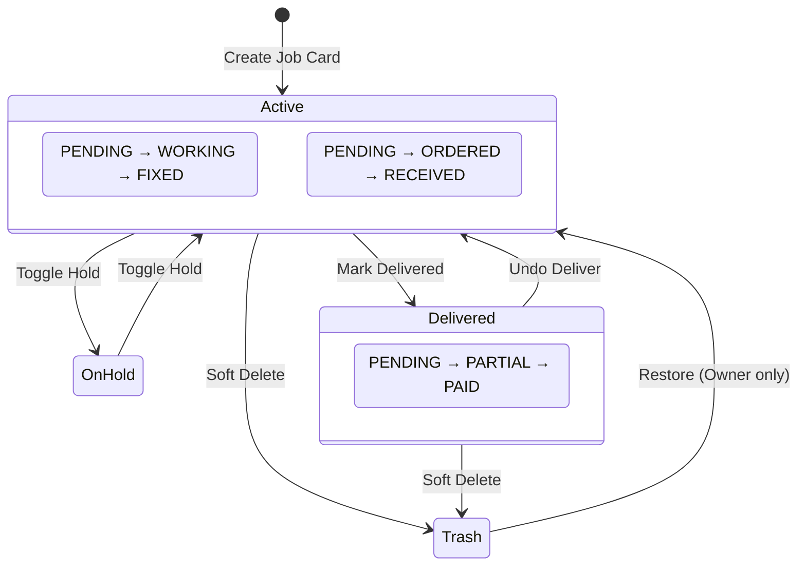
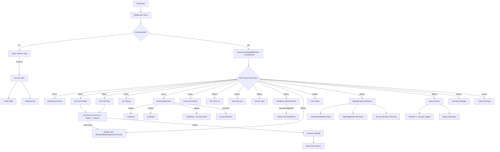

# 🏗️ WorkshopOS (Titan) — SUPER MASTER BLUEPRINT

> **Project**: Formula-D Workshop Management System
> **Framework**: Django 5.2 LTS · Python · SQLite
> **Apps**: `workshop` (core) + `inventory` (warehouse)

---

## 1. HIGH-LEVEL ARCHITECTURE

```mermaid
graph TB
    subgraph DJANGO["Django Project: formulad_workshop"]
        SETTINGS["settings.py"]
        ROOT_URLS["Root urls.py"]
    end

    subgraph WORKSHOP["Workshop App (Core)"]
        W_MODELS["models.py — 14 Models"]
        W_VIEWS["views.py — 30 Views"]
        W_AUTH["auth_views.py — 6 Views"]
        W_MGMT["management_views.py — 7 Views"]
        W_CLEAN["cleanup_views.py — 5 Views"]
        W_URLS["urls.py — 55 URL Patterns"]
        W_FORMS["forms.py — 7 Forms + 3 Formsets"]
        W_DECO["decorators.py — 3 RBAC Guards"]
        W_MID["middleware.py — Session Tracker"]
        W_TAGS["templatetags — 6 Filters"]
        W_ADMIN["admin.py — 8 Registered"]
        W_CMD["setup_groups Command"]
        W_TPL["Templates — 40+ HTML Files"]
    end

    subgraph INVENTORY["Inventory App (Warehouse)"]
        I_MODELS["models.py — 3 Models"]
        I_VIEWS["views.py — 11 Views"]
        I_URLS["urls.py — 13 URL Patterns"]
        I_SIGNALS["signals.py — 3 Signal Handlers"]
        I_ADMIN["admin.py — 3 Registered"]
        I_TPL["Templates — 6 HTML Files"]
    end

    subgraph EXTERNAL["External Services"]
        TWILIO["Twilio SMS API"]
        TELEGRAM["Telegram Bot API"]
    end

    ROOT_URLS -->|"/"| W_URLS
    ROOT_URLS -->|"/inventory/"| I_URLS
    ROOT_URLS -->|"/admin/"| DJANGO_ADMIN["Django Admin"]

    I_SIGNALS -->|"Auto Stock Sync"| W_MODELS
    W_VIEWS -->|"Autocomplete API"| I_MODELS
    W_AUTH --> TWILIO
    W_AUTH --> TELEGRAM
```



---

## 2. DATABASE MODELS — COMPLETE MAP

### Workshop App Models (14)



| # | Model | Fields | Purpose |
|---|-------|--------|---------|
| 1 | **UserProfile** | user (1:1→User), mobile_number | Extends Django User with mobile for OTP |
| 2 | **FailedAttempt** | ip_address (unique), failures, last_attempt | IP-based brute-force lockout |
| 3 | **UserSession** | user (FK→User), session_key, ip, user_agent, last_activity | Live device monitoring |
| 4 | **Mechanic** | name (unique), is_active, created_at | Workshop staff roster |
| 5 | **CarBrand** | name (unique), logo_image, created_at | Master list for autocomplete |
| 6 | **CarModel** | brand (FK→CarBrand), name, created_at | Master list, unique_together(brand,name) |
| 7 | **SparePart** | name (unique), created_at | Master list for autocomplete |
| 8 | **ConcernSolution** | concern (text), created_at | Knowledge base for autocomplete |
| 9 | **JobCard** | bill_number, dates, vehicle info, customer, financials, status flags | **Core entity** — full lifecycle |
| 10 | **JobCardConcern** | job_card (FK), concern_text, status (PENDING/WORKING/FIXED) | Per-job concerns |
| 11 | **JobCardSpareItem** | job_card (FK), part name, qty, prices, shop, order tracking | Per-job spare parts |
| 12 | **JobCardLabourItem** | job_card (FK), job_description, amount | Per-job labour charges |
| 13 | **BulkPayer** | customer_name, is_trashed | Group for fleet/repeat customers |
| 14 | **BulkPaymentHistory** | bulk_payer (FK), amount, method | Audit trail for bulk payments |
| 15 | **SpareShop** | name, phone, address, is_trashed | Master list of suppliers |
| 16 | **SpareShopPayment** | shop (FK), amount, method, note | Audit trail for shop payments |

### Inventory App Models (3)

| # | Model | Fields | Purpose |
|---|-------|--------|---------|
| 1 | **Category** | name | Groups inventory items |
| 2 | **Item** | category (FK), name, average_stock, current_stock, usage_count | Warehouse part with stock levels |
| 3 | **ConsumptionRecord** | user (FK), item (FK), quantity, date, timestamp | Audit trail for stock changes |

---

## 3. SECURITY & ACCESS CONTROL

### 3.1 Three User Roles (RBAC)



| Decorator | Roles Allowed | Used On |
|-----------|---------------|---------|
| `@staff_required` | Floor + Office + Owner | Dashboard, Job CRUD, Live Report, Autocomplete, Inventory |
| `@office_required` | Office + Owner | Job List, Delivered, Invoices, Master Lists, Car Profiles, Management, Cleanup, Payments |
| `@owner_required` | Owner only | Trash, Restore |

### 3.2 Auth System

| Feature | Implementation |
|---------|---------------|
| **Staff Login** | `/login/` — Username/Password, blocks Owners |
| **Owner Login** | `/admin-login/` — Username or Mobile + Password, direct login |
| **IP Lockout** | 5 failures → 15 min block via `FailedAttempt` model |
| **Security Alerts** | On every login → SMS (Twilio) + Telegram to BOTH owners |
| **Forgot Password** | `/forgot-password/` → OTP via SMS/Telegram → `/reset-password/` |
| **OTP Protection** | 6-digit, 5-min expiry, 3 attempts max, 60s cooldown |
| **Session Tracking** | `SessionTrackingMiddleware` updates `UserSession` on every request |
| **Remote Revoke** | Owners can terminate any session from dashboard |
| **40-day Sessions** | `SESSION_COOKIE_AGE = 3,456,000` seconds |

### 3.3 Notification Channels

```
Login Event → send_titan_security_alert()
                ├─→ Twilio SMS → Owner 1 Mobile
                ├─→ Twilio SMS → Owner 2 Mobile
                ├─→ Telegram → Owner 1 Chat ID
                └─→ Telegram → Owner 2 Chat ID
```

---

## 4. ALL URL ROUTES — COMPLETE (68 Total)

### Workshop App (55 routes)

| Section | URL Pattern | View | Access |
|---------|-------------|------|--------|
| **HOME** | `/` | `home` | Staff |
| | `/jobcards/create/` | `jobcard_create` | Staff |
| **JOBS** | `/jobcards/` | `jobcard_list` | Office |
| | `/jobcards/live-report/` | `live_report` | Staff |
| | `/jobcards/<pk>/` | `jobcard_detail` | Staff |
| | `/jobcards/<pk>/edit/` | `jobcard_edit` | Staff |
| | `/jobcards/<pk>/delete/` | `jobcard_delete` | Office |
| **DELIVERED** | `/delivered/` | `delivered_list` | Office |
| | `/jobcards/<pk>/deliver/` | `mark_delivered` | Office |
| | `/jobcards/<pk>/undo-deliver/` | `undo_delivered` | Office |
| | `/jobcards/<pk>/toggle-hold/` | `toggle_hold` | Office |
| | `/jobcards/<pk>/update-bill/` | `update_bill_status` | Office |
| **TRASH** | `/trash/` | `trash_list` | Owner |
| | `/jobcards/<pk>/restore/` | `restore_jobcard` | Owner |
| **PAYMENTS** | `/pending-payments/` | `pending_payments_list` | Office |
| | `/bulk-payments/` | `bulk_payments_home` | Office |
| | `/bulk-payments/search/` | `bulk_payments_search` | Office |
| | `/bulk-payments/process/` | `bulk_payments_process` | Office |
| **SPARE SHOPS** | `/spare-shops/` | `spare_shop_list` | Office |
| | `/spare-shops/<pk>/` | `spare_shop_detail` | Office |
| | `/spare-shops/create/` | `spare_shop_create` | Office |
| | `/spare-shops/<pk>/edit/` | `spare_shop_edit` | Office |
| | `/spare-shops/<pk>/pay/` | `spare_shop_pay` | Office |
| | `/spare-shops/<pk>/pay-item/<item_pk>/` | `spare_shop_pay_item` | Office |
| | `/spare-shops/<shop_pk>/payment/<payment_pk>/reverse/` | `spare_shop_payment_reverse` | Owner |
| | `/spare-shops/<pk>/delete/` | `spare_shop_delete` | Owner |
| | `/spare-shops/<pk>/restore/` | `spare_shop_restore` | Owner |
| | `/spare-shops/<pk>/permanent-delete/` | `spare_shop_permanent_delete` | Owner |
| | `/spare-shops/payment/<pk>/permanent-delete/` | `spare_shop_payment_permanent_delete` | Owner |
| **MASTER LISTS** | `/master-lists/` | `master_lists_home` | Office |
| | `/master-lists/brands/` | `brand_list` | Office |
| | `/master-lists/brands/add/` | `brand_create` | Office |
| | `/master-lists/brands/<pk>/edit/` | `brand_edit` | Office |
| | `/master-lists/brands/<pk>/delete/` | `brand_delete` | Office |
| | `/master-lists/brands/<id>/models/` | `brand_model_list` | Office |
| | `/master-lists/models/add/` | `model_create` | Office |
| | `/master-lists/brands/<id>/models/add/` | `model_create` | Office |
| | `/master-lists/models/<pk>/edit/` | `model_edit` | Office |
| | `/master-lists/models/<pk>/delete/` | `model_delete` | Office |
| | `/master-lists/spares/` | `spare_list` | Office |
| | `/master-lists/spares/add/` | `spare_create` | Office |
| | `/master-lists/spares/<pk>/edit/` | `spare_edit` | Office |
| | `/master-lists/concerns/` | `concern_list` | Office |
| | `/master-lists/concerns/add/` | `concern_create` | Office |
| | `/master-lists/concerns/<pk>/edit/` | `concern_edit` | Staff |
| **AUTOCOMPLETE** | `/api/autocomplete/brands/` | `autocomplete_brands` | Staff |
| | `/api/autocomplete/models/` | `autocomplete_models` | Staff |
| | `/api/autocomplete/spares/` | `autocomplete_spares` | Staff |
| | `/api/autocomplete/concerns/` | `autocomplete_concerns` | Staff |
| **CAR PROFILES** | `/car-profiles/` | `car_profile_list` | Office |
| | `/car-profiles/<reg>/` | `car_profile_detail` | Office |
| **INVOICE** | `/invoice/<pk>/` | `invoice_view` | Office |
| **AUTH** | `/login/` | `staff_login_view` | Public |
| | `/admin-login/` | `admin_login_view` | Public |
| | `/forgot-password/` | `owner_forgot_password_view` | Public |
| | `/reset-password/` | `owner_reset_password_view` | Public |
| | `/logout/` | Django LogoutView | Auth'd |
| **MANAGEMENT** | `/manage/` | `manage_dashboard` | Office |
| | `/manage/create-user/` | `manage_create_user` | Office |
| | `/manage/users/<id>/reset-password/` | `manage_reset_password` | Office |
| | `/manage/users/<id>/delete/` | `manage_delete_user` | Office |
| | `/manage/mechanics/create/` | `manage_create_mechanic` | Office |
| | `/manage/mechanics/<id>/toggle/` | `manage_toggle_mechanic` | Office |
| | `/manage/mechanics/<id>/edit/` | `manage_edit_mechanic` | Office |
| | `/manage/sessions/<id>/terminate/` | `manage_terminate_session` | Office |
| **CLEANUP** | `/manage/cleanup/` | `data_cleanup_view` | Office |
| | `/manage/cleanup/spare/<id>/delete/` | `cleanup_delete_spare` | Office |
| | `/manage/cleanup/spare/<id>/rename/` | `cleanup_rename_spare` | Office |
| | `/manage/cleanup/concern/<id>/delete/` | `cleanup_delete_concern` | Office |
| | `/manage/cleanup/concern/<id>/rename/` | `cleanup_rename_concern` | Office |

### Inventory App (13 routes under `/inventory/`)

| URL | View | Purpose |
|-----|------|---------|
| `/` | `inventory_home` → redirects to restock | Entry point |
| `/manage/` | `inventory_manage` | Category & item management |
| `/category/<id>/` | `category_detail` | Items in a category |
| `/category/add/` | `add_category` | Create category |
| `/category/edit/<id>/` | `edit_category` | Rename category |
| `/category/delete/<id>/` | `delete_category` | Delete category |
| `/category/<id>/item/add/` | `add_item` | Add item to category |
| `/item/edit/<id>/` | `edit_item` | Edit item details |
| `/item/delete/<id>/` | `delete_item` | Delete item |
| `/restock/` | `inventory_restock` | Stock level dashboard |
| `/restock/update/<id>/` | `update_stock` | Update stock count |
| `/low-stock/` | `inventory_low_stock` | Items below 25% threshold |
| `/history/` | `consumption_history` | Audit log |

---

## 5. CROSS-APP CONNECTIONS



**Signal-Based Auto Stock Sync (3 scenarios):**
1. **New spare added** → Deduct full qty from warehouse
2. **Qty changed** → Deduct only the delta
3. **Part name changed** → Restore old part stock, deduct new
4. **Spare deleted** → Restore full qty to warehouse

---

## 6. JOB CARD LIFECYCLE



**Bill Number**: Auto-generated `JB-{YY}-{NNN}` (thread-safe with `select_for_update`)
**Financials**: Denormalized `total_bill_amount` updated via `update_totals()` on every spare/labour save

---

## 7. TEMPLATE STRUCTURE (46 HTML Files)

### Workshop Templates (`workshop/templates/workshop/`)

| Directory | Files | Purpose |
|-----------|-------|---------|
| `/` | `base.html`, `home.html` | Base layout with nav + redirector |
| `/auth/` | `login.html`, `admin_login.html`, `forgot_password.html`, `reset_password.html`, `otp_verify.html` | 5 auth screens |
| `/dashboard/` | `dashboard_home.html` | Main floor dashboard with active jobs |
| `/jobcard/` | `jobcard_form.html`, `jobcard_detail.html`, `jobcard_list.html`, `job_list_partial.html`, `jobcard_confirm_delete.html`, `live_report.html`, `pending_payments.html`, `pending_payments_partial.html`, `bulk_payments.html`, `bulk_payments_partial.html`, `trash_list.html`, `trash_list_partial.html` | 12 job card screens |
| `/delivered/` | `delivered_list.html`, `delivered_list_partial.html` | 2 delivery screens |
| `/master_lists/` | `master_lists_home.html`, `brand_list/form/delete.html`, `model_list/form/delete.html`, `spare_list/form.html`, `concern_list/form.html` | 13 master list screens |
| `/car_profiles/` | `car_profile_list.html`, `car_profile_detail.html`, `car_list_partial.html` | 3 car profile screens |
| `/invoice/` | `invoice_template.html` | Professional invoice |
| `/manage/` | `manage_dashboard.html`, `data_cleanup.html` | 2 admin screens |
| `/includes/` | `pagination.html` | Reusable pagination component |

### Inventory Templates (`inventory/templates/inventory/`)

| File | Purpose |
|------|---------|
| `home.html` | Redirector |
| `manage.html` | Category & item CRUD |
| `category_detail.html` | Items within category |
| `restock.html` | Stock level management |
| `low_stock.html` | Critical stock alerts |
| `consumption_history.html` | Usage audit log |

---

## 8. FORMS & FORMSETS

| Form | Model | Fields |
|------|-------|--------|
| `CarBrandForm` | CarBrand | name, logo_image |
| `CarModelForm` | CarModel | brand, name |
| `SparePartForm` | SparePart | name |
| `ConcernSolutionForm` | ConcernSolution | concern |
| `JobCardForm` | JobCard | 10 fields (dates, vehicle, customer, mechanic, color) |

| Formset | Parent→Child | Fields | Features |
|---------|-------------|--------|----------|
| `JobCardConcernFormSet` | JobCard→Concern | concern_text, status | Autocomplete, can_delete |
| `JobCardSpareFormSet` | JobCard→Spare | 8 fields (name, qty, prices, shop, dates) | Autocomplete, can_delete |
| `JobCardLabourFormSet` | JobCard→Labour | job_description, amount | can_delete |

All forms use `BootstrapFormMixin` to auto-apply Bootstrap classes.

---

## 9. MIDDLEWARE & INFRASTRUCTURE

| Component | File | Purpose |
|-----------|------|---------|
| `SessionTrackingMiddleware` | `middleware.py` | Logs every authenticated request to `UserSession` |
| `create_user_groups` | `apps.py` | Auto-creates Owner/Office/Floor groups on migrate |
| `inventory.signals` | `signals.py` | Auto stock sync on JobCardSpareItem changes |
| `setup_groups` command | `management/commands/` | Manual group creation (legacy) |
| Custom template filters | `templatetags/custom_filters.py` | `has_group`, `is_tomorrow`, `divide`, `multiply`, `clean_qty`, `get_range` |

---

## 10. FULL SYSTEM CONNECTION MAP



---

## 11. DJANGO ADMIN REGISTRATIONS

| Model | Admin Features |
|-------|---------------|
| `UserProfile` | list: user, mobile · search: username, mobile |
| `Mechanic` | list: name, active, created · filter: active |
| `CarBrand` | list: name, created · hide: logo_image |
| `CarModel` | list: name, brand, created · filter: brand |
| `SparePart` | list: name, created |
| `ConcernSolution` | list: concern, created |
| `JobCard` | list: reg, customer, brand, model, updated · inlines: Concerns + Spares + Labour |
| `Category` (inv) | list: name |
| `Item` (inv) | list: name, category, stocks, usage · filter: category |
| `ConsumptionRecord` (inv) | list: user, item, qty, date · filter: date, user |

---

## 12. CONFIGURATION & ENVIRONMENT

| Setting | Value |
|---------|-------|
| `SECRET_KEY` | From `.env` |
| `DEBUG` | From `.env` (default False) |
| `ALLOWED_HOSTS` | `['*']` |
| `DATABASE` | SQLite3 (`db.sqlite3`) |
| `TIME_ZONE` | `Asia/Kolkata` |
| `SESSION_COOKIE_AGE` | 40 days (3,456,000s) |
| `STATIC_URL` | `/static/` |
| `MEDIA_URL` | `/media/` |
| `LOGGING` | Rotating file handler → `errors.log` (5MB × 5 backups) |

### .env Variables Used

| Variable | Purpose |
|----------|---------|
| `SECRET_KEY` | Django secret |
| `DEBUG` | Debug mode toggle |
| `OWNER_1_USERNAME` | Owner 1 login name |
| `OWNER_1_MOBILE` | Owner 1 phone (OTP/alerts) |
| `OWNER_1_CHAT_ID` | Owner 1 Telegram chat |
| `OWNER_2_USERNAME` | Owner 2 login name |
| `OWNER_2_MOBILE` | Owner 2 phone (OTP/alerts) |
| `OWNER_2_CHAT_ID` | Owner 2 Telegram chat |
| `TWILIO_ACCOUNT_SID` | SMS service credentials |
| `TWILIO_AUTH_TOKEN` | SMS service credentials |
| `TWILIO_FROM_NUMBER` | SMS sender number |
| `TELEGRAM_BOT_TOKEN` | Telegram bot credentials |

---

## 13. TEST SUITE (9 Test Files)

| File | Coverage Area |
|------|--------------|
| `tests.py` | Core model tests |
| `test_views.py` | Main view tests |
| `test_auth.py` | Login/logout/lockout |
| `test_api_views.py` | Autocomplete endpoints |
| `test_dashboard_views.py` | Dashboard & delivered |
| `test_jobcard_views.py` | Job CRUD & formsets |
| `test_cleanup_views.py` | Data cleanup operations |
| `test_models_extended.py` | Advanced model logic |
| `test_extras.py` | Template filters & utils |
| `test_filters.py` | Custom filter tests |
| `test_middleware.py` | Session tracking |
| `test_management.py` | Management commands |
| `inventory/tests.py` | Inventory CRUD |
| `inventory/test_signals.py` | Stock sync signals |

---

## 14. FILE TREE SUMMARY

```
WorkshopOS (Titan)/
├── formulad_workshop/          ← Django Project Config
│   ├── settings.py
│   ├── urls.py                 ← Root: admin + workshop + inventory
│   ├── wsgi.py / asgi.py
│
├── workshop/                   ← Core App (55 URLs, 48 Views)
│   ├── models.py               ← 12 Models
│   ├── views.py                ← 30 Views (1194 lines)
│   ├── auth_views.py           ← 6 Auth Views (514 lines)
│   ├── management_views.py     ← 7 Management Views
│   ├── cleanup_views.py        ← 5 Cleanup Views
│   ├── urls.py                 ← 55 URL patterns
│   ├── forms.py                ← 7 Forms + 3 Formsets
│   ├── decorators.py           ← 3 RBAC decorators
│   ├── middleware.py            ← Session tracker
│   ├── admin.py                ← 8 admin registrations
│   ├── apps.py                 ← Auto-create groups
│   ├── templatetags/
│   │   └── custom_filters.py   ← 6 template filters
│   ├── management/commands/
│   │   └── setup_groups.py     ← Group setup command
│   ├── templates/workshop/
│   │   ├── base.html           ← Master layout
│   │   ├── auth/               ← 5 auth templates
│   │   ├── dashboard/          ← 1 dashboard template
│   │   ├── jobcard/            ← 12 job card templates
│   │   ├── delivered/          ← 2 delivery templates
│   │   ├── master_lists/       ← 13 master list templates
│   │   ├── car_profiles/       ← 3 car profile templates
│   │   ├── invoice/            ← 1 invoice template
│   │   ├── manage/             ← 2 management templates
│   │   └── includes/           ← 1 reusable partial
│   └── static/css/, static/js/
│
├── inventory/                  ← Warehouse App (13 URLs, 11 Views)
│   ├── models.py               ← 3 Models
│   ├── views.py                ← 11 Views
│   ├── urls.py                 ← 13 URL patterns
│   ├── signals.py              ← 3 stock-sync signal handlers
│   ├── admin.py                ← 3 admin registrations
│   ├── apps.py                 ← Signal registration
│   └── templates/inventory/    ← 6 templates
│
├── .env                        ← Secrets & owner config
├── db.sqlite3                  ← Database
├── manage.py                   ← Django CLI
└── requirements.txt            ← Dependencies
```

---

> **Total**: 2 Django Apps · 15 Models · 68 URL Routes · 59 Views · 46+ Templates · 3 RBAC Tiers · 2 External APIs · 3 Signal Handlers · 14 Test Files
