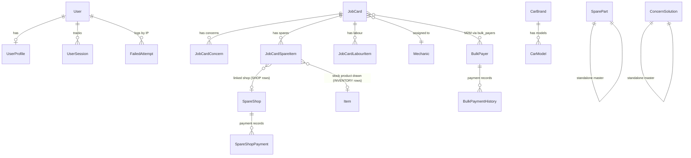
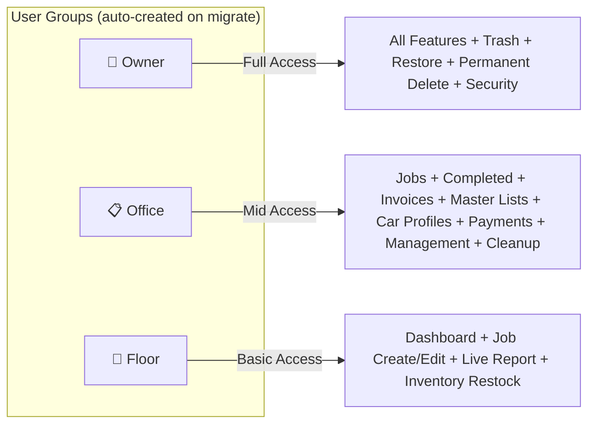
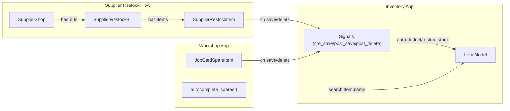
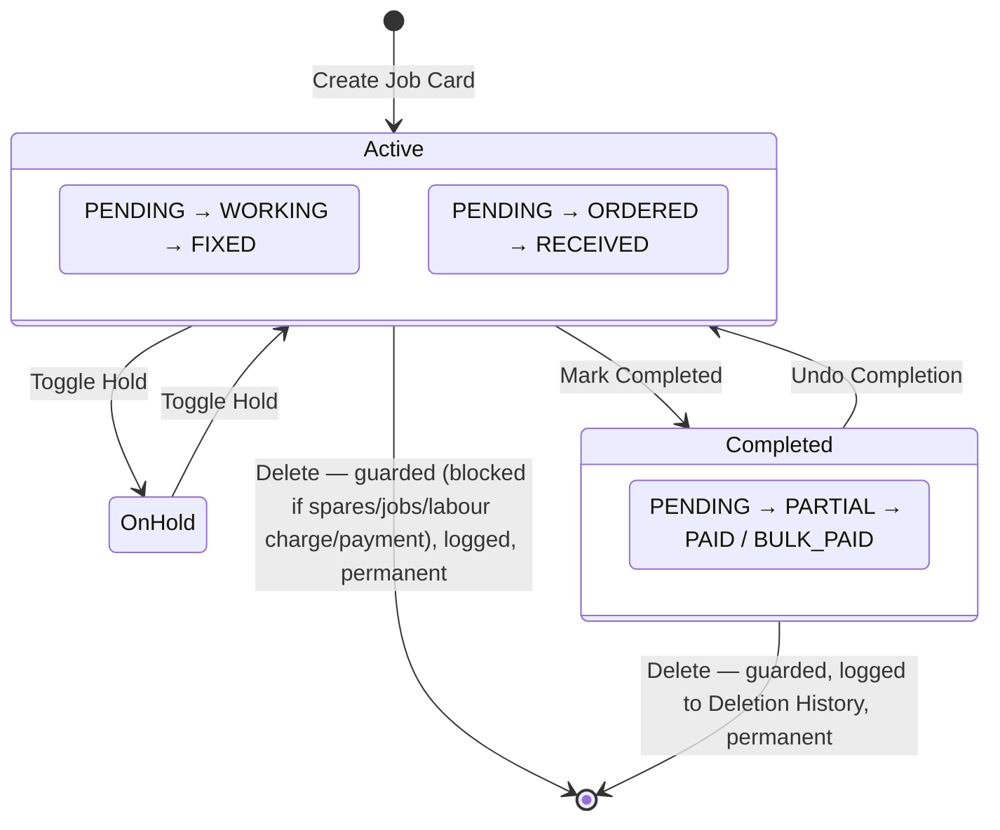
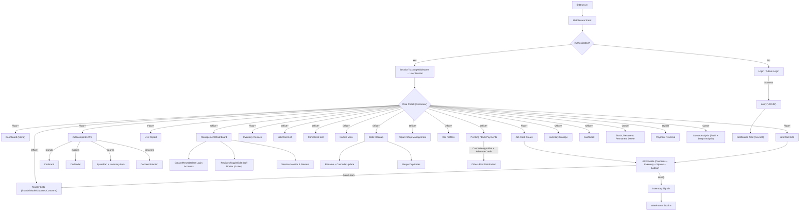

# 🏗️ WorkshopOS (Titan) — SUPER MASTER BLUEPRINT

> **Project**: WorkshopOS (Titan) · Django project package name `formulad_workshop`
> **Framework**: Django 5.2 · Python 3.13 · **PostgreSQL** in development *and* production (development on Neon, production on Railway's own Postgres alongside the app; SQLite retained only for bulk dummy-data seeding and the test suite)
> **Apps**: `workshop` (core) + `inventory` (warehouse)
>
> **Every count in this file is re-derived from the code** — the suite built with
> Django's runner, routes walked from the resolver, files listed from disk.
>
> ⚠ **These numbers drift.** They have gone stale several times, always in the same
> way: a feature lands and the tables are not recounted. Before relying on one, run
> the counter — `DiscoverRunner(verbosity=0).build_suite(['workshop','inventory']).countTestCases()`
> for tests, `get_resolver()` walked recursively for routes, `find` for files.
> Grepping `def test_` undercounts, because it cannot see tests inherited from
> shared base classes.
>
> This is the **technical reference** doc — exact model/route/template/admin/test counts and structure. For workflow narrative see `OPERATIONAL_BLUEPRINT.md`; for mission, status, and roadmap see `TITAN_MASTER_HANDOVER.md`; for day-to-day coding conventions see `CLAUDE.md`.

---

## 1. HIGH-LEVEL ARCHITECTURE

```mermaid
graph TB
    subgraph DJANGO["Django Project: formulad_workshop"]
        SETTINGS["settings/ (base, dev, prod)"]
        ROOT_URLS["Root urls.py"]
    end

    subgraph WORKSHOP["Workshop App (Core)"]
        W_MODELS["models.py — 30 Models"]
        W_VIEWS["views/ — 18 Module Package"]
        W_ANALYSIS["analysis_views.py + analysis_engine.py — Owner Profit & Insights"]
        W_AUTH["auth_views.py — Auth Views"]
        W_MGMT["management_views.py — Management Views"]
        W_CASH["cashbook_views.py — 4 Cashbook Views"]
        W_CLEAN["cleanup_views.py — 5 Views"]
        W_URLS["urls.py — 123 URL Patterns"]
        W_FORMS["forms.py — 12 Forms + 7 Formsets"]
        W_DECO["decorators.py — 3 RBAC Guards"]
        W_MID["middleware.py — Session / NoStore / NoIndex"]
        W_TAGS["templatetags — 13 Filters"]
        W_ADMIN["admin.py — 10 Registered"]
        W_CMD["Commands — 11 management commands"]
        W_TPL["Templates — 83 HTML Files"]
    end

    subgraph INVENTORY["Inventory App (Warehouse + Supplier Shops)"]
        I_MODELS["models.py — 8 Models"]
        I_VIEWS["views.py + views_suppliers.py — 33 Views"]
        I_URLS["urls.py — 33 URL Patterns"]
        I_SIGNALS["signals.py — 8 Signal Handlers (3 groups)"]
        I_ADMIN["admin.py — 8 Registered"]
        I_TPL["Templates — 20 HTML Files"]
    end

    subgraph EXTERNAL["External Services"]
        MAIL["Password-reset codes — SMTP in dev, Resend HTTPS API in production"]
        WPUSH["Web Push — browser vendors' push services (CRITICAL events only)"]
    end

    ROOT_URLS -->|"/"|  W_URLS
    ROOT_URLS -->|"/inventory/"| I_URLS
    ROOT_URLS -->|"/admin/"| DJANGO_ADMIN["Django Admin"]

    I_SIGNALS -->|"Auto Stock Sync"| W_MODELS
    W_VIEWS -->|"Autocomplete API"| I_MODELS
    W_AUTH --> MAIL
    W_MODELS -->|"queue_push, on_commit"| WPUSH
```

> The application makes exactly **two** kinds of outbound network call — the
> password-reset email and Web Push — and both are optional: a deploy with no
> `RESEND_API_KEY` or no `VAPID_*` keys is valid, and neither sits on the request
> path (push hands off to a background thread via `transaction.on_commit`).

---

## 2. DATABASE MODELS — COMPLETE MAP

### Workshop App Models (30)


```mermaid
erDiagram
    User ||--o| UserProfile : "has"
    User ||--o{ UserSession : "tracks"
    User ||--o{ FailedAttempt : "logs by IP"

    JobCard ||--o{ JobCardConcern : "has concerns"
    JobCard ||--o{ JobCardSpareItem : "has spares"
    JobCard ||--o{ JobCardLabourItem : "has labour"
    JobCard }o--|| Mechanic : "assigned to"
    JobCard }o--o{ BulkPayer : "M2M via bulk_payers"

    JobCardSpareItem }o--o| SpareShop : "linked shop (SHOP rows)"
    JobCardSpareItem }o--o| Item : "stock product drawn (INVENTORY rows)"

    CarBrand ||--o{ CarModel : "has models"

    BulkPayer ||--o{ BulkPaymentHistory : "payment records"
    SpareShop ||--o{ SpareShopPayment : "payment records"

    SparePart ||--|| SparePart : "standalone master"
    ConcernSolution ||--|| ConcernSolution : "standalone master"
```

| # | Model | Key Fields | Purpose |
|---|-------|--------|---------|
| 1 | **UserProfile** | user (1:1→User), mobile_number (unique, nullable) | Alternative login identifier. Password-reset codes go to `User.email`, not here |
| 2 | **FailedAttempt** | ip_address (unique), failures, last_attempt | IP-based brute-force lockout |
| 3 | **UserSession** | user (FK→User), session_key (unique), ip, user_agent, last_activity | Live device monitoring & remote revoke |
| 4 | **Notification** | recipient (FK→User), event, severity, title, body, url, actor (FK→User), object_type, object_id, created_at, read_at | In-app feed behind the nav bell. **One row per recipient** (fan-out on write) so the unread count is one indexed query. **Deliberately no FK to its subject** — most events announce a deletion and a FK would cascade the notice away with it; `object_type`/`object_id` are a soft reference and `body` carries a frozen label. Catalogue and the single `notify()` entry point live in `workshop/notifications.py`. Read rows are swept after 14 days; unread are kept forever. |
| 5 | **PushSubscription** | user (FK→User), endpoint (unique), p256dh, auth, user_agent, created_at, last_success, failure_count | One browser's Web Push permission — **per device, not per user**, so revoking on a phone doesn't silence a laptop. `endpoint` is the push service's URL for that browser; a reinstall or permission reset yields a *new* one, which is why dead rows accumulate and are reaped (404/410 → deleted on sight, other errors after `MAX_FAILURES`). `p256dh`/`auth` are the browser's own public key material, not our secrets. Sending lives in `workshop/push.py`. |
| 6 | **AccountLockout** | user (1:1→User), failures, last_attempt | Per-account sign-in lockout: 5 failures / 15 min. The primary control; `FailedAttempt` (by IP, limit 20) is only a backstop. Counting solely by IP locked the whole workshop out whenever one person fumbled, since every device shares one connection. |
| 7 | **PasswordResetOTP** | user (FK→User), code_hash (SHA-256), created_at, expires_at, attempts, used_at, requested_ip | Emailed 6-digit reset code, Owners only. 10-min expiry, single use, 5 attempts, 60s resend cooldown, 3/hour — all counted per account **in the DB**, since a session counter is cleared with the cookies. The code itself is never stored. See CLAUDE.md for why this is a code and not Django's built-in reset link. |
| 8 | **Mechanic** | name (unique), role (Mechanic/Assistant Mechanic/Office Staff/General Helper, default Mechanic), is_active, created_at | Workshop staff roster ("Staff Registration" in the UI — model/table name kept for continuity, see CLAUDE.md). Only Mechanic/Assistant Mechanic roles are selectable as a Job Card's `lead_mechanic`. |
| 9 | **CarBrand** | name (unique), logo_image, created_at | Master list for autocomplete |
| 10 | **CarModel** | brand (FK→CarBrand), name, created_at | Master list, unique_together(brand,name) |
| 11 | **SparePart** | name (unique), created_at | Master list for autocomplete |
| 12 | **ConcernSolution** | concern (text), created_at | Knowledge base for autocomplete |
| 13 | **SpareShop** | name (unique), phone, address, is_trashed | Master list of spare parts suppliers |
| 14 | **JobCard** | bill_number, dates, vehicle info, customer, **notes**, financials, status flags | **Core entity** — full lifecycle. `notes` (migration `0069_jobcard_notes`) is an internal line for the workshop, declared field-for-field like `Estimate.notes` and **never printed** on the invoice. |
| 15 | **JobCardConcern** | job_card (FK), concern_text, status (PENDING/WORKING/FIXED) | Per-job concerns |
| 16 | **JobCardSpareItem** | job_card (FK), part name, qty, **source** (SHOP/INVENTORY), **item** (FK→inventory.Item, PROTECT), unit_price (cost/unit), total_price (customer), **customer_rate** (customer price/unit, optional), shop (FK→SpareShop), order tracking, **original_vehicle_info** (free-text "Ordered For" note) | Per-job parts, both routes. `source` records which route and is **never inferred** — added with `item`/`customer_rate` (migration `0060_jobcardspareitem_customer_rate_jobcardspareitem_item_and_more`). Ordering fields (status/ordered_date/received_date/shop) apply to SHOP rows only. `original_vehicle_info` (since migration 0039) names the car an UNASSIGNED purchase was bought for — stamped automatically when a spare is moved out of a job card, and typed by hand on the Unassigned Hub. Free text with no FK by design: a part is usually ordered before there is a job card to attach it to |
| 17 | **JobCardLabourItem** | job_card (FK), job_description, ~~amount~~ | What was done. A DESCRIPTION, not a price — the charge for all the work is `JobCard.labour_amount`. `amount` is dormant (the old per-line column, summed into the card by migration 0066, no longer written or read). |
| 17a | **JobCardPhoto** | **id (UUID pk)**, job_card (FK, null), spare (FK→JobCardSpareItem, null), taken_at, taken_by (FK→User), byte_size | A photograph of the car (`job_card` set) or of one part (`spare` set) — exactly one, enforced by `clean()`. Migration `0070_jobcard_photos`. The UUID **is** the storage key (derived by `photos.object_key`, never stored). Bytes live in Cloudflare R2 and never pass through Django. Nothing points AT this table: no column on JobCard, no money, no stock, nothing in `analysis_engine.py` or `invoice.py`. Limits 10 per car / 4 per spare, enforced in the view. |
| 17b | **OrphanedPhotoBlob** | storage_key (unique), created_at, attempts | Storage keys whose rows are gone, awaiting `sweep_photo_blobs`. Written in the same transaction as a photo delete so a key cannot be lost between the two — a DELETE to R2 is a network call and never runs on the request path. |
| 18 | **BulkPayer** | customer_name (unique), job_cards (M2M→JobCard), advance_balance, is_trashed | Group for fleet/repeat customers. **UI label: "Fleet Account"** — cosmetic only, model/field/URL names unchanged |
| 19 | **BulkPaymentHistory** | bulk_payer (FK), amount, method, jobs_affected, details (JSON: `{jobs, advance_used, advance_stored}`) | Audit trail for bulk payments, precise reversal |
| 20 | **SpareShopPayment** | shop (FK→SpareShop), amount, method, note, is_trashed | Ledger payment record |
| 21 | **CashbookEntry** | entry_type, category, amount, method, date | Daily expense & income ledger |
| 22 | **DeletionLog** | entity_type, entity_label, amount, snapshot (JSON), reason, deleted_by (FK→User), deleted_at | Read-only audit of every permanent deletion — the **Deletion History**. Written via `DeletionLog.record(...)` immediately before each hard-delete, inside the same atomic block. `entity_type` covers Job Card, Fleet/Spare-Shop/Supplier payments, Restock Bill, Cashbook Entry and **Inventory Product**. No restore. |
| 23 | **SalaryAdvance** | staff (FK→Mechanic), amount, date, note, created_by | A cash advance handed to a staff member, recorded the day it happens. Never flagged "used" — a settlement re-sums whichever advances fall inside its month, so re-settling recomputes cleanly. |
| 24 | **SalaryPayment** | month (unique, always the 1st), created_by, created_at/updated_at | One row per calendar month once that month's salary is settled. A row existing *is* the "settled" flag. `total_amount` sums its lines. |
| 25 | **SalaryPaymentLine** | payment (FK), staff (FK→Mechanic), salary_used, leave_days, advance_used, net_amount — unique per (payment, staff) | One staff member's **frozen** figures for that month. Written once and never recalculated, so a later pay rise cannot rewrite a month already paid. |
| 26 | **Estimate** | estimate_number (unique, auto `EST-26-001`), date, customer/vehicle (all free text), **car_color/car_color_other**, labour_amount, total_amount (denormalized), notes, created_by | A **quotation**, connected to nothing — no job card, no stock, no ledger, no report. Migrations (`0067_estimate_estimatejobline_estimatepartline_and_more`, `0068_estimate_car_color_estimate_car_color_other`). Colour uses the shared `CAR_COLOR_CHOICES`/`CAR_COLOR_HEX`, is picked with the shared `_car_color_picker.html`, and is drawn as the stripe on each history row — never printed on the quotation. `total_amount` is written only by `update_totals()`, called explicitly by the views; there are no signals on any of these three models. |
| 27 | **EstimateJobLine** | estimate (FK), description | One line of work being quoted. **No money column at all** — the charge lives once on `Estimate.labour_amount`, same rule as `JobCard.labour_amount`. |
| 28 | **EstimatePartLine** | estimate (FK), name, quantity, **customer_rate**, **amount** | One quoted part. Note the naming is the OPPOSITE of `JobCardSpareItem`: an estimate has no cost side, so both figures are customer prices. `amount = customer_rate × quantity` is enforced on save when a rate is set. |

Salary models (migration `0054_mechanic_current_salary_and_more`, which also added `Mechanic.current_salary`). Wage cost for a settled month is `net_amount + advance_used` — the advance already left the drawer and the settlement pays the remainder.

`advance_balance` (added migration `0047_bulkpayer_advance_balance`) tracks credit carried forward when a lump-sum Fleet Account payment exceeds the total currently owed; `total_balance` can legitimately go negative once this credit exists.

### Inventory App Models (8)

| # | Model | Key Fields | Purpose |
|---|-------|--------|---------|
| 1 | **Category** | name | Groups inventory items |
| 2 | **Item** | category (FK), name, average_stock, current_stock, usage_count, **avg_cost** | Warehouse part with stock levels. `current_stock` may be **negative** (an overdraw awaiting its supplier bill — deliberate, see CLAUDE.md). `avg_cost` is the weighted-average purchase cost per unit, (migration `inventory/0008_item_avg_cost`), maintained only by restock receipts via a full replay in `inventory/costing.py` |
| 3 | **ConsumptionRecord** | user (FK→User), item (FK→Item), quantity, date, timestamp | **Dormant** — superseded by Stock History, which reads `JobCardSpareItem` live. Nothing writes this model; kept only to avoid a needless migration |
| 6 | **SupplierShop** | name (unique), phone, total_billed_amount, total_paid_amount, is_active | Supplier / Supplies Shop master record |
| 7 | **ShopCatalogItem** | shop (FK→SupplierShop), item (FK→Item), is_active, unique_together(shop,item) | Links a supplier to the items they stock; `is_active=False` = deactivated (listed but excluded from restock bills) |
| 8 | **SupplierRestockBill** | supplier (FK→SupplierShop), bill_date, total_amount, discount_amount, note | Individual restock purchase from a supplier |
| 9 | **SupplierRestockItem** | bill (FK→SupplierRestockBill), item (FK→Item), quantity, total_price (+ `per_unit_price` property) | Line item on a restock bill. There is no `unit_price` **column** — per-unit cost is derived as `total_price / quantity`. This is the per-batch cost record that makes a future FIFO reconstruction possible |
| 10 | **SupplierPayment** | supplier (FK→SupplierShop), amount, payment_method, date, note, is_trashed | Payment record for supplier accounts |

---

## 3. SECURITY & ACCESS CONTROL

### 3.1 Three User Roles (RBAC)


```mermaid
graph LR
    subgraph ROLES["User Groups (auto-created on migrate)"]
        OWNER["👑 Owner"]
        OFFICE["📋 Office"]
        FLOOR["🔧 Floor"]
    end

    OWNER -->|"Full Access"| ALL["All Features + Trash + Restore + Permanent Delete + Security"]
    OFFICE -->|"Mid Access"| MID["Jobs + Completed + Invoices + Master Lists + Car Profiles + Payments + Management + Cleanup"]
    FLOOR -->|"Basic Access"| LOW["Dashboard + Job Create/Edit + Live Report + Inventory Restock"]
```

| Decorator | Roles Allowed | Used On |
|-----------|---------------|---------|
| `@staff_required` | Floor + Office + Owner | Dashboard, Job Create/Edit/Detail, Live Report, Autocomplete, `concern_edit`, **the entire Inventory app** (stock, categories, items, low-stock, history) **and the entire Supplier-Shops module** (bills, payments, catalog — see access-asymmetry note in `OPERATIONAL_BLUEPRINT.md` §5B) |
| `@office_required` | Office + Owner | Job List, Job Delete, Completed, Invoices, Master Lists (except `concern_edit`), Car Profiles, Management, Cleanup, Cashbook, Pending Payments, Spare Shops (non-destructive), Bulk Payer create/detail/pay |
| `@owner_required` | Owner only | Paid Bills, Audits (high-discount), **Deletion History** (read-only), Owner Analysis, Session Terminate |

> Deletion/deactivation actions (job-card delete, Fleet/Shop/Supplier payment delete, account deactivate/reactivate) are **`@office_required`** (Owner + Office) — Office fixes its own entry mistakes, with the guard + Owner-only Deletion History providing the safety net. Only *reading* the Deletion History is Owner-only.

Superusers pass every check regardless of group membership. For the human-readable "who can do what" breakdown, see `OPERATIONAL_BLUEPRINT.md` §2.

### 3.2 Auth System

| Feature | Implementation |
|---------|---------------|
| **Login** | `/login/` — the one door, for every role. Office/Floor by username; **Owners by email address only** (`resolve_login_identifier`). `/admin-login/` redirects here, kept alive for the owners' bookmarks |
| **Legacy owner door** | `/admin-login/` — now a `RedirectView` to `/login/`, carrying `?next=` across. Kept for the owners' bookmarks and existing `reverse('admin_login')` calls |
| **IP Lockout** | 5 failures → 15 min block via `FailedAttempt`, keyed on `REMOTE_ADDR` only |
| **Security Alerts** | On every login → a `LOGIN` notification to the *other* owners, read from the nav bell. The bell is the only alert channel |
| **Change Password** | `/change-password/` — signed-in Owner sets a new password. No email. Entry point is the drawer account panel; Office/Floor have no self-service path (owners manage those from Control Hub) |
| **Forgot Password** | `/forgot-password/` (username, email, or mobile) → 6-digit code **emailed** → `/reset-password/`. Owners only — Office/Floor carry no email and have no self-service path. The code is emailed, never sent over any other channel |
| **OTP Authentication** | 6-digit, 5-min expiry, 3 attempts max, 60s cooldown |
| **Session Tracking** | `SessionTrackingMiddleware` updates `UserSession`, throttled to a 5-minute cooldown per session |
| **Remote Revoke** | Owners can terminate any session from the management dashboard |
| **40-day Sessions** | `SESSION_COOKIE_AGE = 3,456,000` seconds |

### 3.3 Notification Channels

```
Any event → workshop/notifications.py :: notify(event, body, actor=…)
              ├─→ resolve audience (Owner group, minus the actor)
              └─→ one Notification row per recipient
                    └─→ nav bell → /notifications/
```

The event catalogue is the `EVENTS` dict in `workshop/notifications.py` —
fourteen entries, one screen. **Never call `Notification.objects.create()` from
a view.**

**Ten of the fourteen are CRITICAL and also push to a phone**; the other four
(`LOGIN`, `ACCOUNT_ARCHIVED`, `SALARY_ADVANCE`, `SALARY_SETTLED`) are INFO and wait
in the bell. Push is a *delivery layer* over rows that are already written, never a
parallel system — see §II.5 of `TITAN_MASTER_HANDOVER.md`.

Two of the fourteen break the "minus the actor" rule in the diagram above, and
deliberately: `RESET_CODE_LIMIT` and `RESET_CODE_ATTEMPTS_SPENT` are raised from the
*unauthenticated* password-reset form, so there is no actor to exclude and they reach
**both** owners including the one being targeted. They are also the only events
passed through `recently_raised()`, which caps them at one per account per hour — a
form that needs no login would otherwise be a doorbell anyone could hold down. See
`CLAUDE.md` for the full rule, including why the visitor's response must stay
byte-identical.

---

## 4. ALL URL ROUTES — COMPLETE (156 Total)

*Walked from `get_resolver().url_patterns` recursively and
excluding Django admin (131 of its own) — the method below, not by grepping
`path(`, which misses routes reached through `include()`. **Recount rather than
trusting this line; it has now gone stale twice**, most recently reading 147/114
when the resolver said 150/117. The workshop figure includes the root-level
routes (`robots.txt`, `sw.js`, media) since they are served by the same app.*

### Workshop App (123 routes)

| Section | URL Pattern | View | Access |
|---------|-------------|------|--------|
| **HOME** | `/` | `home` | Staff |
| | `/jobcards/create/` | `jobcard_create` | Staff |
| **JOBS** | `/jobcards/` | `jobcard_list` | Office |
| | `/jobcards/live-report/` | `live_report` | Staff (operations board inside it: Office/Owner) |
| | `/jobcards/<pk>/` | `jobcard_detail` (read-only) | **Office** |
| | `/jobcards/<pk>/edit/` | `jobcard_edit` | Staff |
| | `/jobcards/<pk>/delete/` | `jobcard_delete` | Office |
| **COMPLETED** | `/completed/` | `completed_list` | Office |
| | `/jobcards/<pk>/complete/` | `mark_completed` | Floor + Office + Owner |
| | `/jobcards/<pk>/undo-complete/` | `undo_completed` | Office |
| | `/jobcards/<pk>/toggle-hold/` | `toggle_hold` | Floor + Office + Owner |
| | `/jobcards/<pk>/update-bill/` | `update_bill_status` | Office |
| **DELETION HISTORY** | `/deletion-history/` | `deletion_history_list` (read-only) | Owner |
| | `/deletion-history/<pk>/` | `deletion_history_detail` (read-only) | Owner |
| **PENDING PAYMENTS** | `/pending-payments/` | `pending_payments_list` | Office |
| **PAID BILLS** | `/paid-bills/` | `paid_bills_list` | Office (last 7 days, no grand total) + Owner (full) |
| **BULK PAYERS ("Fleet Account" in UI)** | `/pending-payments/bulk-payers/` | `bulk_payer_list` | Office |
| | `/pending-payments/bulk-payers/create/` | `bulk_payer_create` | Office |
| | `/pending-payments/bulk-payers/<pk>/` | `bulk_payer_detail` | Office |
| | `/pending-payments/jobcards/move-to-bulk/` | `move_jobcard_to_bulk` | Office |
| | `/pending-payments/bulk-payers/<pk>/remove-card/` | `bulk_payer_remove_card` | Office |
| | `/pending-payments/bulk-payers/<pk>/pay/` | `bulk_payer_pay` | Office |
| | `/pending-payments/bulk-payers/<pk>/delete/` | `bulk_payer_delete` (deactivate/archive) | Owner+Office |
| | `/pending-payments/bulk-payers/<pk>/history/<hpk>/delete/` | `bulk_payment_history_delete` (reverse + log + hard-delete) | Owner+Office |
| | `/pending-payments/bulk-payers/archived/` | `bulk_payer_archived` | Owner+Office |
| | `/pending-payments/bulk-payers/<pk>/restore/` | `bulk_payer_restore` (reactivate) | Owner+Office |
| **AUDITS** | `/audits/high-discounts/` | `audit_high_discounts` | Owner |
| **SPARE SHOPS** | `/spare-shops/` | `spare_shop_list` | Office |
| | `/spare-shops/create/` | `spare_shop_create` | Office |
| | `/spare-shops/unassigned/` | `unassigned_spares_hub` | Floor (add-only, no prices) + Office + Owner |
| | `/spare-shops/unassigned/add/` | `unassigned_spare_add` (strips price for Floor) | Floor + Office + Owner |
| | `/spare-shops/<pk>/` | `spare_shop_detail` | Office |
| | `/spare-shops/<pk>/edit/` | `spare_shop_edit` | Office |
| | `/spare-shops/<pk>/pay/` | `spare_shop_pay` | Office |
| | `/spare-shops/<shop_pk>/payment/<payment_pk>/reverse/` | `spare_shop_payment_reverse` (log + hard-delete) | Owner+Office |
| | `/spare-shops/archived/` | `spare_shop_archived` | Owner+Office |
| | `/spare-shops/<pk>/delete/` | `spare_shop_delete` (deactivate/archive) | Owner+Office |
| | `/spare-shops/<pk>/restore/` | `spare_shop_restore` (reactivate) | Owner+Office |
| | `/spare-shops/<pk>/print/` | `spare_shop_print` | Office |
| | `/spare-shops/<pk>/add-unassigned/` | `spare_shop_add_unassigned` | Office |
| | `/spare-shops/items/<item_pk>/unassign/` | `spare_shop_unassign_item` | Office |
| | `/spare-shops/items/<item_pk>/update-price/` | `spare_shop_update_item_price` | Office |
| | `/spare-shops/items/<item_pk>/edit/` | `unassigned_spare_edit` | Office |
| | `/spare-shops/items/<item_pk>/delete/` | `spare_shop_delete_unassigned` (log + hard-delete) | Office |
| **MASTER LISTS** | `/master-lists/` | `master_lists_home` | Office |
| | `/master-lists/brands/` | `brand_list` | Office |
| | `/master-lists/brands/add/` | `brand_create` | Office |
| | `/master-lists/brands/<pk>/edit/` | `brand_edit` | Office |
| | `/master-lists/brands/<pk>/delete/` | `brand_delete` | Office |
| | `/master-lists/brands/<id>/models/` | `brand_model_list` | Office |
| | `/master-lists/models/add/` | `model_create` (fallback route) | Office |
| | `/master-lists/brands/<id>/models/add/` | `model_create` (context-aware route) | Office |
| | `/master-lists/models/<pk>/edit/` | `model_edit` | Office |
| | `/master-lists/models/<pk>/delete/` | `model_delete` | Office |
| | `/master-lists/spares/` | `spare_list` | Office |
| | `/master-lists/spares/add/` | `spare_create` | Office |
| | `/master-lists/spares/<pk>/edit/` | `spare_edit` | Office |
| | `/master-lists/concerns/` | `concern_list` | Office |
| | `/master-lists/concerns/add/` | `concern_create` | Office |
| | `/master-lists/concerns/<pk>/edit/` | `concern_edit` | Staff |
| **AUTOCOMPLETE** | `/api/autocomplete/brands/` | `autocomplete_brands` | Staff |
| | `/api/autocomplete/models/` | `autocomplete_models` | Staff |
| | `/api/autocomplete/spares/` | `autocomplete_spares` | Staff |
| | `/api/autocomplete/concerns/` | `autocomplete_concerns` | Staff |
| | `/api/autocomplete/inventory-items/` | `autocomplete_inventory_items` | Staff |
| | `/api/spare-price-hint/` | `spare_price_hint` | **Office** — it returns a price, and Floor sees no prices anywhere |
| **CAR PROFILES** | `/car-profiles/` | `car_profile_list` | Office |
| | `/car-profiles/<reg>/` | `car_profile_detail` | Office |
| **INVOICE** | `/invoice/<pk>/` | `invoice_view` | Office |
| **ESTIMATES** | `/estimates/` | `estimate_list` | Office |
| | `/estimates/create/` | `estimate_create` | Office |
| | `/estimates/<pk>/` | `estimate_print` | Office |
| | `/estimates/<pk>/edit/` | `estimate_edit` | Office |
| | `/estimates/<pk>/delete/` | `estimate_delete` | Office |
| **AUTH** | `/login/` | `login_view` | Public |
| | `/admin-login/` | `RedirectView` → `login` | Public |
| | `/change-password/` | `change_password_view` | Owner |
| | `/forgot-password/` | `owner_forgot_password_view` | Public |
| | `/reset-password/` | `owner_reset_password_view` | Public |
| | `/logout/` | Django `LogoutView` | Auth'd |
| **MANAGEMENT** | `/manage/` | `manage_dashboard` | Owner |
| | `/manage/create-user/` | `manage_create_user` | Owner |
| | `/manage/users/<id>/reset-password/` | `manage_reset_password` | Owner |
| | `/manage/users/<id>/delete/` | `manage_delete_user` | Owner |
| | `/manage/users/<id>/unlock/` | `manage_unlock_account` | Owner |
| | `/manage/mechanics/create/` | `manage_create_mechanic` | Owner |
| | `/manage/mechanics/<id>/toggle/` | `manage_toggle_mechanic` | Owner |
| | `/manage/mechanics/<id>/edit/` | `manage_edit_mechanic` | Owner |
| | `/manage/sessions/<id>/terminate/` | `manage_terminate_session` | Owner |
| **CASHBOOK** | `/cashbook/` | `cashbook_view` | Office |
| | `/cashbook/add/` | `add_cashbook_entry` | Office |
| | `/cashbook/<id>/delete/` | `delete_cashbook_entry` | Office |
| | `/cashbook/<id>/edit/` | `edit_cashbook_entry` | Office |
| **ANALYSIS** | `/analysis/` | `analysis_dashboard` (Profit) | Owner |
| | `/analysis/insights/` | `analysis_insights` (Deep Analysis shell) | Owner |
| | `/analysis/insights/<section>/` | `analysis_insight_section` (AJAX partial) | Owner |
| **SALARY & ADVANCE** | `/salary-advance/` | `salary_advance_home` | Office |
| | `/salary-advance/add/` | `salary_advance_add` | Office |
| | `/salary-advance/<id>/delete/` | `salary_advance_delete` | Office |
| | `/salary-advance/staff/<id>/` | `salary_advance_staff_detail` | Office |
| | `/salary-advance/staff/<id>/set-salary/` | `salary_set_amount` | Office |
| | `/salary-advance/payment/<year>/<month>/` | `salary_payment_form` | Office |
| | `/salary-advance/payment/<id>/delete/` | `salary_payment_delete` | **Owner** |
| **PHOTOS** | `/photos/sign/` | `photo_sign` | Staff |
| | `/photos/commit/` | `photo_commit` | Staff |
| | `/photos/list/` | `photo_list` | Staff |
| | `/photos/delete/` | `photo_delete` | Staff |
| **CLEANUP** | `/manage/cleanup/` | `data_cleanup_view` | Office |
| | `/manage/cleanup/spare/<id>/delete/` | `cleanup_delete_spare` | Office |
| | `/manage/cleanup/spare/<id>/rename/` | `cleanup_rename_spare` | Office |
| | `/manage/cleanup/concern/<id>/delete/` | `cleanup_delete_concern` | Office |
| | `/manage/cleanup/concern/<id>/rename/` | `cleanup_rename_concern` | Office |

*`manage_terminate_session` is secured with `@owner_required`.*

### Inventory App (33 routes under `/inventory/`)

**Access:** all 33 inventory routes (core inventory *and* supplier shops) are `@staff_required` — Floor + Office + Owner. There are no Office-only or Owner-only inventory routes. See the access-asymmetry note in `OPERATIONAL_BLUEPRINT.md` §5B regarding Floor access to supplier financial records.

| URL | View | Purpose |
|-----|------|---------|
| `/` | `inventory_home` | Entry point (redirects to stock list) |
| `/manage/` | `inventory_manage` | **Manage Database** — read-only Category browser; add/list/edit categories only (Office/Owner) |
| `/category/<id>/` | `category_detail` | Read-only: products + shop(s) in a category (Office/Owner) |
| `/category/add/` | `add_category` | Create category (Office/Owner) |
| `/category/edit/<id>/` | `edit_category` | Rename category (Office/Owner) |
| `/category/delete/<id>/` | `delete_category` | Delete category — **only while it holds no products** (Office/Owner) |
| `/list/` | `inventory_list` | Stock level dashboard (Floor+) |
| `/low-stock/` | `inventory_low_stock` | Items below 25% threshold — **read-only** (Floor+) |
| `/history/` | `consumption_history` | **Stock History** — live consumption log, This/Last week (Floor+) |
| `/history/mechanic/<id>/` | `inventory_history_mechanic` | Per-mechanic consumption totals (Floor+) |
| **SUPPLIER SHOPS** (all `@office_required` — Office/Owner) | | |
| `/shops/` | `supplier_shop_list` | All supplier shops dashboard |
| `/shops/deactivated/` | `deactivated_supplier_shop_list` | View deactivated suppliers |
| `/shops/add/` | `add_supplier_shop` | Create new supplier |
| `/shops/<id>/` | `supplier_shop_detail` | Supplier detail with bills & payments |
| `/shops/<id>/edit/` | `edit_supplier_shop` | Edit supplier details |
| `/shops/<id>/deactivate/` | `deactivate_supplier_shop` | Soft-deactivate supplier |
| `/shops/<id>/activate/` | `activate_supplier_shop` | Re-activate supplier |
| `/shops/<id>/catalog/add/` | `add_shop_catalog_item` | **Add Product** (creates the item; requires Average Stock) |
| `/shops/<id>/catalog/<item_id>/remove/` | `remove_shop_catalog_item` | Remove (deactivates instead if it has bill history) |
| `/shops/<id>/catalog/<item_id>/edit/` | `edit_catalog_item` | Edit product name + Average Stock |
| `/shops/<id>/catalog/<item_id>/deactivate/` | `deactivate_catalog_item` | Deactivate catalog entry |
| `/shops/<id>/catalog/<item_id>/reactivate/` | `reactivate_catalog_item` | Reactivate catalog entry |
| `/shops/<id>/restock/` | `shop_restock_select` | Select items for restock bill |
| `/shops/<id>/restock/bill/` | `shop_restock_bill` | Create restock bill |
| `/shops/<id>/bill/<bill_id>/edit/` | `edit_restock_bill` | Edit existing restock bill |
| `/shops/<id>/bill/<bill_id>/delete/` | `delete_restock_bill` | Delete restock bill (reverses stock + logs to Deletion History) |
| `/shops/<id>/bill/<bill_id>/discount/` | `update_bill_discount` | Update bill discount |
| `/shops/<id>/payment/add/` | `add_shop_payment` | Record payment to supplier |
| `/shops/<id>/payment/<payment_id>/delete/` | `delete_shop_payment` | Delete payment (recomputes balance + logs to Deletion History) |
| `/shops/<id>/bills/ajax/` | `ajax_supplier_bills` | AJAX: paginated bills list |
| `/shops/<id>/payments/ajax/` | `ajax_supplier_payments` | AJAX: paginated payments list |
| `/item/<item_id>/suppliers/` | `inventory_item_suppliers` | View all suppliers for an item |

> Note: this table replaces an earlier version whose URL prefixes (`/suppliers/...`) didn't match the actual code (`/shops/...`) — if you have an old copy of this doc bookmarked or cached, discard it.

---

## 5. CROSS-APP CONNECTIONS


```mermaid
graph LR
    subgraph WORKSHOP["Workshop App"]
        JCS["JobCardSpareItem"]
        AC["autocomplete_spares()"]
    end

    subgraph INVENTORY["Inventory App"]
        ITEM["Item Model"]
        SIG["Signals (pre_save/post_save/post_delete)"]
    end

    JCS -->|"on save/delete"| SIG
    SIG -->|"auto-deduct/restore stock"| ITEM
    AC -->|"search Item.name"| ITEM

    subgraph SUPPLIER["Supplier Restock Flow"]
        SS["SupplierShop"]
        RB["SupplierRestockBill"]
        RI["SupplierRestockItem"]
    end

    SS -->|"has bills"| RB
    RB -->|"has items"| RI
    RI -->|"on save/delete"| SIG
```

Stock is synced by **8 signal handlers in 3 groups** (`inventory/signals.py`):

**Group 1 — Workshop Consumption (`JobCardSpareItem`, 3 handlers):**
Applies to **`source='INVENTORY'` rows only**, resolved by the `item` FK. A `source='SHOP'`
row never moves warehouse stock, whatever it is named. It previously
keyed on a `spare_part_name` ↔ `Item.name` match, which deducted the warehouse for
shop-bought parts that shared a name with a stock product.
1. **New draw added** → Deduct full qty from warehouse
2. **Qty changed** → Deduct only the delta
3. **Product corrected** → Return the old product's stock, take the new product's
4. **Draw deleted** → Return full qty to warehouse

None of these clamp at zero: stock may go negative, and that is the intended record of an
overdraw (see CLAUDE.md → Deliberate decisions).

**Group 2 — JobCard Soft-Delete Reversal (`JobCard`, 2 handlers):**
5. **Job card soft-deleted** → Return all its spares' stock to the warehouse *(dormant — job cards are hard-deleted now, so `is_deleted` never flips; kept for safety)*
6. **Job card restored** → Deduct that stock again *(dormant, same reason)*

**Group 3 — Supplier Restock (`SupplierRestockItem`, 3 handlers):**
7. **New restock item created** → Increase stock by full qty
8. **Restock qty changed** → Adjust stock by delta
9. **Restock item/bill deleted** → Reverse stock increase

---

## 6. JOB CARD LIFECYCLE


```mermaid
stateDiagram-v2
    [*] --> Active: Create Job Card
    Active --> OnHold: Toggle Hold
    OnHold --> Active: Toggle Hold
    Active --> Completed: Mark Completed
    Completed --> Active: Undo Completion
    Active --> [*]: Delete — guarded (blocked if spares/jobs/labour charge/payment), logged, permanent
    Completed --> [*]: Delete — guarded, logged to Deletion History, permanent

    state Active {
        Concerns: PENDING → WORKING → FIXED
        Spares: PENDING → ORDERED → RECEIVED
    }

    state Completed {
        Payment: PENDING → PARTIAL → PAID / BULK_PAID
    }
```

**Bill Number**: Auto-generated `JB-{YY}-{NNN}` (thread-safe with `select_for_update`)
**Financials**: Denormalized `total_bill_amount` = spares + `labour_amount`, refreshed by `update_totals()` on every spare save and explicitly by the job-card views after the labour figure is written (saving a job LINE no longer moves money)
**Payment Methods**: CASH, UPI, CARD, TRANSFER
**Dates**: All "today"/date-range logic uses `timezone.localdate()` (IST-correct), not `date.today()`.

---

## 7. TEMPLATE STRUCTURE (106 HTML Files)

### Root Templates (`templates/`) — 3 files

| File | Purpose |
|------|---------|
| `403.html` | Custom Forbidden Error |
| `404.html` | Custom Not Found Error |
| `500.html` | Custom Server Error |

### Workshop Templates (`workshop/templates/workshop/`) — 83 files

| Directory | Files | Purpose |
|-----------|-------|---------|
| `/` | `base.html`, `home.html` | Base layout with nav + redirector |
| `/salary_advance/` | `home.html`, `payment_form.html`, `payment_confirm_delete.html`, `partials/staff_advances.html` | Salary & Advance: roster with advances, month-end settlement form, Owner-only delete confirmation |
| `/analysis/` | `profit.html` | The protected Profit page: Turnover − Expenses = Profit, monthly trend, expense split, position |
| `/analysis/` | `insights.html` | Deep Analysis shell — six AJAX-loaded accordion sections |
| `/analysis/sections/` | `mechanics.html`, `spares.html`, `vehicles.html`, `fleet.html`, `shops.html`, `operations.html` (6) | One partial per Insights section, each rendered by `analysis_insight_section` |
| `/auth/` | `base_auth.html`, `login.html`, `forgot_password.html`, `reset_password.html`, `change_password.html` | 5 files — the shared shell plus 4 screens. There is one sign-in face; a second `admin_login.html` and an `otp_verify.html` were both removed with the flows they belonged to |
| `/dashboard/` | `dashboard_home.html` | Main floor dashboard with active jobs |
| `/jobcard/` | 23 files: CRUD (`jobcard_form/detail/list/confirm_delete`), `job_list_partial`, `live_report`, pending/paid bills + partials, bulk payer detail/panel/trash + bulk_payments + partial, audits (`audit_high_discounts`, `audit_deleted_bulk_payers`), unified trash + 4 tab partials | Job, payment, audit & trash screens |
| `/completed/` | `completed_list.html`, `completed_list_partial.html` | 2 completed-jobs screens |
| `/master_lists/` | 13 files across brands/models/spares/concerns (list/form/confirm_delete each) | Master list CRUD screens |
| `/car_profiles/` | `car_profile_list.html`, `car_profile_detail.html`, `car_list_partial.html` | 3 car profile screens |
| `/invoice/` | `invoice_template.html` | The printed bill. Standalone (does **not** extend `base.html`) and fully self-contained — no Bootstrap, no icon font, no CDN of any kind, so nothing external can move a column on a customer's invoice. Screen controls live outside the `.sheet` element entirely, not merely behind `display:none`. |
| `/estimate/` | `estimate_print.html`, `estimate_form.html`, `estimate_list.html`, `estimate_list_partial.html`, `estimate_confirm_delete.html` | The quotation. `estimate_print.html` is a deliberate near-twin of `invoice_template.html` — same letterhead, bands, column grid and totals block, standalone and self-contained on the same terms. It differs in what the document *is* — title `ESTIMATE`, heading `JOB NEEDS TO BE PERFORMED`, no payment chip, no settle control — and in exactly two columns: **QTY prints only what was typed** (blank stays blank, though it still counts as 1 in the maths) and **UNIT PRICE prints only when a rate was entered** (never derived). Both follow from a bill recording work that happened while an estimate describes work that has not; see `build_estimate`. **Restyle one and you must restyle both**, or the customer gets two documents that look like different businesses. |
| `/spare_shops/` | `shop_list.html`, `shop_detail.html`, `shop_print.html`, `unassigned_hub.html` | 4 spare shop screens |
| `/manage/` | `manage_dashboard.html`, `data_cleanup.html` | 2 admin screens |
| `/cashbook/` | `cashbook.html`, `cashbook_partial.html`, `_stats.html`, `_ledger.html` | The page, the AJAX response, and the two regions both of them share. `_stats` (period totals) and `_ledger` (chips + stream + pager) are the only parts a filter/search/page change replaces; the add form sits between them and is deliberately outside the swap. |
| `/includes/` | `pagination.html`, `_car_color_picker.html` | Reusable pagination component; and the ONE car-colour swatch picker, shared by the Job Card and the Estimate (markup + CSS + JS in one place, palette from `CAR_COLOR_CHOICES`) |

### Inventory Templates (`inventory/templates/inventory/`) — 20 files

| File | Purpose |
|------|---------|
| `home.html` | Redirector |
| `manage.html` | Category & item CRUD |
| `category_detail.html` | Items within category |
| `inventory_list.html` | Stock level management |
| `low_stock.html` | Critical stock alerts |
| `consumption_history.html` | Usage audit log |
| **Suppliers Directory** | |
| `suppliers/shop_list.html` | Supplier shops dashboard |
| `suppliers/shop_detail.html` | Supplier detail with bills, payments, catalog |
| `suppliers/add_shop.html` | Add new supplier form |
| `suppliers/edit_shop.html` | Edit supplier form |
| `suppliers/restock_select.html` | Select items for restock bill |
| `suppliers/restock_bill.html` | Create restock bill form |
| `suppliers/restock_bill_edit.html` | Edit existing restock bill |
| `suppliers/add_catalog_item.html` | Add item to supplier catalog |
| `suppliers/add_payment.html` | Record supplier payment |
| `suppliers/item_suppliers.html` | View all suppliers for an item |
| `suppliers/partials/bill_list_chunk.html` | AJAX partial: paginated bill list |
| `suppliers/partials/payment_list_chunk.html` | AJAX partial: paginated payment list |

---

## 8. FORMS & FORMSETS

| Form | Model | Fields |
|------|-------|--------|
| `CarBrandForm` | CarBrand | name, logo_image |
| `CarModelForm` | CarModel | brand, name |
| `SparePartForm` | SparePart | name |
| `ConcernSolutionForm` | ConcernSolution | concern |
| `SpareShopForm` | SpareShop | name, phone, address |
| `JobCardForm` | JobCard | 10 fields (dates, vehicle, customer, mechanic, color) |
| `EstimateForm` | Estimate | 9 fields (date, customer, vehicle, labour_amount, notes) |
| `EstimateJobLineForm` | EstimateJobLine | description — `required=False`, so an emptied line is deleted rather than erroring |
| `EstimatePartLineForm` | EstimatePartLine | name, quantity, customer_rate, amount — all optional; a priced row with no name is refused |

| Formset | Parent→Child | Fields | Features |
|---------|-------------|--------|----------|
| `JobCardConcernFormSet` | JobCard→Concern | concern_text, status | Autocomplete, can_delete |
| `JobCardSpareFormSet` | JobCard→Spare (`source=SHOP`) | 8 fields (name, qty, prices, shop, status, dates) | Autocomplete, can_delete. Prefix `spares` |
| `JobCardInventoryFormSet` | JobCard→Spare (`source=INVENTORY`) | 4 fields (item FK, qty, customer_rate, total_price) | Prefix `inventory`. Product **picked**, not typed — hidden `item` field carries the choice; `InventoryDrawForm.clean()` rejects a started row with no product |
| `JobCardLabourFormSet` | JobCard→Labour | job_description | can_delete. No `amount` field — deliberately: the charge lives on `JobCard.labour_amount`, and a field that does not exist cannot be posted by a Floor login. |
| `EstimateJobFormSet` | Estimate→JobLine | description | Prefix `jobs`, `extra=3`, `BlankRowIsNoRowFormSet`. No money field — the charge lives on `Estimate.labour_amount` |
| `EstimatePartFormSet` | Estimate→PartLine | name, quantity, customer_rate, amount | Prefix `parts`, `extra=3`, `BlankRowIsNoRowFormSet`. Names come from a native `<datalist>`, not the Job Card's fetch autocomplete — it needs no wiring, so a row added after page load works with nothing to re-initialise |

All forms use `BootstrapFormMixin` to auto-apply Bootstrap classes.

---

## 9. MIDDLEWARE & INFRASTRUCTURE

| Component | File | Purpose |
|-----------|------|---------|
| `SessionTrackingMiddleware` | `middleware.py` | Logs every authenticated request to `UserSession` (5-min cooldown) |
| `NoIndexMiddleware` | `middleware.py` | Sets `X-Robots-Tag: noindex, nofollow` on every response. Paired with `/robots.txt` (`Disallow: /`), which covers a different set of crawlers — one that obeys Disallow never fetches the page and so never sees the header. Neither is a security control |
| `NoStoreMiddleware` | `middleware.py` | `Cache-Control: no-store, no-cache, must-revalidate, private` (+ `Pragma`/`Expires`) on **authenticated** responses, so the back/forward cache cannot redisplay a signed-in page after logout. Must stay after `AuthenticationMiddleware` — it reads `request.user`. Static assets never reach it; WhiteNoise returns them earlier in the chain |
| `ResendEmailBackend` | `email_backend.py` | `EMAIL_BACKEND` in production. Sends via Resend's HTTPS API using stdlib `urllib` — Railway blocks outbound SMTP below the Pro plan. Only the transport differs; the reset flow is unchanged |
| `create_user_groups` | `apps.py` | Auto-creates Owner/Office/Floor groups on migrate |
| `inventory.signals` | `signals.py` | Auto stock sync — 8 handlers in 3 groups: 3 for JobCardSpareItem (consumption, `source='INVENTORY'` only) + 2 for JobCard (soft-delete stock reversal, dormant) + 3 for SupplierRestockItem (restock). Never clamps stock at zero |
| `inventory.costing` | `costing.py` | Weighted-average warehouse cost. Pure functions over a date-ordered replay of receipts and draws; holds no view logic and never touches `current_stock`. Receipts move the average, draws do not |
| Management Commands | `management/commands/` | All nine: `setup_groups` (legacy setup), `backup_db` (follows the active engine — `pg_dump` for Postgres, file copy for SQLite, keeps 14), `sync_owner_identity` (owner group/mobile/admin-access from .env into the DB), `set_owner_email` (reset-code address), `load_master_data` (brands/models/spares), `seed_dummy_data` + `seed_salary_data` (demo data), `purge_business_data` (clears every business table; the reversal of seeding), `copy_sqlite_to_postgres` (seed on SQLite, push up) |
| Custom template filters | `templatetags/custom_filters.py` | `has_group`, `is_drawer_section` (drives the nav's Manage highlight from one prefix list), `is_tomorrow`, `divide`, `multiply`, `clean_qty`/`qty`, `get_range`, `abs_value`, and the four rupee formatters — `inr` (whole rupees, Indian grouping), `inr_amount` (paise only when there are any), `inr_exact` (paise always, for the printed invoice's money columns), `inr_compact` (`45.2L` / `4.57Cr`, for hero figures on a phone) |
| Settings package | `settings/__init__.py` | Auto-selects dev/prod via `DJANGO_ENV`, raises `ImproperlyConfigured` if unset |
| `WhiteNoiseMiddleware` | `settings/production.py` | Serves static assets directly from the application in production |

---

## 10. FULL SYSTEM CONNECTION MAP


```mermaid
graph TB
    BROWSER["🌐 Browser"] --> MW["Middleware Stack"]
    MW --> AUTH_CHECK{"Authenticated?"}
    AUTH_CHECK -->|No| LOGIN["Login / Admin Login"]
    AUTH_CHECK -->|Yes| SESSION_TRACK["SessionTrackingMiddleware → UserSession"]
    SESSION_TRACK --> RBAC{"Role Check (Decorator)"}

    RBAC -->|Floor+| DASH["Dashboard (home)"]
    RBAC -->|Floor+| JC_CREATE["Job Card Create"]
    RBAC -->|Floor+| JC_EDIT["Job Card Edit"]
    RBAC -->|Floor+| LIVE["Live Report"]
    RBAC -->|Floor+| API["Autocomplete APIs"]
    RBAC -->|Floor+| INV_RESTOCK["Inventory Restock"]

    RBAC -->|Office+| JC_LIST["Job Card List"]
    RBAC -->|Office+| COMPLETED["Completed List"]
    RBAC -->|Office+| INVOICE["Invoice View"]
    RBAC -->|Office+| PAYMENTS["Pending / Bulk Payments"]
    RBAC -->|Office+| SPARE_SHOPS["Spare Shop Management"]
    RBAC -->|Office+| MASTER["Master Lists (Brands/Models/Spares/Concerns)"]
    RBAC -->|Office+| CAR_PROF["Car Profiles"]
    RBAC -->|Office+| MANAGE["Management Dashboard"]
    RBAC -->|Office+| CLEANUP["Data Cleanup"]
    RBAC -->|Office+| INV_MANAGE["Inventory Manage"]
    RBAC -->|Office+| CASHBOOK["Cashbook"]

    RBAC -->|Owner| TRASH["Trash, Restore & Permanent Delete"]
    RBAC -->|Owner| REVERSE["Payment Reversal"]
    RBAC -->|Owner| ANALYSIS["Owner Analysis (Profit + Deep Analysis)"]

    JC_CREATE --> FORMSETS["4 Formsets (Concerns + Inventory + Spares + Labour)"]
    JC_EDIT --> FORMSETS
    FORMSETS -->|"Auto-Learn"| MASTER
    FORMSETS -->|"save()"| SIGNALS["Inventory Signals"]
    SIGNALS --> STOCK["Warehouse Stock ±"]

    API -->|"brands"| CB["CarBrand"]
    API -->|"models"| CM["CarModel"]
    API -->|"spares"| SP["SparePart + Inventory.Item"]
    API -->|"concerns"| CS["ConcernSolution"]

    LOGIN -->|"Success"| ALERTS["notify('LOGIN')"]
    ALERTS --> FEED["Notification feed (nav bell)"]

    MANAGE --> USERS["Create/Reset/Delete Login Accounts"]
    MANAGE --> MECHS["Register/Toggle/Edit Staff Roster (4 roles)"]
    MANAGE --> SEC["Session Monitor & Revoke"]

    CLEANUP --> RENAME["Rename + Cascade Update"]
    CLEANUP --> MERGE["Merge Duplicates"]

    PAYMENTS -->|"Cascade Algorithm + Advance Credit"| BULK["Oldest-First Distribution"]
```

---

## 11. DJANGO ADMIN REGISTRATIONS (18 Total)

### Workshop Admin (10)

| Model | Admin Features |
|-------|---------------|
| `UserProfile` | list: user, mobile · search: username, mobile |
| `Mechanic` | list: name, role, active, created · filter: role, active |
| `CarBrand` | list: name, created · exclude: logo_image |
| `CarModel` | list: name, brand, created · filter: brand |
| `SparePart` | list: name, created |
| `ConcernSolution` | list: concern, created |
| `JobCard` | list: reg, customer, brand, model, updated · inlines: Concerns + Spares + Labour |
| `BulkPayer` | list: customer_name, is_trashed, created · filter: is_trashed · search: customer_name |
| `BulkPaymentHistory` | list: bulk_payer, amount, payment_method, jobs_affected, created · filter: payment_method · search: customer_name |

*Not registered in admin (managed via dedicated UI views only): `FailedAttempt`, `UserSession`, `SpareShop`, `SpareShopPayment`, `CashbookEntry`, and JobCard's child models (`JobCardConcern`/`JobCardSpareItem`/`JobCardLabourItem`, managed as JobCard inlines instead).*

### Inventory Admin (8)

| Model | Admin Features |
|-------|---------------|
| `Category` | list: name · search: name |
| `Item` | list: name, category, current_stock, average_stock, usage_count · filter: category · search: name |
| `ConsumptionRecord` | list: user, item, qty, date · filter: date, user |
| `SupplierShop` | list: name, phone, total_billed, total_paid, is_active · filter: is_active · search: name |
| `ShopCatalogItem` | list: shop, item, created_at · filter: shop · search: shop name, item name |
| `SupplierRestockBill` | list: id, supplier, bill_date, total_amount, discount · filter: supplier, bill_date · search: supplier name |
| `SupplierRestockItem` | list: bill, item, quantity, total_price · filter: bill supplier · search: item name |
| `SupplierPayment` | list: supplier, amount, method, date, is_trashed · filter: method, is_trashed, supplier · search: supplier name, note |

---

## 12. CONFIGURATION & ENVIRONMENT

### Split Settings Architecture

| File | Environment | Database | SSL |
|------|-------------|----------|-----|
| `settings/base.py` | Shared config | — | — |
| `settings/development.py` | `DJANGO_ENV=development` | **PostgreSQL** (SQLite if `USE_SQLITE=true`, and always for `manage.py test`) | Off |
| `settings/production.py` | `DJANGO_ENV=production` | **PostgreSQL** | Full HSTS |

`DJANGO_ENV` has no default — the settings package raises `ImproperlyConfigured` when it is unset, so the wrong database is never selected silently. Both environments build their connection from the shared `postgres_db()` / `sqlite_db()` helpers in `base.py`; those dicts used to be duplicated per environment file.

### Base Settings

| Setting | Value |
|---------|-------|
| `SECRET_KEY` | From `.env` |
| `DEBUG` | From `.env` (overridden per environment) |
| `ALLOWED_HOSTS` | From `.env` (dev: `['*']`) |
| `TIME_ZONE` | `Asia/Kolkata` |
| `SESSION_COOKIE_AGE` | 40 days (3,456,000s) |
| `SESSION_SAVE_EVERY_REQUEST` | True |
| `STATIC_URL` | `/static/` |
| `STORAGES['staticfiles']` | `whitenoise.storage.CompressedManifestStaticFilesStorage`. **Must be set via `STORAGES`, not `STATICFILES_STORAGE`** — Django 5.1 removed the latter and ignores it without warning, which silently disabled hashing and compression here for months |
| `MEDIA_URL` | `/media/` — **not served in production.** `formulad_workshop/urls.py` routes it through Django's `static()` helper, which returns an empty list when `DEBUG=False`. See `TECH_DEBT.md` AUD-0088 |
| `LOGGING` | Rotating file handler → `errors.log` (5MB × 5 backups) |
| `CSRF_TRUSTED_ORIGINS` | From `.env` |

### .env Variables Used

| Variable | Purpose |
|----------|---------|
| `SECRET_KEY` | Django secret |
| `DEBUG` | Debug mode toggle |
| `ALLOWED_HOSTS` | Comma-separated allowed hosts |
| `CSRF_TRUSTED_ORIGINS` | Comma-separated trusted CSRF origins |
| `OWNER_1_USERNAME`, `OWNER_1_MOBILE` | Owner 1. Read **only** by `sync_owner_identity`; the authoritative copy lives in the database (`User`, `UserProfile.mobile_number`) |
| `OWNER_2_USERNAME`, `OWNER_2_MOBILE` | Owner 2, same |
| `EMAIL_HOST`, `EMAIL_PORT`, `EMAIL_USE_TLS` | SMTP transport for password-reset codes. **Development only** — production overrides `EMAIL_BACKEND` to Resend because Railway blocks outbound SMTP below the Pro plan |
| `EMAIL_HOST_USER`, `EMAIL_HOST_PASSWORD` | Sending mailbox. The password is a Google **App Password**, not the account password |
| `RESEND_API_KEY` | Production transport. Empty is valid everywhere except production, where the backend raises `ImproperlyConfigured` rather than reporting a delivery failure. The sending domain is verified on a **subdomain** (`mail.formuladservice.in`) so the root domain's mail is untouched |
| `DEFAULT_FROM_EMAIL` | Display name + address recipients see |
| `BUSINESS_NAME` | The name owners know the workshop by (default `Formula D`). Used in the reset email's subject and body — **not** "WorkshopOS", which is the project's internal name and appears nowhere in the UI. A setting rather than a literal so the codebase can serve another workshop without a hunt |
| `EMAIL_REAL` | Development only. False (default) prints mail to the console instead of sending |
| `DJANGO_ENV` | Environment selector (development/production) |
| `DB_NAME`, `DB_USER`, `DB_PASSWORD`, `DB_HOST`, `DB_PORT` | PostgreSQL config |

Owner **email addresses** are deliberately not here — they are per-account
`User.email` values in the database, changed with `set_owner_email`, which is why
changing one needs no deploy. There are no messaging-integration keys: the only
outbound credentials are the mail API key and the VAPID pair, and both are optional.

---

## 13. TEST SUITE (54 files · 1,519 tests)

*File counts by listing the directories, the test total
by building the suite with Django's own runner
(`DiscoverRunner().build_suite([...]).countTestCases()`) rather than by grepping
`def test_`, which undercounts because it cannot see tests inherited from shared
base classes.*

### Workshop Tests — `workshop/tests/` package (48 files, excluding `__init__.py`)

| File | Coverage Area |
|------|--------------|
| `tests.py` | Core model tests |
| `test_views.py` | Main view tests |
| `test_auth.py` | Login/logout/lockout |
| `test_api_views.py` | Autocomplete endpoints |
| `test_dashboard_views.py` | Dashboard & completed |
| `test_jobcard_views.py` | Job CRUD & formsets |
| `test_cleanup_views.py` | Data cleanup operations |
| `test_models_extended.py` | Advanced model logic |
| `test_extras.py` | Template filters & utils |
| `test_filters.py` | Custom filter tests |
| `test_middleware.py` | Session tracking |
| `test_management.py` | Management commands |
| `test_cashbook.py` | Cashbook ledger |
| `test_financial.py` | Financial logic & calculations |
| `test_spare_shop_views.py` | Spare shop views & operations |
| `test_analysis.py` | Profit engine arithmetic, the double-count rule, periods, RBAC, Insights sections |
| `test_render_smoke.py` | Template render smoke tests |
| `test_owner_identity.py` | Unique mobile constraint; `sync_owner_identity` (.env → DB owner migration) |
| `test_change_password.py` | Owner-only password change, session survival, other-device sign-out |
| `test_password_reset.py` | Emailed OTP: hashing, expiry, attempt budget, throttling, identifier resolution, non-disclosure |
| `test_login.py` | One sign-in door for every role, multi-identifier sign-in, per-account + IP lockout, `?next=` open-redirect guard, 403 vs redirect |
| `test_control_hub.py` | Owner-only gate on every hub section and action; owner unlock of locked staff accounts |
| `test_notifications.py` | Fan-out, actor exclusion, audience-by-group, retention, feed RBAC, and all **14** event hooks |
| `test_push.py` | Service-worker root scope, subscribe/unsubscribe RBAC, CRITICAL-only dispatch, dead-endpoint reaping, and the guarantee that a failing push never breaks the feed |
| `test_invoice.py` | Every rule in `workshop/invoice.py` a customer would notice: one parts list, category naming for warehouse draws, derived unit price, blank QTY, labour as one subtotal, nothing interactive on the paper |
| `test_estimate.py` | Estimates: the printed sheet held in step with the invoice, isolation from job cards / stock / ledgers / DeletionLog, `EST-` numbering, the price-hint endpoint, and the screens' RBAC |
| `test_jobcard_inventory_section.py` | The Job Card's two spare routes as two formsets over one model, scoped by `source` |
| `test_template_comments.py` | Static scan: no multi-line `{# … #}`, which stops being a comment and renders on the page |
| `test_email_backend.py` | The Resend HTTPS transport under password reset: the delivered count `send_mail` reports back, a missing key raising rather than looking like a delivery failure, `fail_silently` semantics, and the owner's address never reaching the logs |
| `test_fleet_cashbook_integrity.py` | Fleet Account + Cashbook invariants |
| `test_master_salary_hub_integrity.py` | Master-list rename/merge and Salary hub invariants |
| `test_spare_shop_flow.py`, `test_spare_shop_integrity.py` | Spare-shop ledger flow and its balance invariants |
| `test_ui_regressions.py` | Layout and markup invariants that a functional test cannot see — the double-render rule, a list row never nesting a `<button>` inside an `<a>`, and the drawer/Manage-pill coverage |
| `test_live_report.py` | The Live Report, Office/Owner only (Floor 403s): cars grouped under the mechanic holding them with "Not assigned" last, only SHOP parts chased (never a warehouse draw, a delivered car, or a spare with no card), each box's count matching the rows beneath it, and nothing on the page narrowed by a query string |
| `test_billed_but_not_filled.py` | The critical container at the top of the Live Report: which billed cards are chased (PAID / FLEET PAID / PART PAID, never an unbilled or deleted one), what it says is missing on each, the two spare dates as ONE chip, a warehouse draw chased only for its customer price, and the DB narrowing never disagreeing with `settlement.unfilled` |
| `test_money_guards.py` | The four screens where money MOVES — settling a bill, paying a Fleet Account, a spare shop and a Supplies Shop — all read `workshop/money.py`. Pins the property rather than the wording: `Infinity` (which passes a `> 0` guard honestly and corrupts the column), `NaN` (an ordered comparison against which RAISES, 500ing the page) and an 11-digit overflow all write nothing and move no stored figure, while an ordinary settlement, a real cascade and a blank-means-zero correction still work |
| `test_spare_dates.py` | A part cannot arrive before it was ordered — the pair rule itself, the job card refusing it (which it never used to), and both screens reading the one implementation in `workshop/spare_dates.py` |
| `test_job_line_suggestions.py` | "Job Performed" suggested from the parts already on the card: the datalist, every box pointing at it, a warehouse draw offered by its CATEGORY through the invoice's own rule, and the verbs declared in exactly one place |
| `test_card_list_grid.py` | The app's card lists as ONE shape: Completed, Pending Bills, Paid Bills, Job Cards and the High Discount Audit on the shared `row-cards` rule, Car Profiles on the identical two breakpoints (560 / 800), no fourth column, and the audit card stacked so three across cannot squeeze its number plate |
| `test_jobcard_detail_view.py` | The read-only job card as the owner laid it out: data with NO labels anywhere, a missing value leaving no trace, a part carrying only its two dates and two figures, the four sections copied value-for-value from the dashboard drawer, no figure printed twice on the money line, nothing on the page posting, and the whole page Office/Owner only with its one Floor-visible link gated to match |
| `test_photos.py` | Job card photos: SigV4 pinned to AWS's published known-answer vector, the sign-then-commit ordering that stops a row ever pointing at a missing object, per-subject limits re-checked inside the commit transaction, the settled-card freeze keyed on payment status rather than on the page, Floor being able to take *and* delete on an open card, the box being a `<div>` so the Financial Lock cannot kill viewing, and — the reason the owner asked — that with storage switched off the form still opens, the invoice still prints and settlement never chases a photo |

*JavaScript: `workshop/tests/js/photos-core.test.js` runs under `node --test "workshop/tests/js/*.test.js"`, NOT under `manage.py test`. It covers the photo upload queue's failure paths and the gallery's index arithmetic. It is the only JavaScript in this repo with tests, and it adds no dependency — Node's built-in runner, so still no npm, package.json, node_modules, bundler or linter.*

### Inventory Tests (5 files)

| File | Coverage Area |
|------|--------------|
| `tests.py` | Inventory CRUD + signal tests |
| `test_signals.py` | Stock sync signals (advanced scenarios) |
| `tests_suppliers.py` | Supplier shop models, signals, views, AJAX, edge cases |
| `test_costing.py` | The weighted-average replay in `inventory/costing.py`: date ordering, negative stock, NULL-not-zero for an uncosted draw |
| `test_supplier_costing.py` | Restock-bill cost attribution — pro-rata discount apportionment, an over-large discount dropped and reported, and re-costing when a bill's date or discount changes |

Run with `python manage.py test workshop inventory` (or `workshop.tests.<file>` / `inventory.<file>` for a subset — see `CLAUDE.md`).

---

## 14. FILE TREE SUMMARY

```
WorkshopOS (Titan)/
├── formulad_workshop/          ← Django Project Config
│   ├── settings/
│   │   ├── __init__.py         ← Auto-selects dev/prod via DJANGO_ENV
│   │   ├── base.py             ← Shared settings
│   │   ├── development.py      ← PostgreSQL (SQLite for seeding/tests), DEBUG=True
│   │   └── production.py       ← PostgreSQL, SSL, HSTS
│   ├── urls.py                 ← Root: admin + workshop + inventory
│   ├── wsgi.py / asgi.py
│
├── workshop/                   ← Core App (115 URL routes)
│   ├── models.py               ← 28 Models
│   ├── views/                  ← Modular views package
│   │   ├── __init__.py         ← Re-export layer (backward compatible)
│   │   ├── dashboard.py        ← home, live_report
│   │   ├── jobcard.py          ← CRUD (create, list, detail, edit, delete)
│   │   ├── completed.py        ← completed_list, mark/undo/toggle
│   │   ├── deletion_history.py ← deletion_history_list/detail (Owner-only, read-only)
│   │   ├── billing.py          ← invoice_view, update_bill_status
│   │   ├── estimate.py         ← Estimates: list, create, edit, print, delete (connected to nothing)
│   │   ├── bulk_payer.py       ← bulk payer / "Fleet Account" views incl. advance-balance cascade
│   │   ├── spare_shop.py       ← spare shop views
│   │   ├── pending.py          ← pending_payments_list
│   │   ├── paid.py             ← paid_bills_list (w/ time filters)
│   │   ├── audits.py           ← audit_high_discounts, audit_deleted_bulk_payers, restore_bulk_payer
│   │   ├── car_profiles.py     ← car_profile_list, detail
│   │   ├── master_lists.py     ← master list views
│   │   ├── autocomplete.py     ← 4 autocomplete API views + spare_price_hint
│   │   └── salary_advance.py   ← Salary & Advance: advances, month-end settlement
│   ├── analysis_views.py       ← Owner Profit + Insights views
│   ├── analysis_engine.py      ← All Analysis money math (pure functions, no HTML)
│   ├── invoice.py              ← What BOTH customer documents show — build_invoice + build_estimate (pure functions, no views)
│   ├── settlement.py           ← What is still UNFILLED on a job card — read by the settle dialog and the Live Report's chase list (pure, no views)
│   ├── spare_dates.py          ← The ordered/received pair rule, shared by the job card and the Unassigned Spares hub (pure, no views)
│   ├── auth_views.py           ← Auth views + helpers
│   ├── management_views.py     ← Management views (accounts, mechanics, security)
│   ├── cashbook_views.py       ← 4 Cashbook views (standalone ledger)
│   ├── cleanup_views.py        ← 5 Cleanup views
│   ├── urls.py                 ← 115 URL patterns
│   ├── forms.py                ← 8 Forms + 6 Formsets
│   ├── decorators.py           ← 3 RBAC decorators
│   ├── middleware.py           ← Session tracker
│   ├── admin.py                ← 10 admin registrations
│   ├── apps.py                 ← Auto-create groups on migrate
│   ├── templatetags/
│   │   └── custom_filters.py   ← 12 template filters (incl. inr / inr_exact / inr_compact)
│   ├── management/commands/    ← 9 commands
│   │   ├── setup_groups.py     ← Group setup (legacy)
│   │   ├── sync_owner_identity.py ← Owner group/mobile/admin-access: .env → DB (dry run)
│   │   ├── set_owner_email.py  ← Set an account's reset-code address (dry run by default)
│   │   ├── backup_db.py        ← Rotated SQLite backup (local file only)
│   │   ├── load_master_data.py ← Brands/models/spares — prerequisite for seeding
│   │   ├── seed_dummy_data.py  ← Multi-year demo data (run against SQLite)
│   │   ├── seed_salary_data.py ← Demo salaries/advances/settlements
│   │   ├── purge_business_data.py     ← Clears all business tables (dry run by default)
│   │   └── copy_sqlite_to_postgres.py ← Push a seeded SQLite file up to PostgreSQL
│   ├── templates/workshop/     ← 83 HTML files
│   ├── static/js/              ← script.js (formsets + service-worker registration),
│   │                             estimate.js, spare_autofill.js, sound.js,
│   │                             photos.js + photos-core.js (camera / upload)
│   ├── migrations/             ← 70 migrations
│   └── tests/                  ← 49 test files (package) + tests/js/ (node --test)
│
├── inventory/                  ← Warehouse + Supplier Shops App (33 URLs)
│   ├── models.py               ← 8 Models (3 core + 5 supplier)
│   ├── views.py                ← core inventory views
│   ├── views_suppliers.py      ← supplier shops module views
│   ├── urls.py                 ← 33 URL patterns (13 core + 20 supplier)
│   ├── signals.py              ← 8 signal handlers, 3 groups (3 consumption + 2 jobcard soft-delete reversal + 3 supplier restock)
│   ├── admin.py                ← 8 admin registrations
│   ├── apps.py                 ← Signal registration
│   ├── templates/inventory/    ← 20 templates
│   ├── migrations/             ← 8 migrations
│   └── tests.py, tests_suppliers.py, test_signals.py,
│       test_costing.py, test_supplier_costing.py ← 5 test files
│
├── templates/                  ← Root Templates
│   ├── 403.html                ← Custom Forbidden Error
│   ├── 404.html                ← Custom Not Found Error
│   └── 500.html                ← Custom Server Error
├── static/css/                 ← Global static assets
├── .env                        ← Secrets & owner config
├── .gitignore                  ← Git exclusions
├── errors.log                  ← Rotating error log
├── requirements.txt            ← Django~=5.2.0, Pillow, python-decouple, psycopg2-binary, whitenoise, gunicorn, coverage, pywebpush
├── manage.py                   ← Django CLI
```

---

> **Total**: 2 Django Apps · **38 Models** (30 workshop + 8 inventory) · **156 URL Routes** (123 + 33, excluding Django admin) · **106 Templates** (83 + 20 + 3) · 3 RBAC Tiers · 2 External Services (Resend HTTPS for mail, Web Push) · 8 Signal Handlers (3 groups) · **54 Test Files / 1,519 tests** · **78 Migrations** (70 workshop + 8 inventory)
