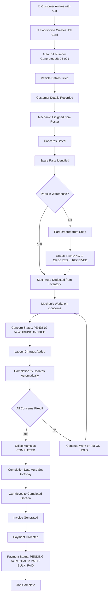

# 🔧 WorkshopOS (Titan) — OPERATIONAL BLUEPRINT
## How Every Feature Connects & Works Together

> **Accurate as of**: 2026-07-23, commit `a34537c`
>
> This is the **workflow narrative** doc — how features connect for a human reading top to bottom. For exact model/route/template tables see `MASTER_BLUEPRINT.md`; for roadmap and status see `TITAN_MASTER_HANDOVER.md`.

---

## 1. THE COMPLETE CAR SERVICE LIFECYCLE

### Step-by-Step Flow



---

## 2. WHO DOES WHAT — STAFF ROLE CONNECTIONS

```
 OWNER
   Can do EVERYTHING below + these exclusive actions:
   - Access the Owner Analysis & Reports Dashboard for hero KPIs (functional) and 7 detail zones (🚧 mid-rebuild — see `TITAN_MASTER_HANDOVER.md` roadmap; zone drill-downs currently show placeholder content, not live analytics).
   - View Paid Bills Dashboard (fully settled jobs and revenue filters)
   - View Financial Audits (High Discounts, Deleted Bulk Payers)
   - View and Restore Trash (deleted job cards, bulk payers, payments)
   - Permanently delete records from trash
   - Reverse payment transactions (bulk & shop)
   - Monitor all active login sessions
   - Remotely revoke any staff access
   - Receive security alerts on every login (⚠️ current SMS/Telegram system)
   - Access Django Admin panel

 OFFICE STAFF
   Everything Floor can do + these actions:
   - View full Job Card List with search
   - Delete job cards (soft-delete to trash)
   - Mark cars as Completed / Undo completion
   - View and Generate Invoices
   - Update payment status and amounts
   - Manage Bulk Payers (create, transfer bills, process cascade payments)
   - View Pending Bills dashboard
   - Manage Spare Shops (create, edit, pay, view ledger, print)
   - Manage Master Lists (Brands, Models, Spares, Concerns)
   - View Car Profiles (vehicle history)
   - Create/Delete/Reset passwords for staff accounts
   - Add/Edit/Toggle mechanics
   - Run Data Cleanup (rename, merge, delete duplicates)
   - Manage Inventory categories and items
   - Record and review Cashbook entries (income & expenses ledger)


 FLOOR (Mechanics / Floor Manager)
   - View Dashboard (active cars on floor)
   - Create new Job Cards
   - Edit existing Job Cards (add concerns, spares, labour)
   - View Live Report (quick scroll of all jobs)
   - Use Autocomplete (search brands, models, spares, concerns)
   - View Inventory Restock page
   - Update stock levels
```

---

## 3. JOB CARD — THE CENTRAL HUB

Everything in the system connects through the Job Card:

```
                    MECHANIC
                    (Roster)
                       |
                  assigned to
                       |
 MASTER LISTS -----> JOB CARD -------> INVOICE
 (Brands,Models,      |                |
  Spares,Concerns)    |                |
     ^                |             PAYMENT
     | auto-learn     |             STATUS
     |                |
     |     +----------+----------+
     |     |          |          |
     |  CONCERNS    SPARES    LABOUR
     |  - Text      - Part     - Job Desc
     |  - Status:   - Qty      - Amount
     |   PENDING    - Shop $
     |   WORKING    - Cust $
     |   FIXED      - Shop FK
     |              - Status:
     |              PENDING
     |              ORDERED
     |              RECEIVED
     |                |
     |                | auto-sync (signals)
     |                v
     |          INVENTORY
     |          (Warehouse)
     |                |
     +------->  TOTAL BILL AMOUNT
           = Sum(Spare Customer Prices)
           + Sum(Labour Amounts)
           Auto-calculated on every save
           (denormalized for performance)
```

---

## 4. BILLING & FINANCIAL FLOW

### Cost Accumulation

```
Spare Part Added (Customer Price) --+
                                    +--> Total Bill Auto-Calculated --> Invoice
Labour Added (Amount) -------------+     (denormalized, updates on every save)
```

### Payment States

```
PENDING   = Nothing received yet
PARTIAL   = Some money received, balance remains
PAID      = Full amount received (discount auto-calculated if received < bill)
BULK_PAID = Paid via bulk/fleet payment system
```

### Payment Methods

```
CASH     = Cash payment
UPI      = UPI / QR Code
CARD     = Credit/Debit Card
TRANSFER = Bank Transfer
```

### Spare Part Pricing (Two-Price System)

```
Shop Price (Unit Price)  = What YOU paid to the parts shop
Customer Price (Total)   = What the CUSTOMER pays (with your markup)
Profit per part = Customer Price - (Shop Price x Quantity)
```

### Bulk/Fleet Payment (Cascade Algorithm)

> **UI note**: This feature is labeled **"Fleet Account"** in the interface. The underlying model, fields, and URLs are still named `BulkPayer` — same feature, cosmetic rename only.

```
Customer "XYZ" has 5 unpaid jobs, plus Rs.500 advance credit from a previous overpayment:

Job 1: Rs.3,000 balance (oldest)
Job 2: Rs.5,000 balance
Job 3: Rs.2,000 balance
Job 4: Rs.4,000 balance
Job 5: Rs.1,000 balance (newest)

Customer pays Rs.10,000 lump sum:

Available funds = Rs.10,000 (payment) + Rs.500 (existing advance) = Rs.10,500

Job 1: Rs.3,000 paid  (remaining: Rs.7,500)
Job 2: Rs.5,000 paid  (remaining: Rs.2,500)
Job 3: Rs.2,000 paid  (remaining: Rs.500)
Job 4: Rs.500 paid, Rs.3,500 still owed
Job 5: Rs.0 -- funds exhausted

Result: 3 jobs fully paid, 1 partially paid, 1 still pending, Rs.0 advance remaining
JSON snapshot saved for precise reversal if needed (also reverses any advance change)
```

If a payment fully covers every pending/partial job and money is left over, the surplus is stored as `advance_balance` (an account credit) rather than lost — it's automatically pooled into the next payment. This means `total_balance` can legitimately show as negative (in credit).

### Spare Shop Payment (Cascade Algorithm)

```
Same oldest-first cascade logic applies to shop payments.
Lump sum distributed across unpaid items chronologically.
Payment history is recorded; Owner can reverse any payment.
```

---

## 5. INVENTORY <-> JOB CARD AUTO-SYNC

```
JOB CARD ACTION                      WAREHOUSE EFFECT
----------------------------------------------
Add "Oil Filter" x 2           -->   Oil Filter: 10 to 8  (auto -2)
Change qty to 5                -->   Oil Filter: 8 to 5   (auto -3 delta)
Change to "Air Filter"         -->   Oil Filter: 5 to 10  (auto +5 restore)
                               -->   Air Filter: 7 to 2   (auto -5 deduct)
Delete spare line              -->   Air Filter: 2 to 7   (auto +5 restore)
Soft-delete whole job card     -->   All its spares' stock returned to warehouse
Restore job card from trash    -->   That stock deducted again
```

Stock sync runs on **three signal groups** (8 handlers): per-spare consumption (above), whole-job-card soft-delete/restore reversal, and supplier restock (§5B). All are signal-driven, never mutated directly in views.

### Low Stock Alert System

```
Each item has:  Average Stock (ideal level)
                Current Stock (actual count)

Health = (Current / Average) x 100%

 Green  (50%+)   = Healthy stock
 Yellow (25-49%) = Warning, reorder soon
 Red    (below 25%) = Critical, order immediately
```

---

## 5B. SUPPLIES SHOPS (INVENTORY SUPPLIERS)

```
SUPPLIES SHOP (Inventory Supplier)
   ├── Name, Phone, Active/Inactive Status
   ├── Catalog (linked inventory items this supplier stocks)
   │
   ├── Restock Bills:
   │     Each bill records a purchase from this supplier
   │     Bill → Line Items (inventory Item + qty + unit price)
   │     Stock auto-increases on bill creation (via signals)
   │     Stock auto-reverses on bill deletion
   │     Optional discount per bill
   │
   ├── Financial Ledger:
   │     Total Billed = SUM(bill total_amount - discount_amount)
   │     Total Paid = SUM(payments where is_trashed=False)
   │     Pending Balance = Total Billed - Total Paid
   │
   ├── Payment Options:
   │     Quick payment form (amount + method + note)
   │     Payments soft-deletable (Owner can reverse)
   │
   ├── Bill Status Tracking:
   │     Each bill shows Covered / Partial / Unpaid status
   │     Running waterfall: oldest bills covered first
   │
   └── AJAX Pagination:
         Bills and Payments tabs load via AJAX partials
         Independent search + date filtering
```

### How Supplies Shops Connect to Inventory

```
SUPPLIER ACTION                      WAREHOUSE EFFECT
----------------------------------------------
Create restock bill (5x Oil Filter)  →   Oil Filter: 10 to 15  (auto +5)
Edit bill qty to 8                   →   Oil Filter: 15 to 18  (auto +3 delta)
Delete bill entirely                 →   Oil Filter: 18 to 10  (auto -8 reverse)
```

### Supplies Shops vs Spare Shops

```
                    SUPPLIES SHOPS              SPARE SHOPS
                    (Inventory App)             (Workshop App)
Purpose:            Buy parts INTO warehouse    Buy parts FOR specific jobs
Linked To:          Inventory Items (FK)        Job Card Spare Items (FK)
Stock Effect:       Increases stock             N/A (tracked separately)
Bill Structure:     Restock Bills + Line Items  Per-job spare items
Payment System:     Quick payments + soft-delete Cascade waterfall + JSON snapshot
Access:             Staff+ (Floor/Office/Owner) Office+ for most; Owner-only
                    — matches Inventory app     for delete/reverse/permanent-delete
```

> ⚠️ **Access asymmetry — worth a design review:** every Supplies-Shop view (including delete-restock-bill and delete-payment) is `@staff_required`, so **Floor mechanics can create/delete supplier bills and payments** — because the whole Inventory app is staff-level. The sibling Spare-Shop module restricts destructive actions to Office/Owner. This is the *current code behavior*, documented here honestly; if Floor should not be touching supplier financial records, the fix is in the code (tighten the decorators), not this doc.

---

## 6. AUTOCOMPLETE — SMART LEARNING SYSTEM

```
MASTER LISTS (Knowledge Base)          JOB CARD FORM
----------------------------          ---------------
CarBrand: Toyota, BMW, Audi      <->  Brand field (autocomplete)
CarModel: Corolla, 3 Series      <->  Model field (dependent on brand)
SparePart: Oil Filter, Brake     <->  Spare Part field (autocomplete)
ConcernSolution: Brake noise     <->  Concern field (autocomplete)
```

**AUTO-LEARN**: When you type a NEW spare part or concern that doesn't exist in the master list, the system AUTOMATICALLY adds it for future use (case-insensitive, whitespace-normalized).

**INVENTORY PRIORITY**: When searching spares, items found in the Warehouse show FIRST (highlighted in yellow), then master list items.

---

## 7. SPARE SHOP MANAGEMENT

```
SPARE SHOP (Supplier)
   ├── Name, Phone, Address
   ├── Linked Spare Items (via FK on JobCardSpareItem)
   ├── Financial Ledger:
   │     Total Purchases = Sum(unit_price × quantity) for linked items
   │     Total Paid = Sum of all payments
   │     Balance = Total Purchases - Total Paid
   │
   ├── Payment Options:
   │     Pay Individual Item (Pay Now button)
   │     Lump Sum Cascade (oldest-first distribution)
   │
   ├── Payment History:
   │     Each payment is stored as a ledger record
   │     Owner can reverse any payment
   │
   ├── Unassigned Spares Hub:
   │     Add legacy stock/balances not linked to any job card
   │     Items can be moved from job cards to Unassigned
   │     Original vehicle info is preserved when unassigning
   │     Unassigned items can be imported into new job cards
   │
   └── Print/Export (shop ledger printable view)
```

---

## 8. CAR PROFILE — VEHICLE HISTORY TRACKING

```
Registration: KL-07-AB-1234

Visit 1 (Jan 2025):  Oil change, Brake pad         Rs.4,500
Visit 2 (Apr 2025):  AC repair, Belt replacement    Rs.8,200
Visit 3 (Sep 2025):  Full service, Tire rotation     Rs.12,000
Visit 4 (Feb 2026):  Engine check, Battery           Rs.6,800
                                                --------
                                     Total:     Rs.31,500
                                     Visits:    4

One click: "New Visit" pre-fills all customer and vehicle details
```

---

## 9. SECURITY — COMPLETE PROTECTION CHAIN

```
SOMEONE TRIES TO LOGIN
        |
        v
 IP LOCKOUT CHECK
 5+ failed attempts within 15 min? --> BLOCKED
        |
        | Passed
        v
 AUTHENTICATE
 Username + Password (or Mobile + Password for Owners)
        |
        | Success
        v
 ROLE CHECK
 Staff portal blocks Owners (privacy)
 Owner portal blocks Staff (security)
        |
        | Correct portal
        v
 SESSION CREATED
 Track: Device, IP, Browser, Last Activity
 (updates on every request via SessionTrackingMiddleware)
        |
        v
 SECURITY ALERT BROADCAST (⚠️ Current system — may change)
 SMS to Owner 1 phone
 SMS to Owner 2 phone
 Telegram to Owner 1 chat
 Telegram to Owner 2 chat
 "[ALERT]: John logged in from Chrome on Samsung Galaxy, IP: 192.168.1.5"
```

### Forgot Password Flow

```
Owner enters username/mobile
  --> System looks up mobile from .env
  --> 6-digit OTP sent via SMS + Telegram
      (60-second cooldown, 5-minute expiry)
  --> Owner enters OTP + New Password
      (3 attempts max, then 5-min lockout)
  --> Password updated, redirect to login
```

### Owner Dashboard (anytime)

```
- See all active sessions (who is logged in, from what device)
- Sessions auto-cleaned after 40 days of inactivity
- One click: REVOKE any session (logs them out instantly)
```

---

## 10. DATA CLEANUP — KEEPING THINGS CLEAN

```
PROBLEM: Over time, typos accumulate in master lists
         "Oil Filter", "oil filter", "Oil Filtr", "OIL FILTER"

CLEANUP TOOL:
  Spare: "Oil Filtr" (used in 3 job cards)
  [Rename to "Oil Filter"]  [Delete]
  --> Rename updates ALL 3 job cards too!
  --> If "Oil Filter" already exists: MERGE WARNING

Same for Concerns:
  "brake noise" + "Brake Noise" --> Merge into one
```

---

## 11. TRASH SYSTEM — UNIFIED TABBED DASHBOARD

```
TRASH PAGE (/trash/) — Owner Only
  ├── Tab: Job Cards
  │     Search, paginate, restore, permanent delete
  ├── Tab: Bulk Payers
  │     Restore, permanent delete
  ├── Tab: Payments (Bulk Payment History)
  │     Permanent delete
  ├── Tab: Spare Shops
  │     Restore, permanent delete
  └── Tab: Shop Payments
        Permanent delete

Each tab has:
  - Independent search
  - Badge count showing number of trashed items
  - Restore (returns to active state)
  - Permanent Delete (Owner only — irreversible)
```

---

## 12. DASHBOARD — WHAT EACH SCREEN SHOWS

```
MAIN DASHBOARD (home)
  Shows: All ACTIVE cars currently on the floor
  Cards: Reg, Brand/Model, Color dot, Mechanic, Completion %
  Actions: Create Job, Mark Completed, Toggle Hold

JOB LIST
  Shows: ALL job cards (active + completed, not trash)
  Searchable, Paginated (45 per page), AJAX live search

LIVE REPORT
  Shows: Quick overview of all jobs for floor workers
  Minimal info, fast scroll, search + status filter

COMPLETED LIST
  Shows: Cars that have been picked up
  Filters: Today / Week / Month / Year / Custom range / All
  Actions: Undo completion, View invoice

PENDING BILLS
  Shows: All unpaid/partially paid jobs
  Displays: Total outstanding balance
  Linked to: Bulk Payer system

PAID BILLS (Owner only)
  Shows: All fully settled job cards (PAID and BULK_PAID)
  Filters: Time ranges (Today, 1 Week, 1 Month, 1 Year, Custom) and Payment Methods
  Displays: Total collected revenue for the filtered period

BULK PAYERS ("Fleet Account" in UI)
  Shows: Fleet/repeat customer groups, including any advance credit balance
  Actions: 2-step UI to move bills, process lump-sum payments (cascade + advance pooling, with locking)
  History: Every payment recorded with precise reversal capability

CASHBOOK
  Shows: Daily income & expense ledger (rent, electricity, scrap sales, etc.)
  Filters: Today / This Week / This Month / This Year / Last Week / Last Month / Last Year / Custom
  Displays: Net balance for the filtered period
  Access: Office and Owner only

OWNER ANALYSIS & REPORTS (Owner only, 🚧 mid-rebuild)
  Shows: Hero KPIs on page load (functional)
  Zone drill-downs (Revenue, Mechanic, Spares, Customer, Inventory, Cashbook, Workshop): currently placeholder content — full rebuild in progress, see `TITAN_MASTER_HANDOVER.md` roadmap

SUPPLIES SHOPS (Inventory App — distinct from Spare Shops, see §5B)
  Shows: Supplier dashboard with per-supplier billed/paid/pending totals
  Drill-down: Bills, payments, and catalog per supplier, with AJAX pagination
  Actions: Create restock bills (auto stock increase), record payments, manage catalog

AUDITS (Owner only)
  Shows: Security and financial logs
  High Discounts: Flags jobs where received amount is significantly lower than total bill
  Deleted Bulk Payers: Tracks manually deleted bulk payer records for accountability

SPARE SHOPS
  Shows: Supplier list with balances
  Drill-down: Full ledger per shop
  Actions: Pay individual items, lump-sum cascade, print ledger

TRASH (Owner only)
  Shows: Soft-deleted items across 5 tabs
  Action: Restore or permanently delete

CAR PROFILES
  Shows: Unique vehicles grouped by registration
  Drill-down: Full visit history with chronological numbering

INVENTORY
  Restock: View all stock levels with health bars
  Manage: Add/edit categories and items
  Low Stock: Critical items needing reorder
  History: Who used what, when

MANAGEMENT DASHBOARD
  Accounts: Create/delete/reset passwords for Office and Floor staff
  Mechanics: Add/rename/toggle active status
  Security: View all devices, revoke sessions
  Cleanup: Fix typos, merge duplicates in master lists
```

---

## 13. STANDARD TIME FILTERS

Five sections share one calendar-aligned filter vocabulary, so switching between them feels consistent: **Paid Bills, Completed, Workshop Spare Shop, Supplier Shop (Inventory), Cashbook.**

```
Today | This Week | This Month | This Year | Last Week | Last Month | Last Year | Custom range
```

- All "today"/range math uses `timezone.localdate()` (IST), not server-local UTC — fixes a class of off-by-one-day bugs around midnight.
- Defaults differ by purpose: operational pages (Paid Bills, Completed, Cashbook) default to **Today**; ledger pages (Spare Shop, Supplier Shop) default to **This Year**, since balances are running totals rather than daily activity.
- Filter selection persists in the URL query string, so a refresh or shared link keeps the same view.
- Items with no relevant date recorded are shown under an explicit "No Date Recorded" grouping rather than silently folded into another date bucket.

---

## 14. COMPLETE CONNECTION SUMMARY

Every connection below is **verified line-by-line** against the actual codebase.

```mermaid
graph TD
    classDef hub fill:#2563eb,stroke:#1e40af,stroke-width:2px,color:#fff,rx:8px;
    classDef actor fill:#059669,stroke:#047857,stroke-width:2px,color:#fff,rx:20px;
    classDef intel fill:#8b5cf6,stroke:#6d28d9,stroke-width:2px,color:#fff;
    classDef finance fill:#ea580c,stroke:#c2410c,stroke-width:2px,color:#fff;
    classDef logistics fill:#0891b2,stroke:#0e7490,stroke-width:2px,color:#fff;
    classDef execution fill:#475569,stroke:#334155,stroke-width:2px,color:#fff;
    classDef security fill:#dc2626,stroke:#991b1b,stroke-width:2px,color:#fff;

    CUST(["🚘 CUSTOMER"]):::actor

    subgraph SYSTEM_INTELLIGENCE ["🧠 System Intelligence & Master Data"]
        ML["MASTER LISTS<br/>(Brands, Models, Spares, Concerns)"]:::intel
        API["AUTOCOMPLETE API<br/>(Brands, Models, Spares, Concerns)"]:::intel
        CAR["CAR PROFILES<br/>(Vehicle History by Registration)"]:::intel
        ANALYTICS["OWNER ANALYSIS<br/>(Hero KPIs live; 7 zones 🚧 mid-rebuild)"]:::intel
    end

    subgraph CORE_WORKFLOW ["⚙️ Core Hub & Finance"]
        JC["📝 JOB CARD<br/>(The Central Hub)"]:::hub
        INV["🧾 INVOICE<br/>(Bill Display & Single Payment)"]:::hub
        PAY["💳 PAYMENT PROCESSING<br/>(Bulk Payer, Pending & Paid Ledgers)"]:::hub
    end

    subgraph JOB_EXECUTION ["🛠️ Job Execution"]
        CON["CONCERNS<br/>(Status: Pending → Working → Fixed)"]:::execution
        SPR["SPARES<br/>(Parts Usage & Shop Tracking)"]:::execution
        LAB["LABOUR<br/>(Work Done & Charges)"]:::execution
    end

    subgraph LOGISTICS_FINANCE ["📦 Logistics & External Finance"]
        INVENT["INVENTORY<br/>(Warehouse Stock Levels)"]:::logistics
        SS["SPARE SHOPS<br/>(Workshop App: Local Purchases)"]:::finance
        SUP["SUPPLIER SHOPS<br/>(Inventory App: Bulk Restock)"]:::finance
        CB["CASHBOOK<br/>(Daily Expense/Income Ledger)"]:::finance
    end

    subgraph SECURITY ["🛡️ Security & Access Control"]
        STAFF["STAFF ACCOUNTS<br/>(Owner, Office, Floor, Mechanics)"]:::security
        SYS["SECURITY SYSTEM<br/>(IP Lockout, Session Monitor, SMS/Telegram Alerts)"]:::security
    end

    %% 1. Customer Flow
    CUST -->|"Brings Car"| JC

    %% 2. Intelligence & Master Data
    JC -->|"Auto-learns Concerns & Spares"| ML
    ML -->|"Feeds Search Data"| API
    INVENT -->|"Feeds Spare Names"| API
    API -->|"Powers Autocomplete"| JC
    JC -->|"Builds Vehicle History"| CAR

    %% 3. Core Workflow
    JC <-->|"Generates Bill & Records Payment"| INV
    JC <-->|"Pending Bills & Bulk Payments"| PAY

    %% 4. Job Execution
    JC -->|"Defines"| CON
    JC -->|"Requires"| SPR
    JC -->|"Requires"| LAB

    %% 5. Logistics & Sync
    SPR <-->|"Auto-Sync Stock Deduct/Restore"| INVENT
    SPR -->|"Purchased From"| SS
    INVENT <-->|"Restocked via Bills"| SUP

    %% 6. Analytics Feeds (One-way)
    JC -->|"Feeds Core Data"| ANALYTICS
    SPR -->|"Feeds Parts Data"| ANALYTICS
    LAB -->|"Feeds Labour Revenue"| ANALYTICS
    SS -->|"Feeds Vendor Data"| ANALYTICS
    SUP -->|"Feeds Supplier Data"| ANALYTICS
    CB -->|"Feeds Cashflow"| ANALYTICS

    %% 7. Security
    STAFF -->|"Protected By"| SYS
    SYS -->|"Guards System Access"| JC

    linkStyle 0 stroke:#10b981,stroke-width:2px;
    linkStyle 1 stroke:#8b5cf6,stroke-width:2px;
    linkStyle 2 stroke:#8b5cf6,stroke-width:2px;
    linkStyle 3 stroke:#8b5cf6,stroke-width:2px;
    linkStyle 4 stroke:#8b5cf6,stroke-width:2px;
    linkStyle 5 stroke:#8b5cf6,stroke-width:2px;
    linkStyle 6 stroke:#2563eb,stroke-width:2px;
    linkStyle 7 stroke:#2563eb,stroke-width:2px;
    linkStyle 8 stroke:#64748b,stroke-width:2px;
    linkStyle 9 stroke:#64748b,stroke-width:2px;
    linkStyle 10 stroke:#64748b,stroke-width:2px;
    linkStyle 11 stroke:#0ea5e9,stroke-width:2px;
    linkStyle 12 stroke:#0ea5e9,stroke-width:2px;
    linkStyle 13 stroke:#0ea5e9,stroke-width:2px;
    linkStyle 14 stroke:#db2777,stroke-width:2px;
    linkStyle 15 stroke:#db2777,stroke-width:2px;
    linkStyle 16 stroke:#db2777,stroke-width:2px;
    linkStyle 17 stroke:#db2777,stroke-width:2px;
    linkStyle 18 stroke:#db2777,stroke-width:2px;
    linkStyle 19 stroke:#db2777,stroke-width:2px;
    linkStyle 20 stroke:#ef4444,stroke-width:2px;
    linkStyle 21 stroke:#ef4444,stroke-width:2px;
```



---

## 🛠️ OPERATIONAL TOOLING

- **Automated SQLite Backups** — Run `python manage.py backup_db` to securely clone the database into a timestamped archive (automatically retains the 7 most recent backups).
- **Production Static Serving** — Integrated `WhiteNoiseMiddleware` to seamlessly serve static assets directly from the application in production environments.

---

## 🔜 COMING SOON

See `TITAN_MASTER_HANDOVER.md` § Roadmap for the authoritative, current list — kept in one place so it doesn't drift out of sync across docs.

---

> **In one sentence**: Customer arrives → Job card created → Concerns/Spares/Labour tracked → Inventory auto-syncs (both consumption and supplier restocking) → Car completed → Invoice generated → Payment collected → Everything searchable forever through Car Profiles.
