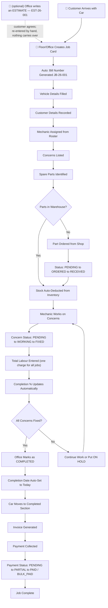

# 🔧 WorkshopOS (Titan) — OPERATIONAL BLUEPRINT
## How Every Feature Connects & Works Together

> This is the **workflow narrative** doc — how features connect, for a human
> reading top to bottom. For exact model/route/template tables see
> `MASTER_BLUEPRINT.md`; for roadmap and status see `TITAN_MASTER_HANDOVER.md`;
> for the rules behind these behaviours see `CLAUDE.md`.

---

## 1. THE COMPLETE CAR SERVICE LIFECYCLE

### Step-by-Step Flow


```mermaid
graph TD
    Q0["📄 (optional) Office writes an ESTIMATE — EST-26-001"] -.->|"customer agrees;<br/>re-entered by hand, nothing carries over"| B
    A["🚗 Customer Arrives with Car"] --> B["📝 Floor/Office Creates Job Card"]
    B --> C["Auto: Bill Number Generated JB-26-001"]
    C --> D["Vehicle Details Filled"]
    D --> E["Customer Details Recorded"]
    E --> F["Mechanic Assigned from Roster"]
    F --> G["Concerns Listed"]
    G --> H["Spare Parts Identified"]

    H --> I{"Parts in Warehouse?"}
    I -->|"Yes"| J["Stock Auto-Deducted from Inventory"]
    I -->|"No"| K["Part Ordered from Shop"]
    K --> L["Status: PENDING to ORDERED to RECEIVED"]
    L --> J

    J --> M["Mechanic Works on Concerns"]
    M --> N["Concern Status: PENDING to WORKING to FIXED"]
    N --> O["Total Labour Entered (one charge for all jobs)"]
    O --> P["Completion % Updates Automatically"]

    P --> Q{"All Concerns Fixed?"}
    Q -->|"Yes"| R["Office Marks as COMPLETED"]
    Q -->|"No"| S["Continue Work or Put ON HOLD"]
    S --> M

    R --> T["Completion Date Auto-Set to Today"]
    T --> U["Car Moves to Completed Section"]
    U --> V["Invoice Generated"]
    V --> W["Payment Collected"]
    W --> X["Payment Status: PENDING to PARTIAL to PAID / BULK_PAID"]
    X --> Y["Job Complete"]
```

---

## 2. WHO DOES WHAT — STAFF ROLE CONNECTIONS

```
 OWNER
   Can do EVERYTHING below + these exclusive actions:
   - Access Owner Analysis & Reports: the **Profit** page (Turnover − Expenses = Profit, filtered by month/year/custom — what profit distribution is decided from) and, from it, the **Deep Analysis** page (mechanics, spares, vehicles, fleet, shops, operations).
   - Delete a whole month's salary settlement (Office can create and correct one, only an Owner can un-record it)
   - View the Paid Bills Dashboard over ANY period, with the grand Total Collected (Office sees the last 7 days and no grand total)
   - View Financial Audits (High Discounts) — Owner only, since it reads as what the workshop settled for against what it billed
   - View the **Deletion History** — read-only log of every permanent deletion (no restore)
   - Monitor all active login sessions
   - Remotely revoke any staff access
   - Receive notifications in-app (nav bell): sign-ins, discounts over **₹3,500**, permanent deletions, archives, salary activity, and the account-security events (lockouts, resets, reset-code abuse, login created/deleted, staff password changed)
   - Change their own password, or recover it by emailed 6-digit code
   - **No** Django Admin access — `is_staff=False` on purpose; see `CLAUDE.md`

 OFFICE STAFF
   Everything Floor can do + these actions:
   - View full Job Card List with search
   - Delete job cards (permanent + logged; blocked if the card still holds spares, jobs, a labour charge, or a payment)
   - Deactivate / reactivate Spare Shops & Fleet Accounts; delete (reverse + log) Fleet/Shop payments
   - Undo a completion (marking one completed is Floor's too, since the mechanic is who knows the car is finished; undoing can put a second active card on the floor for one registration, so it stays here)
   - View and Generate Invoices
   - Update payment status and amounts
   - Manage Bulk Payers (create, transfer bills, process cascade payments)
   - View Pending Bills dashboard
   - Manage Spare Shops (create, edit, pay, view ledger, print) and edit or delete rows in the Unassigned Spares Hub
   - Manage Master Lists (Brands, Models, Spares, Concerns)
   - View Car Profiles (vehicle history)
   - Create/Delete/Reset passwords for staff accounts
   - Add/Edit/Toggle mechanics
   - Run Data Cleanup (rename, merge, delete duplicates)
   - Manage inventory Categories (add/list/edit) + create/edit products via Supplier Shops (Add Product); all supplier-shop management
   - Record and review Cashbook entries (income & expenses ledger)


 FLOOR (Mechanics / Floor Manager)
   - View Dashboard (active cars on floor), including each car's live details — the same four lists (Customer Concerns, Job Performed, Inventory Items, Spare Parts) the read-only job card shows. **This is where Floor reads a card**: the Live Report and the read-only card view at `/jobcards/<pk>/` are both Office/Owner
   - Create new Job Cards
   - Edit existing Job Cards (add concerns, spares, jobs done — but no prices: every money field on the card, the Total Labour included, is Office/Owner only and is enforced on the server)
   - Use Autocomplete (search brands, models, spares, concerns)
   - View Inventory (stock levels), Low Stock, and Stock History — all **read-only** (no stock editing, no supplier-shop access)
   - Put a car On Hold / take it off hold, and Mark it Completed
   - Record a purchase in the **Unassigned Spares Hub** — add only. No price box is shown and none is stored (the row is saved unpriced, and Office fills the figure in from the shop's bill); existing rows cannot be edited or deleted, and no price on the page is visible to Floor. Floor *can* fill in **Ordered For** — a free-text note saying which car the part is for ("BMW 320d"), because a part is usually ordered before there is a job card to attach it to. It is a note, not a link: it moves no money and joins nothing
```

---

## 3. JOB CARD — THE CENTRAL HUB

Everything in the system connects through the Job Card:

```
                    MECHANIC
                    (Roster)
                       |
                  assigned to
                       |
 MASTER LISTS -----> JOB CARD -------> INVOICE
 (Brands,Models,      |                |
  Spares,Concerns)    |                |
     ^                |             PAYMENT
     | auto-learn     |             STATUS
     |                |
     |     +----------+----------+
     |     |          |          |
     |  CONCERNS    SPARES    JOBS
     |  - Text      - Part     - Job Desc
     |  - Status:   - Qty      (description only —
     |   PENDING    - Shop $    no per-line amount)
     |   WORKING    - Cust $
     |   FIXED      - Shop FK
     |              - Status:
     |              PENDING
     |              ORDERED
     |              RECEIVED
     |                |
     |                | auto-sync (signals)
     |                v
     |          INVENTORY
     |          (Warehouse)
     |                |
     +------->  TOTAL BILL AMOUNT
           = Sum(Spare Customer Prices)
           + Total Labour        <- ONE figure on the job card
                                       (JobCard.labour_amount), typed
                                       once by Office for all the jobs
           (denormalized for performance)
```

---

## 3B. ESTIMATES — THE QUOTE THAT COMES BEFORE ANY OF THIS

An **Estimate** is the piece of paper handed to a customer *before* the work is
agreed. It is the one section of WorkshopOS that is connected to nothing else.

```
Customer asks "what will this cost?"
        |
        v
Estimates -> New Estimate
   customer + vehicle (free text, same autocomplete AND the same colour
                       picker as a Job Card)
   jobs to be done   (descriptions; ONE Total Labour figure, as on a bill)
   parts needed      (name, qty, unit price, amount)
        |
        v
Save & Print  ->  EST-26-001 on the workshop's own letterhead
        |
        +--> customer says yes  ->  Office opens a NEW Job Card by hand
        +--> customer says no   ->  the estimate just sits in the history
```

**Nothing crosses that boundary automatically, and that is the design.** An
estimate creates no job card, moves no warehouse stock, touches no spare-shop or
fleet ledger, and never appears on the Profit page. Money on an estimate is a
*proposal*: a quote that entered a report would be the workshop counting work it
has not done and parts it has not fitted. Quoting "Castrol Edge 5W-30" does not
deduct the shelf, because nothing has physically been taken.

Two things carry over from the printed bill, deliberately:

* **The document.** `workshop/invoice.py` builds both, so the estimate and the
  invoice that follows it agree about an unpriced part and how labour is
  subtotalled. The sheet is the same letterhead and the same column grid.
* **The pricing rule.** Labour is one figure for the whole job, exactly as on a
  Job Card — the workshop quotes work whole, so the estimate does too.

And two things deliberately do NOT, because a bill records work that happened
while an estimate describes work that has not:

* **QTY prints only what was typed.** A blank stays blank, though it still
  counts as 1 in the arithmetic. The bill does the opposite and prints 1 —
  because a fitted part really was one, while an unquoted count is simply not
  decided yet.
* **UNIT PRICE prints only when a rate was entered.** It is never derived from
  the total, which would present the workshop's own arithmetic to the customer
  as a quoted rate.

One convenience, and it is only a convenience: when Office types a part name,
the **Unit Price box's placeholder** reads `avg: 1064` — what that part sold for
on average across its last five bills. It is grey suggestion text — never filled
in, never posted. A price on a document handed to a customer is a decision
somebody makes.

**Nothing on an estimate is required.** The screen is filled in with the
customer standing there, so a quote may be half a car and two parts, and it
saves that way. A row left blank is not saved; a row cleared out is deleted, not
argued with. The only two things refused are the ones that would print nonsense:
a figure typed into a **new** row with no part name beside it, and a negative
amount.

**Removing a line is clearing its name and saving.** There is no delete button
on a row, deliberately — a ✕ beside every line is a one-tap way to lose work on
a tablet, and a quote is typed in a hurry. Clearing the name removes the line
even when its figures are still there, because those are exactly the lines
people want to remove.

The car's **colour** is recorded with the same picker as a Job Card and shows as
a stripe down each row of the Estimates list, the same cue the dashboard's live
cards use — it is how staff find a car at a glance. It is deliberately not
printed: the customer knows what colour their own car is.

Estimates are Office/Owner. Deleting one is permanent and, unlike every
financial delete in the app, is **not** written to Deletion History — an
estimate is a draft expected to be rewritten and discarded, and a critical alert
that fires for housekeeping stops being read for the things that matter.

---

## 3C. PHOTOS — EVIDENCE, ATTACHED TO NOTHING

A photograph answers one question later: *what did this car look like when it came
in?* It is evidence in a pre-existing-damage argument, and nothing else in the system
depends on it.

### Where they are taken

| Surface | Who | What they can do |
|---|---|---|
| **Job card → car photos** | Floor, Office, Owner | take, view, delete (while the bill is open) |
| **Job card → a Spare Parts row** | Floor, Office, Owner | take, view, delete (while the bill is open) |
| **Spare Shop → Purchase History** | Office, Owner | **view only** |

The mechanic walking round the car with the tablet is who takes them, which is why
Floor has full access here even though Floor is shown no prices anywhere in the app —
a photo of a car says nothing about whose it is or what it cost.

### How it works

1. The person taps the box; the camera opens; **one tap takes the photo** — there is
   no shutter-then-confirm review step, because that doubles the taps on a ten-photo
   walk-around.
2. The browser asks the server to **sign** an upload URL. The server mints the photo's
   id and hands back a URL pointing straight at the storage bucket.
3. **The browser uploads to the bucket directly.** The bytes never pass through
   Django, so a slow upload on bad shop wifi never occupies a server worker.
4. Only once the bucket confirms does the browser tell the server to **commit** the
   row.

That ordering is the whole design. Writing the row first would mean a browser closed
mid-upload leaves a record pointing at a photo that does not exist — a broken image
nobody can explain or remove. This way **a row always means a real photograph**, and
the worst case is an unreferenced object in the bucket, which a housekeeping command
sweeps up.

Because the frame is held in memory until the server confirms, a failed upload
retries once by itself, and anything still broken becomes a **visible** failed item
plus a warning if you try to leave the page. **A photo never disappears silently.**

### The rules that matter operationally

- **Nothing in the business depends on a photo.** No job card column points at one, no
  money, no stock, no ledger, no report, and nothing on the printed bill. Settlement
  never asks for one — a card with no photographs is a perfectly ordinary card.
- **Limits: 10 per car, 4 per spare.** The count is only shown once the limit is hit;
  a permanent "3/10" badge just invites filling it.
- **Settling the bill freezes the photos.** Once a card is PAID or FLEET PAID its
  photographs can be looked at but not added to or deleted — money and evidence stop
  moving together, the same principle as the Financial Lock. The only delete there is
  removes a mis-shot from an open card.
- **A new job card, and a newly added spare row, offer no photo box** — there is no
  saved record yet to attach one to. The card says "save the job card first". This is
  the real workflow, not a workaround: nobody photographs a car while typing its
  registration.
- **Photos are kept for a year, then purged** — the owner's rule is that complaints
  stop after a year. `purge_old_photos` does it, and it **skips any bill still
  unpaid**, whatever its age: an unpaid bill is an open argument, and those
  photographs are the evidence in it.
- **The whole section is optional.** With no storage configured the box simply does
  not appear, and every other thing on the job card behaves identically.

---

## 4. BILLING & FINANCIAL FLOW

### Cost Accumulation

```
Spare Part Added (Customer Price) --+
                                    +--> Total Bill Auto-Calculated --> Invoice
Total Labour typed on the card --+     (denormalized)

The workshop quotes work as a WHOLE — a customer is told one figure for the
job — so the Jobs section lists what was done and carries no per-line price.
Office types the single Total Labour at the foot of that section, and the
invoice prints it as the JOB PERFORMED subtotal.
```

### Payment States

```
PENDING   = Nothing received yet
PARTIAL   = Some money received, balance remains
PAID      = Full amount received (discount auto-calculated if received < bill)
BULK_PAID = Paid via bulk/fleet payment system
```

### Payment Methods

```
CASH     = Cash payment
UPI      = UPI / QR Code
CARD     = Credit/Debit Card
TRANSFER = Bank Transfer
```

### Spare Part Pricing (Two-Price System)

```
Shop Price (Unit Price)  = What YOU paid to the parts shop
Customer Price (Total)   = What the CUSTOMER pays (with your markup)
Profit per part = Customer Price - (Shop Price x Quantity)
```

### Bulk/Fleet Payment (Cascade Algorithm)

> **UI note**: This feature is labeled **"Fleet Account"** in the interface. The underlying model, fields, and URLs are still named `BulkPayer` — same feature, cosmetic rename only.

```
Customer "XYZ" has 5 unpaid jobs, plus Rs.500 advance credit from a previous overpayment:

Job 1: Rs.3,000 balance (oldest)
Job 2: Rs.5,000 balance
Job 3: Rs.2,000 balance
Job 4: Rs.4,000 balance
Job 5: Rs.1,000 balance (newest)

Customer pays Rs.10,000 lump sum:

Available funds = Rs.10,000 (payment) + Rs.500 (existing advance) = Rs.10,500

Job 1: Rs.3,000 paid  (remaining: Rs.7,500)
Job 2: Rs.5,000 paid  (remaining: Rs.2,500)
Job 3: Rs.2,000 paid  (remaining: Rs.500)
Job 4: Rs.500 paid, Rs.3,500 still owed
Job 5: Rs.0 -- funds exhausted

Result: 3 jobs fully paid, 1 partially paid, 1 still pending, Rs.0 advance remaining
JSON snapshot saved for precise reversal if needed (also reverses any advance change)
```

If a payment fully covers every pending/partial job and money is left over, the surplus is stored as `advance_balance` (an account credit) rather than lost — it's automatically pooled into the next payment. This means `total_balance` can legitimately show as negative (in credit).

### Spare Shop Payment (Cascade Algorithm)

```
Same oldest-first cascade logic applies to shop payments.
Lump sum distributed across unpaid items chronologically.
Payment history is recorded; Owner can reverse any payment.
```

---

## 5. INVENTORY <-> JOB CARD AUTO-SYNC

### Two sections, because a part arrives by one of two routes
A Job Card records parts in **two separate sections**:

| | **Inventory Items** | **Spare Parts** |
|---|---|---|
| Where it came from | the workshop's own shelf | ordered from a spare shop for this job |
| Columns | Item, Qty, Unit Price, Customer Price | Part Name, Qty, Status, Ordered, Received, Shop, Shop Price, Customer Price |
| How the part is chosen | **picked** from stock (search, then select) | typed freely |
| Moves warehouse stock? | **yes** | never |
| Who already paid for it | a Supplies Shop restock bill, earlier | the spare shop, per this job |

They were one section, which meant five of the eight columns were
permanently blank for a warehouse draw and staff were invited to fill boxes that
meant nothing. Worse, the system had to *guess* which route a row took, and guessed
differently in two places — so a shop-bought part that happened to share a name with
a stock product was deducted from the shelf *and* billed to the shop. Both sections
still write one table (`JobCardSpareItem`), told apart by a stored `source`.

**Prices are Office/Owner only in both sections.** Floor sees name and quantity.

**On an Inventory row, "Unit Price" is what the CUSTOMER pays per unit** — enter it
and Customer Price fills in (× qty); or skip it, as staff usually do, and type the
total straight in. What the part *cost* the workshop is never typed: it is taken from
stock automatically (a weighted average of what was actually paid for it) and frozen
onto the line, so a later price change cannot rewrite an old job's margin.

### Taking more than the shelf says you have
This is **allowed**, and the count may go **negative**. A job card records a part the
mechanic has *already physically taken* — refusing the record would not put the part
back, it would only stop a mechanic mid-shift and leave the system disagreeing with
reality. A negative figure is the signal that a Supplies Shop bill has not been
entered yet, and it heals itself when that bill arrives (−3, then a +10 receipt,
lands on 7). **Negative is not the same as Low Stock**: low means order more,
negative means a bill is missing.

The **Low Stock** screen keeps the two apart. Negatives appear in their own amber
"stock discrepancy" banner — naming the products, saying a Supplies Shop bill has
probably not been entered, and telling you *not* to reorder them — while the
"running low" and "out of stock" counts below cover only products at or above zero.
Everyone sees this, Floor included, so a mechanic who notices a negative can say so.
Individual rows carry a **CHECK BILL** chip rather than the ordinary red **OUT** one.

```
JOB CARD ACTION                      WAREHOUSE EFFECT
----------------------------------------------
Inventory: add "Oil Filter" x2  -->   Oil Filter: 10 to 8  (auto -2)
Change qty to 5                -->   Oil Filter: 8 to 5   (auto -3 delta)
Change to "Air Filter"         -->   Oil Filter: 5 to 10  (auto +5 restore)
                               -->   Air Filter: 7 to 2   (auto -5 deduct)
Delete the row                 -->   Air Filter: 2 to 7   (auto +5 restore)
Spare Parts: add anything      -->   (no effect, ever — it never left the shelf)
Delete a job card              -->   (guarded: a card holding spares can't be deleted —
                                      clear/unassign its spares first, so no stock moves)
```

Stock sync runs on **three signal groups** (8 handlers): warehouse draws (above — Inventory-section rows only), a whole-job-card soft-delete/restore reversal that is **now dormant** (job cards are hard-deleted and a card holding spares can't be deleted), and supplier restock (§5B). All stock changes are signal-driven, never mutated directly in views — and there is **no manual stock-number editing anywhere** (Low Stock is read-only).

### Where inventory items come from
Items are created **only** via **Supplier → Add Product** (which requires an Average Stock — see below); there is no separate "add item" screen, and "Manage Database" is a read-only Category browser (add/list/edit/delete Category; drill in to see products + their shops). Category names can't be duplicated in any casing, and a category can only be deleted while it is **empty** — Delete simply isn't offered once it holds products. Product name and Average Stock are edited on the supplier catalog, where a product can also be **deactivated** (kept and listed, but excluded from restock bills — enforced when the bill is saved, not merely hidden from the picker).

Removing a product from a shop's catalog **deactivates instead of removing** in two cases: it has purchase history from that shop (removing would alter historical bill totals), or it still holds stock (stock is signal-only, so deleting the product would silently destroy a countable quantity — clear the stock first). Only a zero-stock product with no purchase history anywhere is actually deleted, and that deletion is written to the Owner-only **Deletion History** like every other permanent delete.

**Stock History** (Floor-visible) is a live log of every spare used on a car — item · qty · mechanic · car · reg — with a per-mechanic totals drill-down and a This/Last-week filter. Parts whose name matches no warehouse product are marked **"not from stock"**: nothing was deducted for them (bought outside, or the name doesn't match the product), so they must not be read as warehouse draws.

### Low Stock Alert System

**Average Stock** is *how many of a product the workshop normally keeps on hand* — the number Office types when adding the product. It is **not** an alert threshold: the Low Stock list fires well below it, at under a quarter. Keep the two ideas distinct in any UI copy.

```
Each item has:  Average Stock (how many you usually keep)
                Current Stock (actual count, signal-maintained)

Health = (Current / Average) x 100%

 Green  (50%+)      = Healthy stock
 Yellow (25-49%)    = Warning, reorder soon
 Red    (below 25%) = Critical — this is what the Low Stock list shows
```

---

## 5B. SUPPLIES SHOPS (INVENTORY SUPPLIERS)

```
SUPPLIES SHOP (Inventory Supplier)
   ├── Name, Phone, Active/Inactive Status
   ├── Catalog (linked inventory items this supplier stocks)
   │
   ├── Restock Bills:
   │     Each bill records a purchase from this supplier
   │     Bill → Line Items (inventory Item + qty + unit price)
   │     Stock auto-increases on bill creation (via signals)
   │     Stock auto-reverses on bill deletion
   │     Optional discount per bill
   │
   ├── Financial Ledger:
   │     Total Billed = SUM(bill total_amount - discount_amount)
   │     Total Paid = SUM(payments where is_trashed=False)
   │     Pending Balance = Total Billed - Total Paid
   │
   ├── Payment Options:
   │     Quick payment form (amount + method + note)
   │     Payments soft-deletable (Owner can reverse)
   │
   ├── Bill Status Tracking:
   │     Each bill shows Covered / Partial / Unpaid status
   │     Running waterfall: oldest bills covered first
   │
   └── AJAX Pagination:
         Bills and Payments tabs load via AJAX partials
         Independent search + date filtering
```

### Why supplier payments are a running balance, not per-bill settlement

This mirrors how the workshop actually trades, and should not be "corrected" into
invoice-by-invoice payment:

- Suppliers **restock at the workshop on credit** as parts are needed — there is no
  payment at the time of delivery.
- They **come round weekly or monthly to collect**, and are rarely paid in full.
  The workshop pays whatever cash is on hand that day — ₹3,000, ₹5,000, ₹8,000.
- So a payment is a **lump sum against the shop's whole outstanding balance**, not a
  settlement of a chosen bill. `SupplierPayment` carries no bill FK by design.
- The per-bill **Covered / Partial / Unpaid** labels are a *derived view*: payments are
  applied oldest-bill-first in a running waterfall so staff can see how far the money
  reached. Nothing stores a bill↔payment link.

The practical consequence: a shop normally sits at a non-zero pending balance, and that
is healthy, not an error state. A shop created for *cash* purchases (e.g. an urgent
outside buy under the workshop's own name) needs its payment recorded alongside the bill,
otherwise it will show an outstanding balance that isn't a real debt.

### How Supplies Shops Connect to Inventory

```
SUPPLIER ACTION                      WAREHOUSE EFFECT
----------------------------------------------
Create restock bill (5x Oil Filter)  →   Oil Filter: 10 to 15  (auto +5)
Edit bill qty to 8                   →   Oil Filter: 15 to 18  (auto +3 delta)
Delete bill entirely                 →   Oil Filter: 18 to 10  (auto -8 reverse)
```

### Supplies Shops vs Spare Shops

```
                    SUPPLIES SHOPS              SPARE SHOPS
                    (Inventory App)             (Workshop App)
Purpose:            Buy parts INTO warehouse    Buy parts FOR specific jobs
Linked To:          Inventory Items (FK)        Job Card Spare Items (FK)
Stock Effect:       Increases stock             N/A (tracked separately)
Bill Structure:     Restock Bills + Line Items  Per-job spare items
Payment System:     Quick payments + soft-delete Cascade waterfall + JSON snapshot
Access:             Staff+ (Floor/Office/Owner) Office+ for most; Owner-only
                    — matches Inventory app     for delete/reverse/permanent-delete
```

> ⚠️ **Access asymmetry — worth a design review:** every Supplies-Shop view (including delete-restock-bill and delete-payment) is `@staff_required`, so **Floor mechanics can create/delete supplier bills and payments** — because the whole Inventory app is staff-level. The sibling Spare-Shop module restricts destructive actions to Office/Owner. This is the *current code behavior*, documented here honestly; if Floor should not be touching supplier financial records, the fix is in the code (tighten the decorators), not this doc.

---

## 6. AUTOCOMPLETE — SMART LEARNING SYSTEM

```
MASTER LISTS (Knowledge Base)          JOB CARD FORM
----------------------------          ---------------
CarBrand: Toyota, BMW, Audi      <->  Brand field (autocomplete)
CarModel: Corolla, 3 Series      <->  Model field (dependent on brand)
SparePart: Oil Filter, Brake     <->  Spare Part field (autocomplete)
ConcernSolution: Brake noise     <->  Concern field (autocomplete)
```

**AUTO-LEARN**: When you type a NEW spare part or concern that doesn't exist in the master list, the system AUTOMATICALLY adds it for future use (case-insensitive, whitespace-normalized).

**INVENTORY PRIORITY**: When searching spares, items found in the Warehouse show FIRST (highlighted in yellow), then master list items.

---

## 7. SPARE SHOP MANAGEMENT

```
SPARE SHOP (Supplier)
   ├── Name, Phone, Address
   ├── Linked Spare Items (via FK on JobCardSpareItem)
   ├── Financial Ledger:
   │     Total Purchases = Sum(unit_price × quantity) for linked items
   │     Total Paid = Sum of all payments
   │     Balance = Total Purchases - Total Paid
   │
   ├── Payment Options:
   │     Pay Individual Item (Pay Now button)
   │     Lump Sum Cascade (oldest-first distribution)
   │
   ├── Payment History:
   │     Each payment is stored as a ledger record
   │     Owner can reverse any payment
   │
   ├── Unassigned Spares Hub  (FLOOR can reach this one — add only):
   │     Add legacy stock/balances not linked to any job card
   │     Items can be moved from job cards to Unassigned
   │     Original vehicle info is preserved when unassigning
   │     Unassigned items can be imported into new job cards
   │     Grouped by shop; an ARCHIVED shop's rows stay listed (badged) and
   │       keep their shop when edited — archiving hides a shop from the
   │       pickers, never what is owed to it
   │     A row with no price is "Not priced", not ₹0 — Office fills the
   │       figure in when the shop's bill is keyed
   │     Floor: no price column, no price box, no edit, no delete
   │
   └── Print/Export (shop ledger printable view)
```

---

## 8. CAR PROFILE — VEHICLE HISTORY TRACKING

```
Registration: KL-07-AB-1234

Visit 1 (Jan 2025):  Oil change, Brake pad         Rs.4,500
Visit 2 (Apr 2025):  AC repair, Belt replacement    Rs.8,200
Visit 3 (Sep 2025):  Full service, Tire rotation     Rs.12,000
Visit 4 (Feb 2026):  Engine check, Battery           Rs.6,800
                                                --------
                                     Total:     Rs.31,500
                                     Visits:    4

One click: "New Visit" pre-fills all customer and vehicle details
```

---

## 9. SECURITY — COMPLETE PROTECTION CHAIN

```
SOMEONE TRIES TO LOGIN
        |
        v
 IP LOCKOUT CHECK
 5+ failed attempts within 15 min? --> BLOCKED
        |
        | Passed
        v
 AUTHENTICATE
 Username + Password (or Mobile + Password for Owners)
        |
        | Success
        v
 ROLE CHECK
 Staff portal blocks Owners (privacy)
 Owner portal blocks Staff (security)
        |
        | Correct portal
        v
 SESSION CREATED
 Track: Device, IP, Browser, Last Activity
 (updates on every request via SessionTrackingMiddleware)
        |
        v
 notify('LOGIN') -> one Notification row per *other* owner
 "Sahad signed in - Google Chrome on Samsung Galaxy - 192.168.1.5"
 Read from the nav bell. The signer-in is not told about their own sign-in.
```

### Forgot Password Flow

```
Owner enters username, email, or mobile
  --> resolved against the DATABASE (not .env)
  --> 6-digit code EMAILED to User.email, code in the subject line
      (10-minute expiry, single use, 60s resend, 3/hour — all per account)
  --> Owner enters code + New Password
      (5 attempts, then the code is dead)
  --> every existing session for that account is terminated
  --> Password updated, redirect to login
```

### Owner Dashboard (anytime)

```
- See all active sessions (who is logged in, from what device)
- Sessions auto-cleaned after 40 days of inactivity
- One click: REVOKE any session (logs them out instantly)
```

---

## 10. DATA CLEANUP — KEEPING THINGS CLEAN

```
PROBLEM: Over time, typos accumulate in master lists
         "Oil Filter", "oil filter", "Oil Filtr", "OIL FILTER"

CLEANUP TOOL:
  Spare: "Oil Filtr" (used in 3 job cards)
  [Rename to "Oil Filter"]  [Delete]
  --> Rename updates ALL 3 job cards too!
  --> If "Oil Filter" already exists: MERGE WARNING

Same for Concerns:
  "brake noise" + "Brake Noise" --> Merge into one
```

---

## 11. DELETION MODEL — DEACTIVATE vs DELETE + HISTORY

The old unified Trash-with-restore was replaced by a two-verb model. Safety comes
from the *structure*, so Office can fix its own mistakes without risking irreversible
damage.

```
ACCOUNTS (Spare Shops, Fleet Accounts, Supplier Shops, Mechanics)
  → DEACTIVATE (archive). Reversible, non-destructive; keeps all linked
    job-card & financial history. Reactivate from each module's "Archived" list.
    (Never hard-deleted — that would CASCADE-destroy their ledgers.)

TRANSACTIONS & RECORDS (Job Cards, Fleet/Shop/Supplier payments,
                        Restock bills, Cashbook entries)
  → DELETE (permanent). Every delete first snapshots the record to the
    Owner-only DeletionLog, then hard-deletes. Financial deletes reverse
    their effect (restore balances/stock) first, atomically.
      • Job-card delete GUARD: blocked while the card holds spares, labour,
        or a received payment — clear/unassign them first.
      • NO RESTORE anywhere — reviving stale records corrupts running balances.

DELETION HISTORY (/deletion-history/) — Owner only, READ-ONLY
  - One unified list of all deletions, filterable by type, click to read the snapshot.
  - Also mirrored read-only in Django Admin (DeletionLog).
```

---

## 12. DASHBOARD — WHAT EACH SCREEN SHOWS

```
MAIN DASHBOARD (home)
  Shows: All ACTIVE cars currently on the floor
  Cards: Reg, Brand/Model, Color dot, Mechanic, Completion %
  Actions: Create Job, Mark Completed, Toggle Hold (all three are Floor's too)
           View Invoice — Office/Owner only, mirroring invoice_view's decorator
  Drawer:  Concerns / Jobs Performed / Inventory Items / Spare Parts, each
           capped at 25 rows with the remainder named ("+7 more on the job
           card"). The heading keeps the true count, so the two add back up.
           Floor is shown no shop name and no price in it.

JOB LIST
  Shows: ALL job cards (active + completed, not trash)
  Searchable, Paginated (45 per page), AJAX live search

LIVE REPORT
  Shows: The live state of the workshop, read on a phone. Two stacked parts
         with two different audiences.

  Operations board (Office / Owner only)
    ON THE FLOOR    Mechanics as panels — four names across on a laptop, three
                    on a tablet, two on a phone, wrapping to a second row for
                    the fifth, all panels on a row ending level — with that
                    person's cars listed beneath their name and a "Not
                    assigned" panel last, in red. A card is the car's name in
                    large type, then
                    its registration and how long it has been in — New, 9d,
                    213d — or ON HOLD, on one small line, with a stripe and
                    wash in the car's own colour. A mechanic holding nothing
                    is not listed. Tap a car to open its job card.
    ON THE WAY      Amber box: parts ordered from a spare shop and still
                    travelling. Part name, then car · registration · shop.
    NOT ORDERED YET Red box: parts nobody has ordered yet. Same shape.
                    Both boxes are square, and their rows sit directly on the
                    box's colour rather than on white cards of their own.
    Both boxes list SHOP purchases only — a warehouse draw came off the shelf
    already fitted and has no ordering workflow to wait on — and only for cars
    still in the workshop.

  Live Jobs (Floor / Office / Owner)
    The detailed card per active car: make, model, registration, the mechanic
    on it, how long it has been in, whether it is on hold, and progress across
    the customer's concerns — then FOUR sections, in the order the work
    happens:
       CUSTOMER CONCERNS  what the customer complained of, each with its state
       JOB PERFORMED      what was done (descriptions only; no money here)
       INVENTORY ITEMS    parts drawn off our own shelf
       SPARE PARTS        parts bought in, each with its ordering state
    Each section shows ten rows and then counts the remainder; an empty
    section is left out. The STATUS badge leads the row in the two sections
    that have one, so the states read as a single column.

  Search + status filter narrow Live Jobs only; the board always reports the
  whole workshop.
  Rules in: workshop/views/dashboard.py — see CLAUDE.md "Deliberate decisions"

COMPLETED LIST
  Shows: Cars that have been picked up
  Filters: Today / Week / Month / Year / Custom range / All
  Actions: Undo completion, View invoice

INVOICE (Office / Owner)
  Shows: The customer's bill, laid out to match the workshop's printed letterhead —
         one A4 sheet, on screen exactly as it prints (narrow screens scale it
         down rather than rearranging it).
  Sections: JOB PERFORMED — what was done, with ONE subtotal and no per-line
            amounts, because a job is quoted whole.
            PART NAME — spare-shop purchases and warehouse draws merged into a
            single list. A warehouse draw is billed under its CATEGORY
            ("Engine Oil"), never the branded product ("Castrol Edge 5W-30").
            The unit price shown is always the customer total ÷ quantity — the
            workshop's own cost never appears on the bill.
  Quantity: a blank QTY means one, and prints as 1.
  Actions:  Print / Save PDF, Settle Bill (non-fleet only), Edit Job. All three
            are screen-only and sit outside the sheet, so nothing but the bill
            reaches paper. A fleet-billed job shows no Settle control at all —
            that money moves through the Fleet Account cascade.
  Rules in: workshop/invoice.py (all of the above; the view does no arithmetic)

ESTIMATES (Office / Owner)
  Shows: Every quotation ever written, newest first. Estimate no, date, reg +
         vehicle, customer, and what it came to — labelled "Quoted", never
         anything that could read as owed or earned.
  Filters: This Year (default) / All Time — only two, unlike every other list
           in the app. Those pages sort daily activity where Today and Last
           Month each answer something; quotes are written a handful of times a
           month and looked up months later, so six of the usual eight would
           show an empty page and read as broken.
  Search:  live, same as Completed and Paid Bills — reg no, car, customer or
           estimate number, as you type.
  Header:  title and the New Estimate button share one row at every width, with
           a one-line description under them; on a phone the title shrinks
           rather than the button dropping to a line of its own.
  Rows:    a colour stripe down the left edge (same cue as the dashboard's live
           cards), then the car (make + model, with the plate beside it), then the
           estimate number, date and customer underneath, then what it came to.
           Any of those may be blank, so the headline falls back to the
           registration, and then to the estimate number — there is always one
           clear line, and nothing missing is announced. An estimate with no
           figures yet reads "Not priced", never "₹0.00", which would state a
           price the workshop never quoted.
  Actions: New Estimate, Open & Print, Edit, Delete.
  The sheet: the same document as the invoice — same letterhead, bands, column
             grid and totals block — differing in the QTY and UNIT PRICE rules
             described in §3B, in the title (ESTIMATE), the
             jobs heading (JOB NEEDS TO BE PERFORMED, future tense) and the
             absence of any payment chip or settle control. An estimate has no
             payment state, and offering one would imply money can be taken
             against it.
  Deleting: permanent, and deliberately NOT recorded in Deletion History — see
            §3B and workshop/views/estimate.py.
  Rules in: workshop/invoice.py (build_estimate — shared with the bill)

PENDING BILLS
  Shows: All unpaid/partially paid jobs
  Displays: Total outstanding balance
  Linked to: Bulk Payer system

PAID BILLS (Owner only)
  Shows: All fully settled job cards (PAID and BULK_PAID)
  Filters: Time ranges (Today, 1 Week, 1 Month, 1 Year, Custom) and Payment Methods
  Displays: Total collected revenue for the filtered period

BULK PAYERS ("Fleet Account" in UI)
  Shows: Fleet/repeat customer groups, including any advance credit balance
  Actions: 2-step UI to move bills, process lump-sum payments (cascade + advance pooling, with locking)
  History: Every payment recorded with precise reversal capability

SALARY & ADVANCE (Office and Owner)
  Shows: every active staff member with their monthly salary and advances taken
  Give an advance: recorded against a staff member on the day it happens
  Settle a month: one row per staff — salary, leave days deducted, advances
    already taken, any overtime, and the net cash to hand over. Overtime is a
    single amount per person per month, added to the net. Saving freezes it all.
  A month has THREE states, following the workshop's own rhythm — a month is
    settled in the first days of the next one and the cash handed over at once:
      open    — not yet settled
      locked  — settled and still the most recent. Correctable, but only via
                "Edit this settlement" in the ⋮ menu; a plain re-save is refused
      closed  — a newer month has since been settled. No edit, no delete, for
                anyone including owners
  Closure is a stored one-way flag, not "is this the latest?" — otherwise
    deleting the newest settlement would hand editability back to the one before
    it, and the whole history could be walked backwards one delete at a time.
  A later pay rise never rewrites a month already settled; the frozen line keeps
    the salary that was actually in effect. To settle a month at a different
    figure, delete the settlement and settle again.
  A month cannot be settled while someone who was handed an advance would get no
    settlement line, and an advance cannot be recorded into a settled month —
    both are refused at the moment of the mistake, not flagged afterwards.
  A settled month shows exactly the people it paid — not today's roster. Staff
    hired since simply do not appear on it, and re-saving cannot enrol them.
    To add somebody to a past month, delete the settlement and settle again.
  Deleting a whole settlement is Owner-only, goes through a confirmation page,
    and is written to Deletion History. Advances are NOT affected by it.
  Feeds: the Salary & Advance expense line on the Owner Profit page — wages come
    from here, never from the Cashbook.

CASHBOOK
  Shows: Daily income & expense ledger (rent, electricity, scrap sales, etc.)
  Filters: Today / This Week / This Month / This Year / Last Week / Last Month / Last Year / Custom
  Displays: Net balance for the filtered period
  Access: Office and Owner only

OWNER ANALYSIS — PROFIT (Owner only)
  Shows: Total Turnover − Total Expenses = Profit for one date window, stated as an equation
  Turnover: Car Bills (bills less discounts) + Cashbook Income
  Expenses: Spare Shops · Supplies Shops · Salary & Advance · General Cashbook (by category)
  Also: month-by-month trend, expense split, and what is owed to/by the workshop right now
  Filters: This Month / Last Month / This Year / Last Year / All Time / Custom
  Purpose: the figure the owners distribute profit from — kept deliberately plain

OWNER ANALYSIS — DEEP ANALYSIS (Owner only, reached from the Profit page)
  Sections (each loaded on demand): Mechanics · Spares · Vehicles · Fleet · Shops · Operations
  Note: customer-level analysis is deliberately minimal — names/contacts are optional on a
  job card and usually blank, so vehicle registration is used as the identity instead

SUPPLIES SHOPS (Inventory App — distinct from Spare Shops, see §5B)
  Shows: Supplier dashboard with per-supplier billed/paid/pending totals
  Drill-down: Bills, payments, and catalog per supplier, with AJAX pagination
  Actions: Create restock bills (auto stock increase), record payments, manage catalog

AUDITS (Owner only)
  Shows: Security and financial logs
  High Discounts: Flags jobs where received amount is significantly lower than total bill
  Deleted Bulk Payers: Tracks manually deleted bulk payer records for accountability

SPARE SHOPS
  Shows: Supplier list with balances
  Drill-down: Full ledger per shop
  Actions: Pay individual items, lump-sum cascade, print ledger

TRASH (Owner only)
  Shows: Soft-deleted items across 5 tabs
  Action: Restore or permanently delete

CAR PROFILES
  Shows: Unique vehicles grouped by registration
  Drill-down: Full visit history with chronological numbering

INVENTORY
  Restock: View all stock levels with health bars
  Manage: Add/edit categories and items
  Low Stock: Critical items needing reorder
  History: Who used what, when

MANAGEMENT DASHBOARD (Owner Control Hub, /manage/)
  Accounts: Create/delete/reset passwords for Office and Floor login accounts
  Staff Registration: Register/rename/re-role/toggle-active the staff roster
    (Mechanic, Assistant Mechanic, Office Staff, General Helper — same
    Mechanic model as before, just no longer limited to mechanics; see
    MASTER_BLUEPRINT.md §Models). Only Mechanic/Assistant Mechanic feed the
    Job Card mechanic picker. Changing someone's role never touches Job
    Cards already assigned to them — same underlying record, same FK.
  Security: View all devices, revoke sessions
  Cleanup: Fix typos, merge duplicates in master lists
```

---

## 13. STANDARD TIME FILTERS

Five sections share one calendar-aligned filter vocabulary, so switching between them feels consistent: **Paid Bills, Completed, Workshop Spare Shop, Supplier Shop (Inventory), Cashbook.**

```
Today | This Week | This Month | This Year | Last Week | Last Month | Last Year | Custom range
```

- All "today"/range math uses `timezone.localdate()` (IST), not server-local UTC — fixes a class of off-by-one-day bugs around midnight.
- Defaults differ by purpose: operational pages (Paid Bills, Completed, Cashbook) default to **Today**; ledger pages (Spare Shop, Supplier Shop) default to **This Year**, since balances are running totals rather than daily activity.
- Filter selection persists in the URL query string, so a refresh or shared link keeps the same view.
- Items with no relevant date recorded are shown under an explicit "No Date Recorded" grouping rather than silently folded into another date bucket.

---

## 14. COMPLETE CONNECTION SUMMARY

Every connection below is **verified line-by-line** against the actual codebase.


```mermaid
graph TD
    classDef hub fill:#2563eb,stroke:#1e40af,stroke-width:2px,color:#fff,rx:8px;
    classDef actor fill:#059669,stroke:#047857,stroke-width:2px,color:#fff,rx:20px;
    classDef intel fill:#8b5cf6,stroke:#6d28d9,stroke-width:2px,color:#fff;
    classDef finance fill:#ea580c,stroke:#c2410c,stroke-width:2px,color:#fff;
    classDef logistics fill:#0891b2,stroke:#0e7490,stroke-width:2px,color:#fff;
    classDef execution fill:#475569,stroke:#334155,stroke-width:2px,color:#fff;
    classDef security fill:#dc2626,stroke:#991b1b,stroke-width:2px,color:#fff;

    CUST(["🚘 CUSTOMER"]):::actor

    subgraph SYSTEM_INTELLIGENCE ["🧠 System Intelligence & Master Data"]
        ML["MASTER LISTS<br/>(Brands, Models, Spares, Concerns)"]:::intel
        API["AUTOCOMPLETE API<br/>(Brands, Models, Spares, Concerns)"]:::intel
        CAR["CAR PROFILES<br/>(Vehicle History by Registration)"]:::intel
        ANALYTICS["OWNER ANALYSIS<br/>(Profit + Deep Analysis)"]:::intel
    end

    subgraph CORE_WORKFLOW ["⚙️ Core Hub & Finance"]
        JC["📝 JOB CARD<br/>(The Central Hub)"]:::hub
        INV["🧾 INVOICE<br/>(Bill Display & Single Payment)"]:::hub
        PAY["💳 PAYMENT PROCESSING<br/>(Bulk Payer, Pending & Paid Ledgers)"]:::hub
    end

    subgraph JOB_EXECUTION ["🛠️ Job Execution"]
        CON["CONCERNS<br/>(Status: Pending → Working → Fixed)"]:::execution
        SPR["SPARES<br/>(Parts Usage & Shop Tracking)"]:::execution
        LAB["LABOUR<br/>(Work Done & Charges)"]:::execution
    end

    subgraph LOGISTICS_FINANCE ["📦 Logistics & External Finance"]
        INVENT["INVENTORY<br/>(Warehouse Stock Levels)"]:::logistics
        SS["SPARE SHOPS<br/>(Workshop App: Local Purchases)"]:::finance
        SUP["SUPPLIER SHOPS<br/>(Inventory App: Bulk Restock)"]:::finance
        CB["CASHBOOK<br/>(Daily Expense/Income Ledger)"]:::finance
    end

    subgraph SECURITY ["🛡️ Security & Access Control"]
        STAFF["STAFF<br/>(Login: Owner/Office/Floor · Roster: Mechanic/Asst/Office/Helper — not logins)"]:::security
        SYS["SECURITY SYSTEM<br/>(Account + IP Lockout, Session Monitor, In-app Notifications)"]:::security
    end

    %% 1. Customer Flow
    CUST -->|"Brings Car"| JC

    %% 2. Intelligence & Master Data
    JC -->|"Auto-learns Concerns & Spares"| ML
    ML -->|"Feeds Search Data"| API
    INVENT -->|"Feeds Spare Names"| API
    API -->|"Powers Autocomplete"| JC
    JC -->|"Builds Vehicle History"| CAR

    %% 3. Core Workflow
    JC <-->|"Generates Bill & Records Payment"| INV
    JC <-->|"Pending Bills & Bulk Payments"| PAY

    %% 4. Job Execution
    JC -->|"Defines"| CON
    JC -->|"Requires"| SPR
    JC -->|"Requires"| LAB

    %% 5. Logistics & Sync
    SPR <-->|"Auto-Sync Stock Deduct/Restore"| INVENT
    SPR -->|"Purchased From"| SS
    INVENT <-->|"Restocked via Bills"| SUP

    %% 6. Analytics Feeds (One-way)
    JC -->|"Feeds Core Data"| ANALYTICS
    SPR -->|"Feeds Parts Data"| ANALYTICS
    LAB -->|"Feeds Labour Revenue"| ANALYTICS
    SS -->|"Feeds Vendor Data"| ANALYTICS
    SUP -->|"Feeds Supplier Data"| ANALYTICS
    CB -->|"Feeds Cashflow"| ANALYTICS

    %% 7. Security
    STAFF -->|"Protected By"| SYS
    SYS -->|"Guards System Access"| JC

    linkStyle 0 stroke:#10b981,stroke-width:2px;
    linkStyle 1 stroke:#8b5cf6,stroke-width:2px;
    linkStyle 2 stroke:#8b5cf6,stroke-width:2px;
    linkStyle 3 stroke:#8b5cf6,stroke-width:2px;
    linkStyle 4 stroke:#8b5cf6,stroke-width:2px;
    linkStyle 5 stroke:#8b5cf6,stroke-width:2px;
    linkStyle 6 stroke:#2563eb,stroke-width:2px;
    linkStyle 7 stroke:#2563eb,stroke-width:2px;
    linkStyle 8 stroke:#64748b,stroke-width:2px;
    linkStyle 9 stroke:#64748b,stroke-width:2px;
    linkStyle 10 stroke:#64748b,stroke-width:2px;
    linkStyle 11 stroke:#0ea5e9,stroke-width:2px;
    linkStyle 12 stroke:#0ea5e9,stroke-width:2px;
    linkStyle 13 stroke:#0ea5e9,stroke-width:2px;
    linkStyle 14 stroke:#db2777,stroke-width:2px;
    linkStyle 15 stroke:#db2777,stroke-width:2px;
    linkStyle 16 stroke:#db2777,stroke-width:2px;
    linkStyle 17 stroke:#db2777,stroke-width:2px;
    linkStyle 18 stroke:#db2777,stroke-width:2px;
    linkStyle 19 stroke:#db2777,stroke-width:2px;
    linkStyle 20 stroke:#ef4444,stroke-width:2px;
    linkStyle 21 stroke:#ef4444,stroke-width:2px;
```

---

## 🛠️ OPERATIONAL TOOLING

- **Database backups** — `python manage.py backup_db` follows whichever database is
  active: `pg_dump` for PostgreSQL, a file copy for SQLite. It keeps the 14 most
  recent, and the file extension tells you how to restore it (`.dump` needs
  `pg_restore`, `.sql` needs `psql`, `.sqlite3` is a plain copy).
  ⚠ On Railway this writes to the container's **ephemeral** filesystem — see
  `RAILWAY_OPERATIONS.md` §6 for the procedure that actually persists.
- **Production static serving** — WhiteNoise serves static assets from the
  application layer, through `STORAGES` with a content-hashing manifest.
- **Before real books go in** — `purge_business_data --yes` clears every business
  table. It never touches logins, groups or the master lists.

---

## 🔜 COMING SOON

See `TITAN_MASTER_HANDOVER.md` § Roadmap for the authoritative, current list — kept in one place so it doesn't drift out of sync across docs.

---

> **In one sentence**: Customer arrives → Job card created → Concerns/Spares/Labour tracked → Inventory auto-syncs (both consumption and supplier restocking) → Car completed → Invoice generated → Payment collected → Everything searchable forever through Car Profiles.
